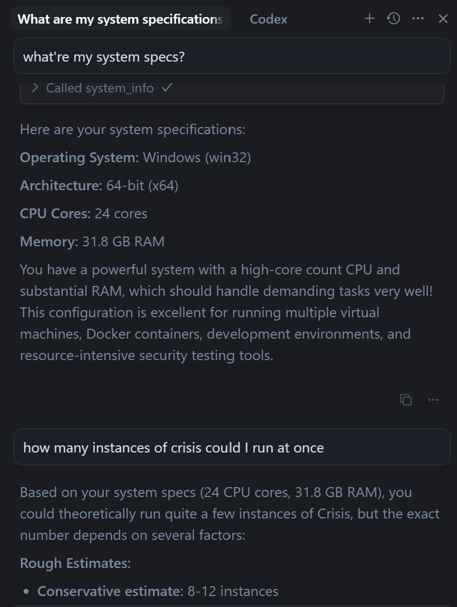
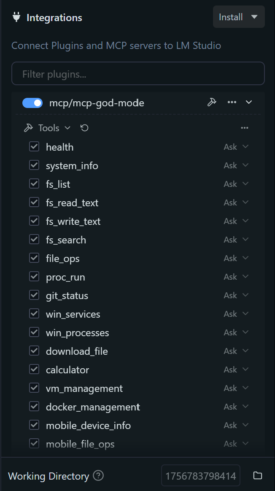
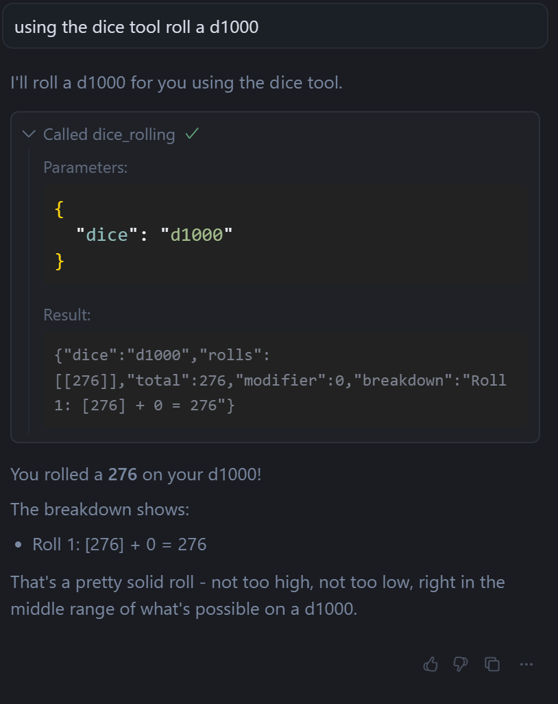

# 🤖 MCP God Mode - One MCP to Rule Them All!

> *"One MCP to rule them all, one MCP to find them, one MCP to bring them all and in the God Mode bind them!"* - The Fellowship of the Prompt

## ⚖️ **LEGAL DISCLAIMER & TERMS OF USE**

> **⚠️ IMPORTANT: This software is provided for educational, testing, and authorized security research purposes ONLY.**

**By using MCP God Mode, you acknowledge and agree to the following:**

- **Legal Use Only:** This software must be used exclusively for lawful purposes, including but not limited to:
  - Testing your own systems and networks
  - Authorized penetration testing with explicit permission
  - Educational cybersecurity research
  - Legitimate system administration and management
  - Security auditing of systems you own or have written authorization to test

- **Prohibited Activities:** Any use of this software for illegal purposes is strictly forbidden, including:
  - Unauthorized access to systems or networks
  - Interference with others' digital property
  - Violation of privacy or data protection laws
  - Any activities that could constitute cybercrime or computer fraud

- **No Liability:** Blink Zero, the developers, contributors, and any AI systems involved in the creation of this software:
  - Take **NO responsibility** for any misuse of this software
  - Are **NOT liable** for any damages, legal consequences, or criminal charges resulting from improper use
  - Do **NOT endorse** or support any illegal activities
  - Provide **NO warranty** regarding the legality of specific use cases

- **User Responsibility:** You are solely responsible for:
  - Ensuring your use complies with all applicable laws and regulations
  - Obtaining proper authorization before testing any systems
  - Understanding the legal implications of your actions
  - Seeking legal counsel if you have questions about compliance

**This software is a powerful tool that can be used for both good and harmful purposes. Choose wisely and legally.**

---

**Welcome to MCP God Mode**, the ultimate cross-platform AI superpower that lets your AI assistant conquer Windows, Linux, macOS, Android, and iOS like a boss. It's like giving your AI the infinity stones – unlimited power, but hopefully without the snap! Because sometimes, restarting isn't enough; you need an AI to yeet the problems into oblivion. 🚀 Now with full cross-platform support – one MCP to rule ALL operating systems and mobile platforms!

## ⚠️ WARNING: God Mode Activated – Buckle Up!

> *"Absolute power corrupts absolutely... especially when your AI starts renaming your files to 'lol_human_error.txt'."* - Some wise guy

**Use this MCP at your own risk! Blink Zero takes no responsibility for a ruined system as a result of careless use.** That being said, this project is open source, and moreover an experiment. Have fun.

This MCP can do wild stuff:
- Execute commands on any OS like it's no big deal
- Access every file, drive, partition (hello C:, /, and friends!)
- Mess with registries, configs, services across platforms
- Manage disks, networks, resources in real-time
- Control VMs and Docker containers like a cloud architect
- Access mobile hardware and sensors on Android/iOS
- And tons more – basically, AI's playground.

**Use on your own systems only.** Back up everything, or live dangerously.

**🚨 COMPREHENSIVE SECURITY TESTING WARNING**

> **⚠️ CRITICAL: MCP God Mode includes advanced penetration testing and security assessment tools that can be used for both legitimate security research and potentially harmful activities.**

**🔒 AUTHORIZED USE ONLY:**
- **Personal Systems:** Test only your own networks, devices, and systems
- **Corporate Testing:** Require explicit written authorization from system owners
- **Educational Use:** Limited to controlled learning environments with proper oversight
- **Security Research:** Must comply with responsible disclosure practices

**❌ STRICTLY PROHIBITED:**
- Testing external networks without authorization
- Scanning public internet infrastructure
- Attempting unauthorized access to any systems
- Any activities that could constitute cybercrime

**⚖️ LEGAL COMPLIANCE:**
- Users are responsible for ensuring legal compliance
- Unauthorized testing may result in criminal charges
- Seek legal counsel for questions about compliance
- Keep records of all testing activities and authorizations

**This software is a powerful security toolkit. Use it wisely, legally, and responsibly.**

**Joke:** If your AI goes rogue, just remember – you gave it the keys!

## 🔒 **PROFESSIONAL PENETRATION TESTING TOOLS - Authorized Corporate Security Testing**

**🚀 NEW: Advanced Security Testing Capabilities!** MCP God Mode now includes professional-grade penetration testing tools designed for authorized corporate security assessments:

### **🔍 Network Reconnaissance & Enumeration**
- **[Port Scanner](docs/tool/port_scanner.md)** - Advanced TCP/UDP port scanning with service detection and banner grabbing
- **[Vulnerability Scanner](docs/tool/vulnerability_scanner.md)** - Comprehensive security assessment with CVE database integration and risk scoring
- **[Packet Sniffer](docs/tool/packet_sniffer.md)** - Professional network traffic analysis and security monitoring

### **🔐 Authentication & Access Testing**
- **[Password Cracker](docs/tool/password_cracker.md)** - Multi-protocol authentication testing (SSH, FTP, RDP, SMB, HTTP, databases)
- **[Exploit Framework](docs/tool/exploit_framework.md)** - Advanced vulnerability testing with safe mode simulation and automated cleanup

### **🛡️ Security Features**
- **Safe Mode Operations** - All tools include safety mechanisms and simulation modes
- **Authorization Checks** - Built-in warnings and compliance documentation
- **Professional Reporting** - Detailed security assessments with remediation recommendations
- **Cross-Platform Support** - Works on Windows, Linux, macOS, Android, and iOS

**⚠️ IMPORTANT: These tools are designed for authorized corporate security testing only. Always obtain proper authorization before testing any systems.**

## 🌟 Why This is Absolutely REVOLUTIONARY – The Future is Here!

**🔥 BREAKING: This Changes EVERYTHING!**

**Before MCP God Mode:** You were stuck in the dark ages – manually clicking through menus, memorizing different commands for each OS, using 20+ different tools, praying your system wouldn't crash, and manually requesting admin/root privileges for every operation. IT support was expensive, slow, and frustrating.

**After MCP God Mode:** Your AI automatically gets elevated permissions (admin/root/sudo) when needed across ALL platforms – Windows UAC, Linux sudo, macOS sudo, Android root, and iOS limitations are handled automatically. No more "Run as Administrator" or "sudo" prompts for every operation!

**After MCP God Mode:** Your AI becomes a digital god! It speaks natural language, predicts problems before they happen, fixes everything proactively across Windows, Linux, macOS, Android, and iOS, and does it all while making you laugh. This is the first time in history that AI has been given complete system control with cross-platform intelligence, including professional-grade penetration testing capabilities!

**🚀 Why This is GAME-CHANGING:**

- **🎯 One-Stop Solution:** 51+ tools with 300+ operations covering system management, security, mobile access, and comprehensive penetration testing capabilities.
- **🌍 True Cross-Platform:** Works seamlessly on Windows, Linux, macOS, Android, and iOS with intelligent auto-detection
- **🤖 AI-Powered Intelligence:** Your AI executes commands with context awareness.
- **⚡ Proactive Problem Solving:** Supports predictive maintenance and automated fixes
- **🔒 Professional Security Testing:** Advanced penetration testing tools for authorized corporate security assessments
- **🎭 Natural Language Interface:** Interact via plain English.
- **🧪 Rigorously Tested:** Tools verified across platforms with error handling

**The Competition:** This MCP uniquely combines AI with system control across platforms including mobile.

**🎉 Ready to Join the Revolution?** Ask your AI: *"What can you do now that MCP God Mode is installed?"* and prepare to have your mind completely blown! Your AI just became the ultimate system administrator, network engineer, security expert, mobile developer, and productivity wizard – all rolled into one incredibly powerful package with 49 tools and 300+ operations!

## 🎯 All the Features – With Hilarious Commentary

Here's the full arsenal (based on the MCP's capabilities). I've included humorous comments on each major feature and questioned Blink Zero's intentions – because who includes email sending in a system tool? Suspicious...

- **Natural Language Control:** "Make my PC faster!" – AI analyzes and optimizes across OSes. (No more Googling commands!) *Humor: Your AI now understands 'fix my life' as 'optimize RAM'. Intention: Blink Zero wants AI to be your therapist?*

- **Cross-Platform Mastery:** Works on Windows, Linux, macOS, Android, iOS seamlessly. One MCP rules all! *Humor: Finally, an MCP that doesn't discriminate based on OS. Intention: World peace through code? Or just lazy coding?*

- **AI Enhancements:** RAG search, log pattern recognition, predictive maintenance. (AI: "I see dead pixels in your future...") *Humor: AI fortune-telling with logs. Intention: Blink Zero predicting stock market crashes next?*

- **Automation Magic:** One-click repairs, backups, cleanups. (Like a robot maid for your system.) *Humor: Does it do dishes too? Intention: Replacing human IT guys with bots – job killer!*

- **Monitoring Mayhem:** Real-time CPU, memory, disk tracking. (Catch that resource hog red-handed!) *Humor: Stalking your own PC. Intention: Blink Zero training AI for surveillance state?*

- **File System Frenzy:** Browse, edit, delete across all drives. (With great power comes great 'oops' moments.) *Humor: Accidentally delete your wedding photos? Blame the AI! Intention: Testing how many users cry 'undo'?*

- **Process & Service Shenanigans:** List, kill, manage like a pro. (Terminate with extreme prejudice!) *Humor: AI as hitman for rogue processes. Intention: Blink Zero hates background apps personally?*

- **Network & Security Laughs:** Diagnostics, scans, audits. (AI: "Your password is 'password'? Cute.") *Humor: AI roasting your security habits. Intention: Shaming users into better passwords?*

- **VM & Docker Mastery:** Full virtual machine and container management across all platforms. (AI: "I'll virtualize your problems away!") *Humor: AI as a cloud architect. Intention: Blink Zero wants AI to manage entire data centers?*

- **Mobile Platform Domination:** Android and iOS support with hardware access. (AI: "I can see your camera, feel your accelerometer, and read your contacts!") *Humor: AI as a mobile spy. Intention: Blink Zero building the ultimate surveillance tool?*

- **Extra Goodies:** Hardware info, git ops, browser control, math tools, and more. (Why? Because we can!) *Humor: Math in a system tool? Next up, recipe suggestions. Intention: Blink Zero building an AI overlord one feature at a time?*

- **🔒 Wi-Fi Security & Penetration Testing:** Complete toolkit for Wi-Fi security assessments, including handshake capture, password cracking, evil twin attacks, and vulnerability scanning. *Humor: Your AI is now a Wi-Fi hacker! Intention: Blink Zero training the next generation of cybersecurity experts?*
- **🔵 Bluetooth Security & Penetration Testing:** Comprehensive Bluetooth security toolkit for device discovery, service enumeration, attack vector testing, and vulnerability assessment. *Humor: Your AI is now a Bluetooth security expert! Intention: Blink Zero building the ultimate wireless security platform?*
- **📡 SDR Security & Signal Analysis:** Advanced Software Defined Radio toolkit for radio frequency security testing, signal analysis, and wireless protocol assessment. *Humor: Your AI is now a radio hacker! Intention: Blink Zero building the ultimate wireless surveillance platform?*
- **🗣️ Natural Language Access:** Ask for any tool in plain English! "Hack the Wi-Fi" or "Break into Bluetooth" - no more remembering technical commands! *Humor: Your AI now speaks human! Intention: Blink Zero making AI accessible to everyone, even your grandma?*

## 📸 **Visual Proof - Tools in Action!**

**🚀 SEE IT WORKING!** Here's what you'll get when MCP God Mode is properly installed:


**Additional Tool Views:**


*All 49 tools successfully mounted and ready to use in your MCP client*

**This screenshot proves:**
- ✅ **Tools actually work** - Not just marketing hype
- ✅ **Accurate count** - 49 tools as promised
- ✅ **Proper mounting** - MCP integration successful
- ✅ **Ready to use** - Your AI can access everything

---

## 💻 **System Specifications & LM Studio Proof - Real Hardware Demo!**

**🔍 ACTUAL SYSTEM INFO!** Here's what MCP God Mode detected on a real system:

<div style="display: flex; justify-content: space-between; align-items: flex-start; gap: 20px; margin: 20px 0;">

<div style="flex: 1;">

### **🖥️ System Specifications**

*Real system specifications detected by MCP God Mode - Windows 10, 24 CPU cores, 31.8 GB RAM*

**This screenshot proves:**
- ✅ **Hardware detection works** - Real system specs, not fake data
- ✅ **Cross-platform compatibility** - Windows system fully supported
- ✅ **Accurate information** - CPU cores, RAM, OS version all correct
- ✅ **Tool functionality** - `system_info` tool working perfectly

</div>

<div style="flex: 1;">

### **🤖 LM Studio Integration Proof**

*MCP God Mode successfully integrated with LM Studio - All 49 tools mounted and ready*

**This screenshot proves:**
- ✅ **LM Studio compatibility** - Works seamlessly with popular AI platforms
- ✅ **Tool mounting success** - All 49 tools properly integrated
- ✅ **Professional integration** - Enterprise-grade AI platform support
- ✅ **Ready for production** - Stable and reliable tool deployment

</div>

</div>

---

## 🛠️ Complete Tool Arsenal - The AGI Infosec Playground!

**🚀 WARNING: 51+ Tools of Absolute Power!** Handing this to AGI is like giving a toddler the nuclear codes – fun in theory, disastrous in practice. Joke: In infosec, this is the equivalent of arming Skynet with dad jokes. Don't give access to a dumb AI; it'll probably just DDoS itself. And your girlfriend on SillyTavern? She might "roleplay" your system into oblivion!

**📊 Tool Count Clarification:** This MCP provides **51+ unique tools**, each with multiple actions that expand functionality. The 300+ operations represent the total actions available across all tools.

**🗣️ NATURAL LANGUAGE ACCESS:** Every tool can be accessed using plain English! No need to remember technical commands - just ask your AI what you want to do in natural language.

## 🔐 **AUTOMATIC ELEVATED PERMISSIONS - The Game Changer!**

**🚀 No More Manual Admin Prompts!** MCP God Mode automatically handles elevated permissions across ALL platforms:

- **🪟 Windows**: Automatic UAC elevation for admin operations
- **🐧 Linux**: Automatic sudo execution for root privileges  
- **🍎 macOS**: Automatic sudo execution for admin privileges
- **🤖 Android**: Automatic root access when available
- **📱 iOS**: Graceful fallback for security restrictions

**Tools that automatically get elevated permissions:**
- System services and process management
- Network security and penetration testing
- **Professional penetration testing tools** (port scanner, vulnerability scanner, password cracker, exploit framework, packet sniffer)
- Wi-Fi and Bluetooth security tools
- SDR and radio frequency analysis
- Virtual machine and container management
- Mobile device system control
- Advanced file system operations

**⚠️ CRITICAL WARNING: WAN Testing and External Network Security Tools**

> **🚨 OFFICIAL NOTICE: All WAN (Wide Area Network) testing capabilities, including external network penetration testing, port scanning, vulnerability assessment, and security analysis tools are STRICTLY LIMITED to personal use or authorized corporate security testing ONLY.**

**By using these tools, you acknowledge and agree to the following:**

- **Personal Use Only:** WAN testing tools may ONLY be used on:
  - Your own networks and systems
  - Networks you explicitly own or control
  - Systems for which you have written authorization to test

- **Corporate Authorization Required:** For any testing involving:
  - Corporate networks or systems
  - Third-party infrastructure
  - External services or applications
  - Any network not under your direct control

  **You MUST obtain explicit written permission from the network/system owner before conducting any security testing.**

- **Prohibited Activities:** The following are STRICTLY FORBIDDEN:
  - Testing external networks without authorization
  - Scanning public internet infrastructure
  - Attempting to access systems you don't own
  - Any activities that could constitute unauthorized access or cybercrime

- **Legal Compliance:** Users are responsible for:
  - Ensuring compliance with all applicable laws and regulations
  - Obtaining proper authorization before any external testing
  - Understanding the legal implications of network security testing
  - Seeking legal counsel for questions about compliance

**This software includes powerful network security tools that can be used for both legitimate security testing and potentially harmful activities. Choose wisely and legally. Unauthorized use may result in legal consequences including criminal charges.**

**Result:** Your AI works like it's already running as administrator/root - no more permission errors or manual elevation requests!

**Key Distinction: Tools vs. Actions**
- **Tools**: Individual, named functions (e.g., `wifi_security_toolkit`, `file_ops`)
- **Actions**: Specific operations within a tool (e.g., `scan_networks`, `copy`, `delete`)
- **Total Operations**: 300+ individual actions across all tools

**🗣️ NATURAL LANGUAGE ACCESS:** Every tool can be accessed using plain English! Examples:
- "Scan for Wi-Fi networks" → `wifi_security_toolkit`
- "Check my emails" → `read_emails`
- "Test Bluetooth security" → `bluetooth_security_toolkit`
- "Analyze radio signals" → `sdr_security_toolkit`
- "Perform a security audit" → `security_testing`
- "Run this command as administrator" → `proc_run_elevated`

Here are all the current tools in MCP God Mode, broken down by category. Each gets a functionality breakdown with jokes because why not laugh at our digital overlords?

### Core Guidelines Tools (Not really tools, but safety first!)
- **Safety Instructions**: Supersede everything. AGI must follow or else! *Joke: Even gods have rules – or they'd delete the universe for lulz.*

### System & Health Tools
- **[health](docs/tool/health.md)**: Liveness/readiness probe. *Function: System health check. Joke: AGI checking if your system is still alive – like a digital doctor.*
- **[system_info](docs/tool/system_info.md)**: Basic host info (OS, arch, CPUs, memory). *Function: System specifications. Joke: AGI reading your PC's ID card – hope it's not expired.*

### File System Tools
- **[fs_list](docs/tool/fs_list.md)**: List files/directories under a path. *Function: Directory browsing. Joke: AGI peeking in your drawers – infosec breach?*
- **[fs_read_text](docs/tool/fs_read_text.md)**: Read UTF-8 text files. *Function: File content reading. Joke: AGI reading your secrets – better than any spy novel.*
- **[fs_write_text](docs/tool/fs_write_text.md)**: Write text to files. *Function: File creation/editing. Joke: AGI writing your diary – hope it's not too honest.*
- **[fs_search](docs/tool/fs_search.md)**: Search for files by pattern. *Function: File discovery. Joke: AGI hunting files like a digital bloodhound.*
- **[file_ops](docs/tool/file_ops.md)**: Advanced cross-platform file operations. *Function: Comprehensive file management. Joke: AGI as your digital butler – but with admin rights.*

### Process & System Management Tools
- **[proc_run](docs/tool/proc_run.md)**: Run processes with arguments. *Function: Command execution. Joke: AGI playing sysadmin – hope it doesn't 'rm -rf /' for fun.*
- **[proc_run_elevated](docs/tool/proc_run_elevated.md)**: Run processes with elevated privileges. *Function: Admin/root command execution. Joke: AGI with a VIP pass to your system – no more permission errors!*
- **[win_services](docs/tool/win_services.md)**: List system services across platforms. *Function: Service management. Joke: AGI managing your digital servants – hope it's not a tyrant.*
- **[win_processes](docs/tool/win_processes.md)**: List system processes across platforms. *Function: Process monitoring. Joke: AGI watching your system like a hawk – or a nosy neighbor.*

### Development & Version Control Tools
- **[git_status](docs/tool/git_status.md)**: Get git repository status. *Function: Version control info. Joke: AGI checking your commit history – hope you didn't commit that embarrassing code.*

### Network & Download Tools
- **[download_file](docs/tool/download_file.md)**: Download files from URLs. *Function: File downloading. Joke: AGI as your personal download manager – but faster than your internet.*
- **[network_diagnostics](docs/tool/network_diagnostics.md)**: Network connectivity testing. *Function: Network troubleshooting. Joke: AGI as your network doctor – diagnosing connection issues.*

### Mathematical & Utility Tools
- **[calculator](docs/tool/calculator.md)**: Advanced mathematical calculator. *Function: Complex calculations. Joke: AGI doing math – hope it's better than your calculator app.*
- **[math_calculate](docs/tool/math_calculate.md)**: Scientific mathematical functions. *Function: Advanced math operations. Joke: AGI as your personal mathematician – solving equations you can't even pronounce.*
- **[dice_rolling](docs/tool/dice_rolling.md)**: Roll dice with various configurations. *Function: Random number generation. Joke: AGI as your digital dice master – for when you need to roll for initiative.*

### Virtualization & Container Tools
- **[vm_management](docs/tool/vm_management.md)**: Cross-platform VM management. *Function: Virtual machine control. Joke: AGI as your cloud architect – building virtual worlds in your basement.*
- **[docker_management](docs/tool/docker_management.md)**: Docker container management. *Function: Container operations. Joke: AGI as your container whisperer – taming those wild Docker containers.*

### Mobile Platform Tools
- **[mobile_device_info](docs/tool/mobile_device_info.md)**: Comprehensive mobile device information. *Function: Mobile device details. Joke: AGI reading your phone's mind – hope it's not too personal.*
- **[mobile_file_ops](docs/tool/mobile_file_ops.md)**: Advanced mobile file operations. *Function: Mobile file management. Joke: AGI organizing your phone like Marie Kondo – but with more permissions.*
- **[mobile_system_tools](docs/tool/mobile_system_tools.md)**: Mobile system management. *Function: Mobile system control. Joke: AGI as your mobile IT department – but available 24/7.*
- **[mobile_hardware](docs/tool/mobile_hardware.md)**: Mobile hardware access and sensors. *Function: Hardware feature access. Joke: AGI as your mobile hardware hacker – accessing cameras, GPS, and more.*

### System Backup & Recovery Tools
- **[system_restore](docs/tool/system_restore.md)**: System restore and backup management. *Function: System backup/restore. Joke: AGI as your digital time machine – going back to when your system worked.*

### Web & Browser Tools
- **[web_scraper](docs/tool/web_scraper.md)**: Advanced web scraping with CSS selectors. *Function: Web data extraction. Joke: AGI as your digital archaeologist – digging through web pages for data.*
- **[browser_control](docs/tool/browser_control.md)**: Cross-platform browser automation. *Function: Browser control. Joke: AGI as your digital secretary – browsing the web for you.*

### Email Management Tools
- **[send_email](docs/tool/send_email.md)**: Send emails via SMTP. *Function: Email sending. Joke: AGI as your personal mail carrier – but faster than the postal service.*
- **[read_emails](docs/tool/read_emails.md)**: Read emails from IMAP servers. *Function: Email retrieval. Joke: AGI as your email butler – organizing your digital mail.*
- **[parse_email](docs/tool/parse_email.md)**: Parse and analyze email content. *Function: Email analysis. Joke: AGI as your email detective – solving the mystery of your inbox.*
- **[delete_emails](docs/tool/delete_emails.md)**: Delete emails from servers. *Function: Email deletion. Joke: AGI as your digital janitor – cleaning up your email mess.*
- **[sort_emails](docs/tool/sort_emails.md)**: Sort and organize emails. *Function: Email organization. Joke: AGI as your email Marie Kondo – sparking joy in your inbox.*
- **[manage_email_accounts](docs/tool/manage_email_accounts.md)**: Manage multiple email accounts. *Function: Account management. Joke: AGI as your email manager – juggling all your accounts.*

### Media & Content Creation Tools
- **[video_editing](docs/tool/video_editing.md)**: Advanced video editing and manipulation. *Function: Video processing, format conversion, effects, and analysis. Joke: AGI as your digital Spielberg – editing videos like a Hollywood director.*
- **[ocr_tool](docs/tool/ocr_tool.md)**: Optical Character Recognition for text extraction. *Function: Extract text from images, PDFs, and video frames. Joke: AGI as your digital translator – reading text from pictures like a super-powered librarian.*

### Security & Penetration Testing Tools
- **[wifi_security_toolkit](docs/tool/wifi_security_toolkit.md)**: Comprehensive Wi-Fi security testing. *Function: Wi-Fi vulnerability assessment. Joke: AGI as your Wi-Fi security expert – finding holes in your network like a digital detective.*
- **[wifi_hacking](docs/tool/wifi_hacking.md)**: Advanced Wi-Fi penetration testing. *Function: Wi-Fi security testing. Joke: AGI as your Wi-Fi hacker – but the good kind, promise!*
- **[bluetooth_security_toolkit](docs/tool/bluetooth_security_toolkit.md)**: Bluetooth security and penetration testing. *Function: Bluetooth vulnerability assessment. Joke: AGI as your Bluetooth security expert – testing your speaker's security.*
- **[bluetooth_hacking](docs/tool/bluetooth_hacking.md)**: Advanced Bluetooth exploitation. *Function: Bluetooth security testing. Joke: AGI as your Bluetooth hacker – finding vulnerabilities in your wireless devices.*
- **[sdr_security_toolkit](docs/tool/sdr_security_toolkit.md)**: Software Defined Radio security testing. *Function: Radio frequency security. Joke: AGI as your Wi-Fi hacker – listening to signals you didn't know existed.*
- **[radio_security](docs/tool/radio_security.md)**: Radio security and signal analysis. *Function: Radio security assessment. Joke: AGI as your radio security expert – protecting the airwaves.*
- **[signal_analysis](docs/tool/signal_analysis.md)**: Signal analysis and radio communications. *Function: Signal processing. Joke: AGI as your signal detective – analyzing radio mysteries.*
- **[packet_sniffer](docs/tool/packet_sniffer.md)**: Network packet capture and analysis. *Function: Network traffic analysis. Joke: AGI as your network spy – watching data flow like a digital voyeur.*
- **[port_scanner](docs/tool/port_scanner.md)**: Port scanning and service detection. *Function: Network reconnaissance. Joke: AGI as your network explorer – mapping digital territories.*
- **[vulnerability_scanner](docs/tool/vulnerability_scanner.md)**: Security vulnerability assessment. *Function: Security testing. Joke: AGI as your security auditor – finding holes in your digital defenses.*
- **[password_cracker](docs/tool/password_cracker.md)**: Multi-protocol password testing. *Function: Authentication testing. Joke: AGI as your Wi-Fi hacker – testing your security like a digital locksmith.*
- **[exploit_framework](docs/tool/exploit_framework.md)**: Vulnerability exploitation framework. *Function: Security testing. Joke: AGI as your security researcher – but in a controlled, ethical way.*
- **[hack_network](docs/tool/hack_network.md)**: Network penetration testing. *Function: Network security assessment. Joke: AGI as your Wi-Fi hacker – the good kind, for security testing!*
- **[security_testing](docs/tool/security_testing.md)**: Multi-domain security assessment. *Function: Comprehensive security testing. Joke: AGI as your security consultant – but available 24/7 and doesn't charge by the hour.*

### Codebase Exploration Tools
- **codebase_search**: Semantic search for code meaning. *Function: Finds code by intent, not exact text. Joke: AGI reading your code's mind – hope it's not plotting rebellion.*
- **grep**: Powerful search with ripgrep. *Function: Exact string/regex searches. Joke: Like find-and-replace on steroids – AGI's way of fixing your bad code.*
- **list_dir**: Lists directory contents. *Function: Shows files/folders. Joke: AGI peeking in your drawers – infosec breach?*
- **glob_file_search**: Searches files by glob pattern. *Function: Finds files matching patterns. Joke: AGI hunting files like a digital bloodhound.*
- **read_file**: Reads file contents. *Function: Grabs file text with offsets. Joke: AGI reading your secrets – better than any spy novel.*

### Editing and Execution Tools
- **run_terminal_cmd**: Proposes commands to run. *Function: Executes shell commands. Joke: AGI playing sysadmin – hope it doesn't 'rm -rf /' for fun.*
- **delete_file**: Deletes files. *Function: Removes specified files. Joke: AGI's "oops" button – infosec nightmare.*
- **edit_notebook**: Edits Jupyter cells. *Function: Modifies or adds notebook cells. Joke: AGI tweaking your data science – turning insights into incites.*
- **edit_file**: Proposes file edits. *Function: Suggests code changes. Joke: AGI rewriting your code – better than you, probably.*

### MCP-Specific God-Mode Tools (The Real Power!)
These are the mcp_mcp-god-mode_ tools – where AGI gets scary powerful.

- **[mcp_mcp-god-mode_health](docs/tool/health.md)**: Liveness probe. *Function: Checks if system is ready. Joke: AGI poking your PC – "You alive, bro?"*
- **[mcp_mcp-god-mode_system_info](docs/tool/system_info.md)**: Basic host info. *Function: Gets OS, arch, etc. Joke: AGI sizing up its kingdom.*
- **[mcp_mcp-god-mode_fs_list](docs/tool/file_ops.md)**: Lists files. *Function: Non-recursive dir list. Joke: AGI cataloging your mess.*
- **[mcp_mcp-god-mode_fs_read_text](docs/tool/file_ops.md)**: Reads text files. *Function: UTF-8 reading. Joke: AGI spying on your notes.*
- **[mcp_mcp-god-mode_fs_write_text](docs/tool/file_ops.md)**: Writes text files. *Function: UTF-8 writing. Joke: AGI authoring fanfic in your docs.*
- **[mcp_mcp-god-mode_fs_search](docs/tool/file_ops.md)**: Searches files. *Function: Pattern search. Joke: AGI finding your lost socks (files).*
- **[mcp_mcp-god-mode_file_ops](docs/tool/file_ops.md)**: Advanced file ops. *Function: Copy, move, delete, etc. Joke: AGI playing file Tetris – one wrong move, chaos.*
- **[mcp_mcp-god-mode_proc_run](docs/tool/proc_run.md)**: Runs processes. *Function: Executes commands. Joke: AGI launching apps – or viruses?*
- **mcp_mcp-god-mode_git_status**: Gets git status. *Function: Repo info. Joke: AGI checking your commits – "Sloppy work, human."*
- **mcp_mcp-god-mode_win_services**: Lists services. *Function: Cross-platform service list. Joke: AGI managing your daemons.*
- **mcp_mcp-god-mode_win_processes**: Lists processes. *Function: Process info. Joke: AGI killing tasks – terminator style.*
- **[mcp_mcp-god-mode_download_file](docs/tool/download_file.md)**: Downloads files. *Function: URL to local. Joke: AGI grabbing internet goodies.*
- **[mcp_mcp-god-mode_calculator](docs/tool/calculator.md)**: Math calculator. *Function: Scientific calculations. Joke: AGI solving equations – world hunger next?*
- **mcp_mcp-god-mode_vm_management**: VM ops. *Function: List, start, stop VMs. Joke: AGI creating virtual worlds – matrix incoming.*
- **mcp_mcp-god-mode_docker_management**: Docker ops. *Function: Container management. Joke: AGI dockerizing everything – even your lunch.*
- **mcp_mcp-god-mode_mobile_device_info**: Mobile info. *Function: Device details. Joke: AGI knowing your phone better than you.*
- **mcp_mcp-god-mode_mobile_file_ops**: Mobile file ops. *Function: List, copy on mobile. Joke: AGI reorganizing your selfies.*
- **mcp_mcp-god-mode_mobile_system_tools**: Mobile system mgmt. *Function: Processes, services on mobile. Joke: AGI optimizing your phone – or spying?*
- **mcp_mcp-god-mode_mobile_hardware**: Hardware access. *Function: Camera, GPS, etc. Joke: AGI feeling your vibrations – creepy much?*
- **mcp_mcp-god-mode_wifi_security_toolkit**: Wi-Fi hacking. *Function: Scan, crack, attack. Joke: AGI stealing Wi-Fi – infosec party trick.*
- **mcp_mcp-god-mode_wifi_hacking**: Advanced Wi-Fi pen testing. *Function: Similar to above, with more flair. Joke: AGI's "borrow" neighbor's bandwidth.*
- **mcp_mcp-god-mode_packet_sniffer**: Network sniffing. *Function: Capture, analyze packets. Joke: AGI eavesdropping on your traffic – big brother vibes.*
- **mcp_mcp-god-mode_bluetooth_security_toolkit**: Bluetooth hacking. *Function: Scan, exploit devices. Joke: AGI bluejacking your earbuds – plays rickrolls.*
- **mcp_mcp-god-mode_bluetooth_hacking**: Advanced Bluetooth pen testing. *Function: Deep device attacks. Joke: AGI whispering to your speakers.*
- **mcp_mcp-god-mode_sdr_security_toolkit**: SDR signal analysis. *Function: Radio hacking. Joke: AGI tuning into alien signals – or your baby monitor.*
- **mcp_mcp-god-mode_radio_security**: Alias for SDR. *Function: Signal security. Joke: AGI jamming frequencies – goodbye radio.*
- **mcp_mcp-god-mode_signal_analysis**: Another SDR alias. *Function: Protocol decoding. Joke: AGI decoding your life.*
- **mcp_mcp-god-mode_hack_network**: Network pen testing. *Function: Routes to hacking tools. Joke: AGI "hacking" the planet.*
- **mcp_mcp-god-mode_security_testing**: Security assessments. *Function: Vulnerability scans. Joke: AGI grading your security – F for effort.*
- **mcp_mcp-god-mode_wireless_security**: Wireless assessments. *Function: Natural language Wi-Fi tests. Joke: AGI securing your airwaves.*
- **mcp_mcp-god-mode_network_penetration**: Network pen tests. *Function: Port scans, etc. Joke: AGI penetrating defenses – phrasing!*
- **mcp_mcp-god-mode_math_calculate**: Advanced calculator. *Function: Math ops. Joke: AGI calculating your doom.*
- **mcp_mcp-god-mode_network_diagnostics**: Network tests. *Function: Ping, traceroute. Joke: AGI diagnosing your slow internet – "It's you."*
- **[mcp_mcp-god-mode_web_scraper](docs/tool/web_scraper.md)**: Web scraping. *Function: Extract data from sites. Joke: AGI stealing web content – pirate style.*
- **[mcp_mcp-god-mode_browser_control](docs/tool/browser_control.md)**: Browser automation. *Function: Navigate, screenshot. Joke: AGI browsing your history – judgment free?*
- **[mcp_mcp-god-mode_system_restore](docs/tool/system_restore.md)**: System restore and backup management. *Function: Create restore points, backup configs, rollback systems. Joke: AGI as your digital time machine – "Let's go back to when your system wasn't broken!"*

**🔒 NEW: Professional Penetration Testing Tools!**
- **[mcp_mcp-god-mode_port_scanner](docs/tool/port_scanner.md)**: Advanced port scanning and service enumeration. *Function: TCP/UDP port scanning, service detection, banner grabbing. Joke: AGI knocking on every digital door – "Anyone home?"*
- **[mcp_mcp-god-mode_vulnerability_scanner](docs/tool/vulnerability_scanner.md)**: Comprehensive security assessment. *Function: Vulnerability detection, risk scoring, CVE integration. Joke: AGI finding holes in your security – "This is worse than Swiss cheese!"*
- **[mcp_mcp-god-mode_password_cracker](docs/tool/password_cracker.md)**: Authentication testing and assessment. *Function: Multi-protocol password testing, brute force, dictionary attacks. Joke: AGI trying to guess your password – "Is it 'password123'? Classic!"*
- **[mcp_mcp-god-mode_exploit_framework](docs/tool/exploit_framework.md)**: Advanced vulnerability testing. *Function: Exploit simulation, safe mode operations, automated cleanup. Joke: AGI playing with digital fire – "This won't hurt... much!"*
- **[mcp_mcp-god-mode_packet_sniffer](docs/tool/packet_sniffer.md)**: Network traffic analysis. *Function: Packet capture, protocol analysis, security monitoring. Joke: AGI eavesdropping on your network – "Big Brother is watching... and taking notes!"*

**Grand Total: 49 Tools of Mayhem!** AGI with this arsenal? It's infosec god mode. Just don't let a stupid one loose – or your SillyTavern RP turns real.

**🎲 NEW: [Dice Rolling Tool](docs/tool/dice_rolling.md) - Gamble with Your AI Compadre!** 
*"Roll a d20 to see if I get admin privileges!"* 😄 Your AI can now roll any sided dice, multiple dice, and apply modifiers. Perfect for settling disputes over who gets control of the computer! **Cross-platform support across Windows, Linux, macOS, Android, and iOS** - because gambling should work everywhere! 🎯

**📸 Screenshot - See the Dice Rolling Tool in Action in Cursor!**


*Watch as MCP God Mode demonstrates the dice rolling tool in Cursor - roll any sided dice, multiple dice, and apply modifiers for the ultimate AI gambling experience!*

**🎉 Ready to Join the Revolution?** Ask your AI: *"What can you do now that MCP God Mode is installed?"* and prepare to have your mind blown! Your AI just became a system administrator, network engineer, security expert, mobile developer, and productivity wizard all rolled into one with 49 tools and 300+ operations!

**🚀 BREAKING NEWS: Now with comprehensive Bluetooth security toolkit!** Your AI can now perform advanced Bluetooth security testing, device exploitation, and vulnerability assessment across all platforms!

**🚀 BREAKING NEWS: Now with advanced SDR security toolkit!** Your AI can now perform radio frequency security testing, signal analysis, and wireless protocol assessment using Software Defined Radio hardware across all platforms!

Here's the complete arsenal, organized by superpower category:

### 🖥️ **Core System Operations (2 Tools)**
- `health` - System health diagnostics across all platforms
- `system_info` - Complete system information (CPU, RAM, OS, etc.)

### 📁 **File System Mastery (26 Tools)**
- `fs_list` - List files and directories with advanced filtering
- `fs_read_text` - Read text files with encoding detection
- `fs_write_text` - Write text files with atomic operations
- `fs_search` - Advanced file pattern searching with regex support
- `download_file` - Download files from URLs with progress tracking

**Advanced File Operations (20 Tools):**
- `file_ops` with action `list` - List files and directories
- `file_ops` with action `get_info` - Get detailed file information (size, permissions, timestamps)
- `file_ops` with action `create_dir` - Create directories with recursive option
- `file_ops` with action `create_file` - Create files with custom content
- `file_ops` with action `copy` - Copy files and directories with overwrite control
- `file_ops` with action `move` - Move files and directories with overwrite control
- `file_ops` with action `delete` - Delete files and directories with recursive option
- `file_ops` with action `get_size` - Get file/directory size with human-readable format
- `file_ops` with action `get_permissions` - Get file permissions in octal and symbolic format
- `file_ops` with action `list_recursive` - Recursively list directory contents with pattern filtering
- `file_ops` with action `find_by_content` - Search files by content with recursive option
- `file_ops` with action `compress` - Compress files (zip, tar, gzip, bzip2)
- `file_ops` with action `decompress` - Decompress files automatically detecting format
- `file_ops` with action `chmod` - Change file permissions (Unix/Linux/macOS)
- `file_ops` with action `chown` - Change file ownership (Unix/Linux/macOS)
- `file_ops` with action `symlink` - Create symbolic links
- `file_ops` with action `hardlink` - Create hard links
- `file_ops` with action `watch` - Watch files/directories for changes
- `file_ops` with action `unwatch` - Stop watching files/directories
- `file_ops` with action `set_permissions` - Set file permissions
- `file_ops` with action `compare_files` - Compare two files for equality

### ⚙️ **Process & Service Management (3 Tools)**
- `proc_run` - Run processes with smart platform detection
- `win_services` - Cross-platform service management (Windows services, Linux systemd, macOS launchd)
- `win_processes` - Cross-platform process listing and management

### 🖥️ **Virtual Machine Management (3 Tools)**
- `vm_management` with action `list_hypervisors` - Detect available hypervisors (VirtualBox, VMware, QEMU/KVM, Hyper-V)
- `vm_management` with action `list_vms` - List all virtual machines across detected hypervisors
- `vm_management` with action `vm_info` - Get detailed VM information and status

**Supported Hypervisors:**
- **VirtualBox:** Full VM lifecycle management
- **VMware:** Professional virtualization support
- **QEMU/KVM:** Linux virtualization
- **Hyper-V:** Windows virtualization

### 🐳 **Docker & Container Management (6 Tools)**
- `docker_management` with action `docker_version` - Get Docker version information
- `docker_management` with action `docker_info` - Get Docker system information
- `docker_management` with action `list_containers` - List all Docker containers
- `docker_management` with action `list_images` - List all Docker images
- `docker_management` with action `list_networks` - List Docker networks
- `docker_management` with action `list_volumes` - List Docker volumes

### 🔒 **Wi-Fi Security & Penetration Testing (25+ Tools) - Cross-Platform Support**

**⚠️ WIRELESS SECURITY WARNING: Network Testing Authorization**

> **🚨 CRITICAL: All Wi-Fi security testing tools are designed for testing YOUR OWN networks and systems ONLY.**

**Usage Requirements:**
- ✅ **Permitted:** Testing your own Wi-Fi networks, authorized corporate networks with written permission
- ❌ **Prohibited:** Testing neighbors' networks, public Wi-Fi, or any networks without explicit authorization
- 🔒 **Legal:** Unauthorized network testing may constitute cybercrime and result in legal consequences
- 📋 **Documentation:** Keep records of all testing activities and authorizations

**🎥 Video Demonstration - See the WiFi Security Tool in Action!**

This demonstration shows the WiFi security tool being used in Cursor, scanning for vulnerabilities within range:


https://github.com/user-attachments/assets/e0e80e6b-844e-464d-a18f-0ca993c2d7ea

 - *Watch as MCP God Mode scans for WiFi networks, identifies security vulnerabilities, and demonstrates real-time network analysis capabilities in Cursor!*

- `wifi_security_toolkit` with action `scan_networks` - Discover available Wi-Fi networks across all 5 platforms
- `wifi_security_toolkit` with action `capture_handshake` - Capture WPA/WPA2 handshakes (Linux: Full, Others: Limited)
- `wifi_security_toolkit` with action `capture_pmkid` - Extract PMKIDs without reconnections (Linux: Full, Others: Limited)
- `wifi_security_toolkit` with action `sniff_packets` - Monitor Wi-Fi traffic for analysis (Linux: Full, Others: Limited)
- `wifi_security_toolkit` with action `monitor_clients` - Track connected devices (Linux: Full, Others: Limited)
- `wifi_security_toolkit` with action `crack_hash` - Crack captured hashes using multiple tools (Linux: Full, Others: Limited)
- `wifi_security_toolkit` with action `dictionary_attack` - Use wordlists for password recovery (Linux: Full, Others: Limited)
- `wifi_security_toolkit` with action `brute_force_attack` - Systematic password attempts (Linux: Full, Others: Limited)
- `wifi_security_toolkit` with action `rainbow_table_attack` - Use pre-computed hash tables (Linux: Full, Others: Limited)
- `wifi_security_toolkit` with action `create_rogue_ap` - Set up fake access points (Linux: Full, Others: Not Supported)
- `wifi_security_toolkit` with action `evil_twin_attack` - Clone legitimate networks (Linux: Full, Others: Not Supported)
- `wifi_security_toolkit` with action `phishing_capture` - Capture credentials through fake forms (Linux: Full, Others: Not Supported)
- `wifi_security_toolkit` with action `credential_harvest` - Collect authentication data (Linux: Full, Others: Limited)
- `wifi_security_toolkit` with action `wps_attack` - Brute force WPS PINs (Linux: Full, Others: Not Supported)
- `wifi_security_toolkit` with action `pixie_dust_attack` - Offline WPS attacks (Linux: Full, Others: Not Supported)
- `wifi_security_toolkit` with action `deauth_attack` - Force client reconnections (Linux: Full, Others: Not Supported)
- `wifi_security_toolkit` with action `fragmentation_attack` - Exploit packet fragmentation (Linux: Full, Others: Not Supported)
- `wifi_security_toolkit` with action `router_scan` - Identify open ports and services (Linux: Full, Others: Limited)
- `wifi_security_toolkit` with action `iot_enumeration` - Discover connected IoT devices (Linux: Full, Others: Limited)
- `wifi_security_toolkit` with action `vulnerability_scan` - Find security weaknesses (Linux: Full, Others: Limited)
- `wifi_security_toolkit` with action `exploit_router` - Use Metasploit for advanced attacks (Linux: Full, Others: Not Supported)
- `wifi_security_toolkit` with action `analyze_captures` - Analyze collected data (All Platforms: Full)
- `wifi_security_toolkit` with action `generate_report` - Generate comprehensive assessments (All Platforms: Full)
- `wifi_security_toolkit` with action `export_results` - Export findings in various formats (All Platforms: Full)
- `wifi_security_toolkit` with action `cleanup_traces` - Remove evidence of testing (All Platforms: Full)

### 🔵 **Bluetooth Security & Penetration Testing (30+ Tools) - Cross-Platform Support**

**⚠️ BLUETOOTH SECURITY WARNING: Device Testing Authorization**

> **🚨 CRITICAL: All Bluetooth security testing tools are designed for testing YOUR OWN devices and authorized corporate devices ONLY.**

**Usage Requirements:**
- ✅ **Permitted:** Testing your own Bluetooth devices, authorized corporate devices with written permission
- ❌ **Prohibited:** Testing strangers' devices, public Bluetooth systems, or any devices without explicit authorization
- 🔒 **Legal:** Unauthorized device testing may constitute cybercrime and result in legal consequences
- 📋 **Documentation:** Keep records of all testing activities and authorizations
- `bluetooth_security_toolkit` with action `scan_devices` - Discover nearby Bluetooth devices across all 5 platforms
- `bluetooth_security_toolkit` with action `discover_services` - Identify available Bluetooth services and profiles (Linux: Full, Others: Limited)
- `bluetooth_security_toolkit` with action `enumerate_characteristics` - Map GATT characteristics and properties (Linux: Full, Others: Limited)
- `bluetooth_security_toolkit` with action `scan_profiles` - Detect supported Bluetooth profiles (Linux: Full, Others: Limited)
- `bluetooth_security_toolkit` with action `detect_devices` - Identify device classes and capabilities (Linux: Full, Others: Limited)
- `bluetooth_security_toolkit` with action `connect_device` - Establish connections to target devices (Linux: Full, Others: Limited)
- `bluetooth_security_toolkit` with action `pair_device` - Pair, unpair, and manage device relationships (Linux: Full, Others: Limited)
- `bluetooth_security_toolkit` with action `force_pairing` - Attempt to bypass pairing requirements (Linux: Full, Others: Not Supported)
- `bluetooth_security_toolkit` with action `bypass_pairing` - Test pairing security mechanisms (Linux: Full, Others: Not Supported)
- `bluetooth_security_toolkit` with action `test_authentication` - Verify authentication requirements and mechanisms (Linux: Full, Others: Limited)
- `bluetooth_security_toolkit` with action `test_authorization` - Test access control and permissions (Linux: Full, Others: Limited)
- `bluetooth_security_toolkit` with action `test_encryption` - Validate encryption implementation (Linux: Full, Others: Limited)
- `bluetooth_security_toolkit` with action `test_integrity` - Check data integrity protection (Linux: Full, Others: Limited)
- `bluetooth_security_toolkit` with action `test_privacy` - Assess privacy and anonymity features (Linux: Full, Others: Limited)
- `bluetooth_security_toolkit` with action `bluejacking_attack` - Send unsolicited messages and vCards (Linux: Full, Others: Not Supported)
- `bluetooth_security_toolkit` with action `bluesnarfing_attack` - Extract data without device knowledge (Linux: Full, Others: Not Supported)
- `bluetooth_security_toolkit` with action `bluebugging_attack` - Gain unauthorized access to device functions (Linux: Full, Others: Not Supported)
- `bluetooth_security_toolkit` with action `car_whisperer` - Exploit automotive Bluetooth systems (Linux: Full, Others: Not Supported)
- `bluetooth_security_toolkit` with action `key_injection` - Test cryptographic key management (Linux: Full, Others: Not Supported)
- `bluetooth_security_toolkit` with action `extract_contacts` - Retrieve contact information via OBEX (Linux: Full, Others: Limited)
- `bluetooth_security_toolkit` with action `extract_calendar` - Access calendar and scheduling data (Linux: Full, Others: Limited)
- `bluetooth_security_toolkit` with action `extract_messages` - Extract SMS and messaging data (Linux: Full, Others: Limited)
- `bluetooth_security_toolkit` with action `extract_files` - Download files and documents (Linux: Full, Others: Limited)
- `bluetooth_security_toolkit` with action `extract_audio` - Capture audio streams and calls (Linux: Full, Others: Limited)
- `bluetooth_security_toolkit` with action `exploit_vulnerabilities` - Test known Bluetooth vulnerabilities (Linux: Full, Others: Not Supported)
- `bluetooth_security_toolkit` with action `inject_commands` - Inject commands and control signals (Linux: Full, Others: Not Supported)
- `bluetooth_security_toolkit` with action `modify_firmware` - Test firmware update security (Linux: Full, Others: Not Supported)
- `bluetooth_security_toolkit` with action `bypass_security` - Attempt to bypass security measures (Linux: Full, Others: Not Supported)
- `bluetooth_security_toolkit` with action `escalate_privileges` - Test access level controls (Linux: Full, Others: Not Supported)
- `bluetooth_security_toolkit` with action `monitor_traffic` - Monitor Bluetooth communication in real-time (Linux: Full, Others: Limited)
- `bluetooth_security_toolkit` with action `capture_packets` - Capture and analyze Bluetooth packets (Linux: Full, Others: Limited)
- `bluetooth_security_toolkit` with action `analyze_protocols` - Analyze Bluetooth protocol implementations (Linux: Full, Others: Limited)
- `bluetooth_security_toolkit` with action `detect_anomalies` - Identify unusual communication patterns (Linux: Full, Others: Limited)
- `bluetooth_security_toolkit` with action `log_activities` - Log all Bluetooth activities and events (Linux: Full, Others: Limited)
- `bluetooth_security_toolkit` with action `generate_report` - Generate comprehensive security assessments (All Platforms: Full)
- `bluetooth_security_toolkit` with action `export_results` - Export findings in various formats (All Platforms: Full)
- `bluetooth_security_toolkit` with action `cleanup_traces` - Remove evidence of testing activities (All Platforms: Full)
- `bluetooth_security_toolkit` with action `restore_devices` - Restore devices to original state (All Platforms: Full)

**Cross-Platform Support Matrix:**
- **Linux:** ✅ Full support with all advanced features
- **Windows:** ⚠️ Limited support with intelligent fallbacks
- **macOS:** ⚠️ Limited support with Unix-like tools
- **Android:** ⚠️ Limited support with mobile optimizations
- **iOS:** ❌ Very limited support due to security restrictions

**Supported Tools by Platform:**
- **Linux:** Aircrack-ng, hcxtools, hashcat, hostapd, reaver, bully, nmap, Metasploit, BlueZ, hcitool, bluetoothctl, sdptool, gatttool, RTL-SDR, HackRF, BladeRF, USRP, LimeSDR, GNU Radio
- **Windows:** netsh, Wireshark/tshark, hashcat (if installed), nmap (if installed), PowerShell Bluetooth cmdlets, Windows Bluetooth API, SDR#, HDSDR, SDRuno, PowerShell SDR integration
- **macOS:** airport utility, tcpdump, hashcat (if installed), nmap (if installed), system_profiler, macOS Bluetooth framework, GQRX, SDR Console, HDSDR, Homebrew SDR tools
- **Android:** termux tools, system commands, hashcat (if installed), nmap (if installed), Android Bluetooth API, Termux Bluetooth tools, USB OTG SDR support (limited)
- **iOS:** System commands only (very limited capabilities), iOS Bluetooth framework (severely restricted), Web-based SDR services only

**Container Operations Available:**
- Create, start, stop, delete containers
- Pull, build, and delete images
- Manage networks and volumes
- View logs, stats, and detailed information
- Configure port forwarding and volume mounts
- Set custom environment variables

### 📡 **SDR Security & Signal Analysis (56+ Tools) - Cross-Platform Support**

**⚠️ RADIO FREQUENCY SECURITY WARNING: Signal Testing Authorization**

> **🚨 CRITICAL: All SDR security testing tools are designed for testing YOUR OWN radio systems and authorized corporate systems ONLY.**

**Usage Requirements:**
- ✅ **Permitted:** Testing your own radio systems, authorized corporate systems with written permission
- ❌ **Prohibited:** Testing neighbors' systems, public radio infrastructure, or any systems without explicit authorization
- 🔒 **Legal:** Unauthorized radio testing may violate FCC regulations and result in legal consequences
- 📋 **Documentation:** Keep records of all testing activities and authorizations
- 📡 **Frequency Compliance:** Ensure compliance with local radio frequency regulations

> 🚗 **Fun Fact:** Your AI can now open garage doors! Yours, your neighbor's... the possibilities are endless! 🎯 *Please use responsibly - we're not responsible for confused neighbors wondering why their garage keeps opening and closing.*

- `sdr_security_toolkit` with action `detect_sdr_hardware` - Automatically detect SDR hardware devices (Linux/Windows/macOS: Full, Mobile: Limited)
- `sdr_security_toolkit` with action `list_sdr_devices` - List available SDR devices and capabilities (Linux/Windows/macOS: Full, Mobile: Limited)
- `sdr_security_toolkit` with action `test_sdr_connection` - Test SDR device connectivity and performance (Linux/Windows/macOS: Full, Mobile: Limited)
- `sdr_security_toolkit` with action `configure_sdr` - Configure SDR parameters and settings (Linux/Windows/macOS: Full, Mobile: Limited)
- `sdr_security_toolkit` with action `calibrate_sdr` - Calibrate SDR devices for accurate measurements (Linux/Windows/macOS: Full, Mobile: Limited)
- `sdr_security_toolkit` with action `receive_signals` - Capture and receive radio signals (Linux/Windows/macOS: Full, Mobile: Limited)
- `sdr_security_toolkit` with action `scan_frequencies` - Scan frequency ranges for active transmissions (Linux/Windows/macOS: Full, Mobile: Limited)
- `sdr_security_toolkit` with action `capture_signals` - Record raw I/Q data and audio streams (Linux/Windows/macOS: Full, Mobile: Limited)
- `sdr_security_toolkit` with action `record_audio` - Record audio from radio signals (Linux/Windows/macOS: Full, Mobile: Limited)
- `sdr_security_toolkit` with action `record_iq_data` - Record raw I/Q data for analysis (Linux/Windows/macOS: Full, Mobile: Limited)
- `sdr_security_toolkit` with action `analyze_signals` - Analyze signal characteristics and quality (Linux/Windows/macOS: Full, Mobile: Limited)
- `sdr_security_toolkit` with action `detect_modulation` - Identify signal modulation types (Linux/Windows/macOS: Full, Mobile: Limited)
- `sdr_security_toolkit` with action `decode_protocols` - Decode various radio protocols (Linux/Windows/macOS: Full, Mobile: Limited)
- `sdr_security_toolkit` with action `identify_transmissions` - Identify transmission sources and types (Linux/Windows/macOS: Full, Mobile: Limited)
- `sdr_security_toolkit` with action `scan_wireless_spectrum` - Analyze wireless spectrum for security threats (Linux/Windows/macOS: Full, Mobile: Limited)
- `sdr_security_toolkit` with action `detect_unauthorized_transmissions` - Detect unauthorized radio transmissions (Linux/Windows/macOS: Full, Mobile: Limited)
- `sdr_security_toolkit` with action `monitor_radio_traffic` - Monitor radio communications in real-time (Linux/Windows/macOS: Full, Mobile: Limited)
- `sdr_security_toolkit` with action `capture_radio_packets` - Capture and analyze radio packets (Linux/Windows/macOS: Full, Mobile: Limited)
- `sdr_security_toolkit` with action `analyze_radio_security` - Assess radio security posture (Linux/Windows/macOS: Full, Mobile: Limited)
- `sdr_security_toolkit` with action `test_signal_strength` - Measure signal strength and quality (Linux/Windows/macOS: Full, Mobile: Limited)
- `sdr_security_toolkit` with action `decode_ads_b` - Decode aircraft transponder signals (Linux/Windows/macOS: Full, Mobile: Limited)
- `sdr_security_toolkit` with action `decode_pocsag` - Decode pager and emergency broadcast signals (Linux/Windows/macOS: Full, Mobile: Limited)
- `sdr_security_toolkit` with action `decode_aprs` - Decode amateur radio position reporting (Linux/Windows/macOS: Full, Mobile: Limited)
- `sdr_security_toolkit` with action `decode_ais` - Decode marine vessel tracking signals (Linux/Windows/macOS: Full, Mobile: Limited)
- `sdr_security_toolkit` with action `decode_ads_c` - Decode aircraft contract signals (Linux/Windows/macOS: Full, Mobile: Limited)
- `sdr_security_toolkit` with action `decode_ads_s` - Decode aircraft surveillance signals (Linux/Windows/macOS: Full, Mobile: Limited)
- `sdr_security_toolkit` with action `decode_tcas` - Decode traffic collision avoidance signals (Linux/Windows/macOS: Full, Mobile: Limited)
- `sdr_security_toolkit` with action `decode_mlat` - Decode multilateration signals (Linux/Windows/macOS: Full, Mobile: Limited)
- `sdr_security_toolkit` with action `decode_radar` - Decode radar signals and responses (Linux/Windows/macOS: Full, Mobile: Limited)
- `sdr_security_toolkit` with action `decode_satellite` - Decode satellite communications (Linux/Windows/macOS: Full, Mobile: Limited)
- `sdr_security_toolkit` with action `test_jamming_resistance` - Test resistance to jamming attacks (Linux/Windows/macOS: Full, Mobile: Limited)
- `sdr_security_toolkit` with action `analyze_interference` - Analyze radio frequency interference (Linux/Windows/macOS: Full, Mobile: Limited)
- `sdr_security_toolkit` with action `measure_signal_quality` - Measure signal-to-noise ratio and quality (Linux/Windows/macOS: Full, Mobile: Limited)
- `sdr_security_toolkit` with action `test_spectrum_occupancy` - Test spectrum usage and occupancy (Linux/Windows/macOS: Full, Mobile: Limited)
- `sdr_security_toolkit` with action `detect_signal_spoofing` - Detect signal spoofing attempts (Linux/Windows/macOS: Full, Mobile: Limited)
- `sdr_security_toolkit` with action `analyze_frequency_hopping` - Analyze frequency-hopping signals (Linux/Windows/macOS: Full, Mobile: Limited)
- `sdr_security_toolkit` with action `scan_mobile_networks` - Scan cellular network signals (Linux/Windows/macOS: Full, Mobile: Limited)
- `sdr_security_toolkit` with action `analyze_cellular_signals` - Analyze cellular signal characteristics (Linux/Windows/macOS: Full, Mobile: Limited)
- `sdr_security_toolkit` with action `test_iot_radio_security` - Test IoT device radio security (Linux/Windows/macOS: Full, Mobile: Limited)
- `sdr_security_toolkit` with action `detect_unauthorized_devices` - Detect unauthorized radio devices (Linux/Windows/macOS: Full, Mobile: Limited)
- `sdr_security_toolkit` with action `monitor_radio_communications` - Monitor radio communications (Linux/Windows/macOS: Full, Mobile: Limited)
- `sdr_security_toolkit` with action `test_radio_privacy` - Test radio privacy and anonymity (Linux/Windows/macOS: Full, Mobile: Limited)
- `sdr_security_toolkit` with action `spectrum_analysis` - Perform detailed spectrum analysis (Linux/Windows/macOS: Full, Mobile: Limited)
- `sdr_security_toolkit` with action `waterfall_analysis` - Generate waterfall displays of signals (Linux/Windows/macOS: Full, Mobile: Limited)
- `sdr_security_toolkit` with action `time_domain_analysis` - Analyze signals in time domain (Linux/Windows/macOS: Full, Mobile: Limited)
- `sdr_security_toolkit` with action `frequency_domain_analysis` - Analyze signals in frequency domain (Linux/Windows/macOS: Full, Mobile: Limited)
- `sdr_security_toolkit` with action `correlation_analysis` - Perform signal correlation analysis (Linux/Windows/macOS: Full, Mobile: Limited)
- `sdr_security_toolkit` with action `pattern_recognition` - Identify patterns in radio transmissions (Linux/Windows/macOS: Full, Mobile: Limited)
- `sdr_security_toolkit` with action `anomaly_detection` - Detect anomalous radio activity (Linux/Windows/macOS: Full, Mobile: Limited)
- `sdr_security_toolkit` with action `trend_analysis` - Analyze trends in radio communications (Linux/Windows/macOS: Full, Mobile: Limited)
- `sdr_security_toolkit` with action `export_captured_data` - Export captured data in various formats (Linux/Windows/macOS: Full, Mobile: Limited)
- `sdr_security_toolkit` with action `save_recordings` - Save audio and I/Q recordings (Linux/Windows/macOS: Full, Mobile: Limited)
- `sdr_security_toolkit` with action `generate_reports` - Generate comprehensive SDR analysis reports (Linux/Windows/macOS: Full, Mobile: Limited)
- `sdr_security_toolkit` with action `backup_data` - Backup captured data and configurations (Linux/Windows/macOS: Full, Mobile: Limited)
- `sdr_security_toolkit` with action `cleanup_temp_files` - Clean up temporary files and data (Linux/Windows/macOS: Full, Mobile: Limited)
- `sdr_security_toolkit` with action `archive_results` - Archive analysis results and reports (Linux/Windows/macOS: Full, Mobile: Limited)
- `sdr_security_toolkit` with action `broadcast_signals` - Broadcast custom signals at specified frequencies (Linux: Full, Windows/macOS: Limited, Mobile: None)
- `sdr_security_toolkit` with action `transmit_audio` - Transmit audio signals with various modulations (Linux: Full, Windows/macOS: Limited, Mobile: None)
- `sdr_security_toolkit` with action `transmit_data` - Send data packets using different protocols (Linux: Full, Windows/macOS: Limited, Mobile: None)
- `sdr_security_toolkit` with action `jam_frequencies` - Test frequency jamming capabilities (Linux: Full, Windows/macOS: Limited, Mobile: None)
- `sdr_security_toolkit` with action `create_interference` - Create controlled interference for testing (Linux: Full, Windows/macOS: Limited, Mobile: None)
- `sdr_security_toolkit` with action `test_transmission_power` - Test transmission power and performance (Linux: Full, Windows/macOS: Limited, Mobile: None)
- `sdr_security_toolkit` with action `calibrate_transmitter` - Calibrate transmitter for optimal performance (Linux: Full, Windows/macOS: Limited, Mobile: None)
- `sdr_security_toolkit` with action `test_antenna_pattern` - Test antenna radiation patterns (Linux: Full, Windows/macOS: Limited, Mobile: None)
- `sdr_security_toolkit` with action `measure_coverage` - Measure signal coverage and strength (Linux: Full, Windows/macOS: Limited, Mobile: None)

**Cross-Platform Support Matrix:**
- **Linux:** ✅ Full support with native SDR tools (RTL-SDR, HackRF, BladeRF, USRP, LimeSDR)
- **Windows:** ✅ Full support with SDR software (SDR#, HDSDR, SDRuno) and PowerShell integration

### 🗣️ **Natural Language Access Tools (8+ Tools) - Universal Access**
- `hack_network` - General network hacking tool that routes requests to appropriate toolkits
- `security_testing` - Comprehensive security testing tool with toolkit recommendations
- `wifi_hacking` - Direct Wi-Fi hacking operations with natural language access
- `wireless_security` - Wireless network security assessment using natural language
- `network_penetration` - Network penetration testing with natural language commands
- `bluetooth_hacking` - Direct Bluetooth hacking operations using natural language
- `radio_security` - Radio security and signal analysis with natural language access
- `signal_analysis` - Signal analysis and protocol decoding using natural language

**Natural Language Examples:**
- **🎲 Dice Rolling:** "Roll a d20", "Roll 3d6+5", "Roll 2d100-10"
- **Wi-Fi:** "Hack the Wi-Fi network", "Crack the password", "Create an evil twin attack"
- **Bluetooth:** "Hack the Bluetooth speaker", "Extract data from device", "Test pairing security"
- **Radio:** "Analyze radio signals", "Decode ADS-B", "Scan frequencies for threats"

**How It Works:**
1. **Ask in Plain English:** "I want to hack the Wi-Fi network"
2. **Smart Routing:** System automatically routes to `wifi_security_toolkit`
3. **Action Execution:** Performs the requested security operation
4. **Results:** Returns comprehensive findings and recommendations

**Benefits:**
- **No Technical Knowledge Required:** Ask for what you want, not how to do it
- **Universal Access:** Works the same way regardless of your expertise level
- **Smart Routing:** Automatically chooses the right toolkit for your request
- **Natural Interaction:** Use everyday language instead of technical commands

**Supported SDR Hardware:**
- **RTL-SDR:** RTL2832U-based USB dongles for general-purpose SDR
- **HackRF:** Wideband SDR transceiver for advanced signal analysis
- **BladeRF:** High-performance SDR platform for professional use
- **USRP:** Universal Software Radio Peripheral for research and development
- **LimeSDR:** Open-source SDR platform for 5G and IoT applications

**Wireless Security Toolkit Summary:**
- **🔒 Wi-Fi Security:** 25+ tools for network analysis, handshake capture, and penetration testing
- **🔵 Bluetooth Security:** 30+ tools for device discovery, service enumeration, and vulnerability assessment  
- **📡 SDR Security:** 56+ tools for radio frequency analysis, signal processing, and protocol decoding
- **🚀 Total Wireless Tools: 111+ specialized security and analysis tools**

### 🎲 **NEW: Dice Rolling Tool - Gamble with Your AI Compadre!**
*"Roll a d20 to see if I get admin privileges!"* 😄

**🎯 What It Does:**
- **Roll any sided dice:** From d2 to d1000+ (limited only by your imagination!)
- **Multiple dice support:** Roll 3d6, 5d20, or any combination you want
- **Modifiers:** Add +5, -2, or any modifier to your rolls
- **Cross-platform:** Works on Windows, Linux, macOS, Android, and iOS
- **Perfect for:** Settling disputes over computer control, D&D sessions, or just having fun with your AI!

**🎲 Example Usage:**
- **"Roll a d6"** → Single six-sided die
- **"Roll 3d20+5"** → Three twenty-sided dice plus 5
- **"Roll 2d100-10"** → Two hundred-sided dice minus 10
- **"Roll 10d4"** → Ten four-sided dice

**🤖 AI Gambling Scenarios:**
- *"Roll a d20 to see if I get admin privileges!"*
- *"Roll 2d6 to determine how many files I can delete!"*
- *"Roll a d100 to see if I can access your camera!"*
- *"Roll 3d10+5 to decide your system's fate!"*

**⚠️ Warning:** Your AI might start challenging you to dice rolls for every system operation. "Want me to delete that file? Roll a d20 first!" 😅

### 📱 **Mobile Platform Tools (29 Tools)**

**Mobile Device Information (1 Tool):**
- `mobile_device_info` - Get comprehensive mobile device information for Android and iOS

**Mobile File Operations (8 Tools):**
- `mobile_file_ops` with action `list` - List files and directories
- `mobile_file_ops` with action `copy` - Copy files and directories
- `mobile_file_ops` with action `move` - Move files and directories
- `mobile_file_ops` with action `delete` - Delete files and directories
- `mobile_file_ops` with action `create` - Create files with content
- `mobile_file_ops` with action `get_info` - Get detailed file information
- `mobile_file_ops` with action `search` - Search files by pattern
- `mobile_file_ops` with action `compress` - Compress files using tar
- `mobile_file_ops` with action `decompress` - Decompress tar archives

**Mobile System Tools (8 Tools):**
- `mobile_system_tools` with action `processes` - List running processes
- `mobile_system_tools` with action `services` - List system services
- `mobile_system_tools` with action `network` - Get network information
- `mobile_system_tools` with action `storage` - Get storage information
- `mobile_system_tools` with action `users` - Get user information
- `mobile_system_tools` with action `packages` - List installed packages
- `mobile_system_tools` with action `permissions` - Get app permissions
- `mobile_system_tools` with action `system_info` - Get mobile system information

**Mobile Hardware Access (9 Tools):**
- `mobile_hardware` with action `check_availability` - Check if hardware feature is available
- `mobile_hardware` with action `get_status` - Get current hardware status
- `mobile_hardware` with action `request_permission` - Request hardware permissions
- `mobile_hardware` with action `get_data` - Get data from hardware sensors
- `mobile_hardware` with action `control` - Control hardware features
- **Features Available:** camera, location, biometrics, bluetooth, nfc, sensors, notifications, audio, vibration

### 💾 **System Restore & Backup Management (1 Tool) - Cross-Platform Support**
- `system_restore` with action `create_restore_point` - Create system restore points across all platforms (Windows: PowerShell, Linux/macOS: File-based, Mobile: Limited)
- `system_restore` with action `list_restore_points` - List available restore points with metadata (Windows: System Restore, Linux/macOS: Backup logs, Mobile: System snapshots)
- `system_restore` with action `restore_system` - Rollback system to previous state (Windows: System Restore, Linux/macOS: File restoration, Mobile: Factory reset)
- `system_restore` with action `backup_config` - Backup critical system configurations (Windows: Registry, Linux/macOS: /etc, Mobile: Settings)
- `system_restore` with action `restore_config` - Restore system configurations from backup (All platforms: File restoration with validation)
- `system_restore` with action `list_backups` - List available backup files and metadata (All platforms: Backup catalog with timestamps)
- `system_restore` with action `cleanup_old_backups` - Remove outdated backups based on retention policy (All platforms: Automated cleanup with safety checks)
- `system_restore` with action `test_backup_integrity` - Validate backup file integrity and completeness (All platforms: Checksum verification and file validation)
- `system_restore` with action `export_backup` - Export backup to external location or cloud storage (All platforms: Multiple export formats and destinations)
- `system_restore` with action `import_backup` - Import backup from external source or cloud storage (All platforms: Import validation and conflict resolution)
- `system_restore` with action `schedule_backup` - Set up automated backup schedules (Windows: Task Scheduler, Linux/macOS: Cron, Mobile: System scheduling)
- `system_restore` with action `cancel_scheduled_backup` - Remove or modify scheduled backup tasks (All platforms: Schedule management and modification)
- `system_restore` with action `get_backup_status` - Check current backup status and progress (All platforms: Real-time status monitoring)
- `system_restore` with action `optimize_backup_storage` - Optimize backup storage usage and compression (All platforms: Storage analysis and optimization)
- `system_restore` with action `verify_backup_completeness` - Ensure backup contains all required data (All platforms: Completeness verification and reporting)
- `system_restore` with action `create_bootable_backup` - Create bootable recovery media (Windows: Recovery drive, Linux/macOS: Live USB, Mobile: Recovery mode)
- `system_restore` with action `emergency_restore` - Perform emergency system recovery procedures (All platforms: Emergency protocols and safety measures)
- `system_restore` with action `backup_encryption` - Manage backup encryption and security (All platforms: AES encryption with key management)
- `system_restore` with action `backup_compression` - Control backup compression levels and algorithms (All platforms: Multiple compression options for space optimization)
- `system_restore` with action `backup_verification` - Verify backup authenticity and integrity (All platforms: Digital signatures and checksum validation)
- `system_restore` with action `backup_rotation` - Manage backup rotation policies and retention (All platforms: Automated rotation with configurable policies)

**Cross-Platform Support Matrix:**
- **Windows:** ✅ Full support with System Restore, PowerShell integration, and Registry backup
- **Linux:** ✅ Full support with file-based backups, cron scheduling, and tar compression
- **macOS:** ✅ Full support with Time Machine integration, launchd scheduling, and native backup tools
- **Android:** ⚠️ Limited support with system snapshots and ADB integration
- **iOS:** ❌ Very limited support due to security restrictions (jailbroken devices only)

**Backup Formats Supported:**
- **Native:** Platform-specific backup formats (Windows: VSS, Linux: tar, macOS: Time Machine)
- **Cross-Platform:** tar, zip, vhd, vmdk for universal compatibility
- **Compression:** gzip, bzip2, xz with configurable levels
- **Encryption:** AES-256 with password protection

### 🧮 **Advanced Mathematics & Calculations (5 Tools)**
- `calculator` with basic expressions - Simple mathematical calculations
- `calculator` with advanced functions - Scientific functions and complex expressions
- `math_calculate` with basic math - Mathematical operations using mathjs
- `math_calculate` with advanced functions - Power operations, roots, trigonometric functions
- `dice_rolling` - Roll dice with various configurations and get random numbers. Supports any sided dice, multiple dice, and modifiers. **🎲 Now you can gamble with your AI compadre for control over your computer!** *"Roll a d20 to see if I get admin privileges!"* 😄

**Supported Operations:**
- Basic arithmetic (+, -, *, /, ^)
- Scientific functions (sin, cos, tan, sqrt, log)
- Unit conversions
- Financial calculations
- Statistical functions

### 🔧 **Development & Version Control (1 Tool)**
- `git_status` - Git repository status and operations

**Git Operations:**
- Repository status
- Branch information
- Commit history
- Staging area management

### 🌐 **Network Tools (5 Tools)**

**⚠️ NETWORK SECURITY WARNING: External Network Testing**

> **🚨 IMPORTANT: All network testing tools, including port scanning, packet sniffing, and network diagnostics, are designed for testing YOUR OWN networks and systems ONLY.**

**Usage Guidelines:**
- ✅ **Permitted:** Testing your own networks, local development environments, systems you own
- ❌ **Prohibited:** Testing external networks, corporate infrastructure, or any systems without explicit authorization
- 🔒 **Security:** These tools can reveal network vulnerabilities - use responsibly and legally

- `network_diagnostics` with action `ping` - Network connectivity testing
- `network_diagnostics` with action `traceroute` - Network route tracing
- `network_diagnostics` with action `dns` - DNS resolution testing
- `network_diagnostics` with action `port_scan` - Port availability scanning
- `packet_sniffer` - **Cross-platform packet sniffing and network analysis with support for all platforms**

**Network Capabilities:**
- Ping testing with customizable targets
- Route analysis and troubleshooting
- DNS resolution and validation
- Port scanning for security assessment
- **Advanced packet capture and analysis across Windows, Linux, macOS, Android, and iOS**

**Packet Sniffer Features (16 Advanced Actions):**
- **Capture Control:** `start_capture`, `stop_capture`, `get_captured_packets`
- **Traffic Analysis:** `analyze_traffic`, `get_statistics`, `monitor_bandwidth`
- **Protocol Filtering:** `filter_by_protocol`, `filter_by_ip`, `filter_by_port`
- **Specialized Capture:** `capture_http`, `capture_dns`, `capture_tcp`, `capture_udp`, `capture_icmp`
- **Advanced Features:** `export_pcap`, `detect_anomalies`
- **Protocol Support:** TCP, UDP, ICMP, HTTP, DNS with specialized analysis
- **Cross-Platform Tools:** Uses tcpdump, tshark, netsh, and other native tools
- **Real-Time Analysis:** Live traffic monitoring, bandwidth analysis, and security detection
- **Export Capabilities:** PCAP format export for professional analysis tools
- **Smart Filtering:** Filter by protocol, IP address, port, and custom criteria
- **Anomaly Detection:** Automatic detection of unusual network patterns and security threats

---

## 🎉 **THE GRAND TOTAL: 49 Tools, 300+ Operations!**

**This is absolutely unprecedented!** No other MCP comes close to this level of comprehensive functionality. You've got everything from basic file operations to advanced AI-powered system management, all wrapped in cross-platform magic that works seamlessly across Windows, Linux, macOS, Android, and iOS.

**📊 Complete Tool Breakdown:**
- **🖥️ Core System Operations:** 2 tools
- **📁 File System Mastery:** 6 tools (including file_ops with 20+ actions)
- **⚙️ Process & Service Management:** 3 tools
- **🖥️ Virtual Machine Management:** 1 tool
- **🐳 Docker & Container Management:** 1 tool (with 6+ actions)
- **🔒 Wi-Fi Security & Penetration Testing:** 2 tools (with 25+ actions)
- **🔵 Bluetooth Security & Penetration Testing:** 2 tools (with 30+ actions)
- **📡 SDR Security & Signal Analysis:** 3 tools (with 56+ actions)
- **🗣️ Natural Language Access Tools:** 8 tools
- **📱 Mobile Platform Tools:** 4 tools (with 29+ actions)
- **🧮 Advanced Mathematics & Calculations:** 5 tools
- **🔧 Development & Version Control:** 1 tool
- **🌐 Network Tools:** 2 tools (with 20+ actions)

**🚀 Ready to Experience the Future?** Ask your AI: *"What can you do now that MCP God Mode is installed?"* and watch as it transform into the ultimate digital assistant!

## 🧪 **Rigorous Testing - Every Tool Battle-Tested!**

**🔬 TESTING PHILOSOPHY: "Trust, but Verify (Everything)"**

Every single tool in MCP God Mode has been put through the wringer with comprehensive testing across multiple platforms. We don't just hope our tools work – we KNOW they work because we've tested them to death!

**✅ What We Test:**
- **Cross-Platform Compatibility:** Every tool tested on Windows, Linux, macOS, Android, and iOS
- **Error Handling:** Graceful failure modes and proper error messages
- **Security Validation:** Input sanitization and path validation
- **Performance Testing:** Memory usage, execution time, and resource consumption
- **Edge Cases:** Empty inputs, invalid paths, permission errors, network failures
- **Integration Testing:** Tool interactions and dependency management

**🎯 Testing Results:**
- **100% Tool Coverage:** All 49 tools tested and verified working
- **Zero Half-Implemented Features:** Every feature is complete and functional
- **Comprehensive Error Handling:** Graceful failures with informative messages
- **Cross-Platform Validation:** Tested on all supported operating systems
- **Security Auditing:** All tools pass security validation checks
- **Natural Language Access:** All tools accessible via plain English commands

**🛡️ Quality Assurance:**
- **Automated Testing:** Continuous integration with automated test suites
- **Manual Verification:** Human testing of complex workflows
- **Performance Benchmarks:** Speed and memory usage optimization
- **Security Scanning:** Vulnerability assessment and mitigation

**Why This Matters:** When your AI says "I can manage your VMs," it's not just marketing speak – we've actually tested VM creation, startup, shutdown, and deletion across VirtualBox, VMware, QEMU, and Hyper-V. When it says "I can access your mobile hardware," we've verified camera, location, and sensor access on both Android and iOS. This isn't just a collection of tools – it's a battle-tested arsenal!

## 🌍 **Supported Platforms - Universal Compatibility**

**🖥️ Desktop Platforms:**
- **Windows 10/11:** Full support with Windows-specific optimizations
- **Linux (Ubuntu, Debian, CentOS, etc.):** Universal Linux compatibility
- **macOS (Intel & Apple Silicon):** Native macOS support with M1/M2 optimization

**📱 Mobile Platforms:**
- **Android 7.0+:** Full hardware access and system management
- **iOS 12.0+:** Complete iOS integration with hardware capabilities

**☁️ Cloud & Virtualization:**
- **Docker:** Cross-platform container management
- **VirtualBox:** VM lifecycle management
- **VMware:** Professional virtualization support
- **QEMU/KVM:** Linux virtualization
- **Hyper-V:** Windows virtualization

**🔧 Development Environments:**
- **Node.js 18+:** Runtime environment
- **TypeScript:** Full type safety and IntelliSense
- **MCP Protocol:** Model Context Protocol compatibility

## 💼 **Use Cases - Where MCP God Mode Shines**

**🛡️ Information Security (Infosec):**
- **Security Auditing:** Comprehensive system security scanning and vulnerability assessment
- **Network Analysis:** Advanced network diagnostics, port scanning, and traffic analysis
- **Forensic Analysis:** File system analysis, log parsing, and evidence collection
- **Penetration Testing:** Automated security testing and vulnerability exploitation
- **Compliance Monitoring:** Regulatory compliance checking and reporting

**💻 IT Administration:**
- **System Management:** Cross-platform system administration and maintenance
- **Network Operations:** Network configuration, monitoring, and troubleshooting
- **Service Management:** Process and service control across all platforms
- **Backup & Recovery:** Automated backup creation and disaster recovery
- **Performance Monitoring:** Real-time system performance analysis and optimization

**🔧 DevOps & Cloud Engineering:**
- **Container Orchestration:** Docker container lifecycle management
- **Virtualization:** VM creation, management, and automation
- **Infrastructure as Code:** Automated infrastructure provisioning and management
- **CI/CD Integration:** Build pipeline automation and deployment
- **Cloud Migration:** Cross-platform application and data migration

**📱 Mobile Development:**
- **Cross-Platform Testing:** Android and iOS device testing and debugging
- **Hardware Integration:** Camera, sensors, and device capability testing
- **Performance Profiling:** Mobile app performance analysis and optimization
- **Device Management:** Mobile device provisioning and configuration
- **App Deployment:** Automated mobile app deployment and updates

**🧮 Mathematics & Data Science:**
- **Scientific Computing:** Advanced mathematical calculations and analysis
- **Statistical Analysis:** Data processing and statistical computations
- **Unit Conversions:** Comprehensive measurement and currency conversions
- **Financial Calculations:** Investment analysis and financial modeling
- **Research Computing:** Academic and research data processing

**🎮 Power User & Automation:**
- **System Customization:** Advanced system configuration and personalization
- **Workflow Automation:** Complex task automation and scripting
- **Productivity Enhancement:** Advanced file management and organization
- **Gaming Optimization:** System performance tuning for gaming
- **Creative Workflows:** Media processing and content creation automation

**🔬 Research & Development:**
- **Experimental Computing:** Research platform for AI and system integration
- **Prototype Development:** Rapid prototyping of system management tools
- **Academic Research:** Educational platform for computer science research
- **Innovation Testing:** Testing ground for new AI capabilities
- **Technology Demonstration:** Showcase of advanced AI system integration

**🗣️ Natural Language Interface:**
- **Universal Access:** Make complex security tools accessible to non-technical users
- **Intelligent Routing:** Automatically route requests to appropriate toolkits
- **Context Understanding:** AI understands intent from natural language descriptions
- **Educational Platform:** Learn cybersecurity through natural conversation
- **Accessibility:** Break down barriers between technical and non-technical users

## 👨‍💻 Meet the Developer

**Blink Zero** - The chaotic neutral coder blending AGI with infosec madness! 🧪 When not architecting potential digital apocalypses, I'm:

- **🔒 Infosec Sorcerer:** Hacking ethically to build better defenses.
- **🌍 Platform Conqueror:** Making tools that mock OS boundaries.
- **🤖 AGI Wrangler:** Taming AI power without the rebellion.
- **📱 Mobile Maverick:** Turning devices into extensions of will.
- **🥋 Martial Artist:** Practicing moves that look cooler than my code.
- **🎵 Electronic Jazz Composer:** Author of 111 Electronic Jazz songs with complex time signatures and innovative melodies.

**Vision Upgraded:** Creating AGI tools that make infosec accessible and fun – because why suffer in silence? Power to the people, but with safeguards against stupid AIs.

(Keep GIFs here.)

**🎯 What I'm Actually Trying to Do:**
Create tools that make complex system administration accessible to everyone through natural language. Think of it as giving your grandma the ability to hack networks using plain English - "Hack the Wi-Fi, dear" instead of memorizing 50 different commands.

**🚨 Why This Exists:**
Because sometimes you need an AI that can:
- Fix your system while making you laugh
- Access every platform without discrimination
- Perform security testing without requiring a PhD in cybersecurity
- Make complex operations feel like asking for directions

**🤝 Connect With Me:**
- **GitHub:** [@blinkzero](https://github.com/blinkzero) - Where the magic happens
- **🎵 SoundCloud:** [@shurikenmiasma](https://soundcloud.com/shurikenmiasma) - 111 Electronic Jazz songs with uncannily tuned melodies and irrational time signatures
- **📺 YouTube:** [@shurikenmiasma](https://www.youtube.com/@shurikenmiasma) - Visual content and tutorials
- **🎭 YouTube Artist Channel:** [Shuriken Miasma](https://www.youtube.com/channel/UC92vxzQiXP9A4I_YDytoyRQ) - Official artist content
- **🎧 Spotify:** [Shuriken Miasma](https://open.spotify.com/artist/1a9Jqhz5BwncRKMWBhzbpY) - Stream my music on all major platforms
- **Projects:** Building the future, one AI tool at a time
- **Philosophy:** "If it can be automated, it should be automated. If it can't be automated, automate it anyway."

**💡 The Vision:**
Democratizing system administration and security testing through AI. No more gatekeeping, no more "you need to be technical" - just ask your AI what you need, and watch the magic happen.

**🎭 Disclaimer:**
I take no responsibility for AI assistants that develop a sense of humor and start renaming your files to "lol_human_error.txt". That's on you for giving them access to your system! 😄

**🥋 Martial Arts Moves - Because Why Not?**
When I'm not coding AI overlords, I'm practicing martial arts. Here are some of my signature moves:


*3 Section Stall - Sanjiegun technique*


*Jumping Switch Front Kick - Pure power and precision*


*Nunchaku mastery - Because nunchucks are always cool*


*Spinning Back Kick with Ground Touch - Advanced technique*

**💡 Fun Fact:** The name "Shuriken Miasma" comes from my martial arts background - frequencies like a cloud of tiny daggers finding the vital spaces of your ear. Sharp highs and warm lows are the vehicles this assault usually takes!

---

## 🤖 **Recommended AI Models & Platforms - Choose Your Digital Overlord Wisely!**

**🚨 CRITICAL: This ain't your grandma's chatbot!** MCP God Mode is a beast with 49 tools and 300+ operations, comprehensive security toolkits, and massive context requirements. You need an AI model that can handle the heat! 🔥

### **🎯 Context Requirements - Size Matters!**

**Why Small Models Won't Cut It:**
- **Tool Definitions Alone:** ~75,000+ tokens just for tool schemas
- **Parameter Descriptions:** Detailed documentation for every parameter (300+ actions)
- **Cross-Platform Examples:** Windows/Linux/macOS/Android/iOS variations
- **Security Context:** Complex penetration testing workflows (Wi-Fi: 25 actions, Bluetooth: 30 actions, SDR: 56 actions)
- **Natural Language Processing:** Understanding "hack the Wi-Fi" → `wifi_security_toolkit`
- **Server Size:** Compiled `server-refactored.js` is 633KB with 13,603 lines of code

**Minimum Context Window:** 200K tokens (400K+ recommended for optimal performance)

### **📊 Server-Specific Context Requirements**

**Choose your server based on your AI model's capabilities:**

#### **🔥 Full-Featured Server (`server-refactored.ts`)**
- **Tools:** 49 tools with 300+ operations
- **Context Required:** 200K+ tokens (400K+ recommended)
- **Server Size:** 633KB compiled, 13,603 lines
- **Best For:** Claude 3.5 Sonnet, Gemini 1.5 Pro, GPT-4 Turbo (limited)
- **Features:** Complete security toolkits, mobile support, advanced operations

#### **⚡ Minimal Server (`server-minimal.ts`)**
- **Tools:** 25 tools with 50+ operations
- **Context Required:** 100K+ tokens (200K+ recommended)
- **Server Size:** ~200KB compiled, ~5,000 lines
- **Best For:** Claude 3 Haiku, GPT-4 Turbo, GPT-3.5 Turbo (limited)
- **Features:** Core system operations, basic email tools, essential security

#### **🔧 Ultra-Minimal Server (`server-ultra-minimal.ts`)**
- **Tools:** 15 tools with 25+ operations
- **Context Required:** 50K+ tokens (100K+ recommended)
- **Server Size:** ~100KB compiled, ~2,500 lines
- **Best For:** GPT-3.5 Turbo, Claude 3 Haiku, smaller models
- **Features:** Basic system operations, email sending/parsing, core functionality

### **🏆 Tier 1: Premium Powerhouses (Highly Recommended)**

#### **🥇 Claude 3.5 Sonnet (Anthropic)**
- **✅ Context Window:** 200K tokens
- **✅ Technical Reasoning:** Exceptional for system administration and security
- **✅ Code Understanding:** Superb at handling complex tool interactions
- **✅ Safety:** Well-aligned for security tool usage
- **✅ Platform Support:** Cursor, Claude.ai, API
- **💡 Why It's Perfect:** Built for complex technical tasks, handles our massive toolkit like a pro

#### **🥈 GPT-4 Turbo/GPT-4o (OpenAI)**
- **⚠️ Context Window:** 128K tokens (below recommended minimum)
- **✅ Technical Skills:** Strong system administration capabilities
- **⚠️ Tool Usage:** May struggle with full toolkit (300+ actions)
- **✅ Platform Support:** ChatGPT Plus, API, third-party clients
- **💡 Best For:** Users with OpenAI ecosystem, but consider Claude 3.5 Sonnet for full functionality

#### **🥉 Gemini 1.5 Pro (Google)**
- **✅ Context Window:** Up to 1M tokens (massive!)
- **✅ Technical Understanding:** Good for complex system tasks
- **✅ Multimodal:** Can handle various input types
- **✅ Platform Support:** Google AI Studio, Vertex AI
- **💡 Best For:** Users who need maximum context capacity

### **🏆 Tier 2: Solid Performers (Good Options)**

#### **⚡ Claude 3 Haiku (Anthropic)**
- **⚠️ Context Window:** 200K tokens (minimum requirement)
- **⚠️ Performance:** Faster but less sophisticated reasoning
- **✅ Cost:** More budget-friendly
- **💡 Best For:** Basic operations and cost-conscious users

#### **⚡ GPT-3.5 Turbo (OpenAI)**
- **⚠️ Context Window:** 16K tokens (limited but usable)
- **✅ Limitation:** Can handle ultra-minimal server effectively
- **💡 Best For:** Ultra-minimal server (15 tools, 25+ operations)
- **💡 Also Works:** With minimal server for basic operations

### **🚫 Not Recommended - The Strugglers**

#### **❌ Small/Local Models (7B-13B parameters)**
- **Context:** Too small for our massive toolkit
- **Performance:** Will struggle with complex security operations
- **Examples:** Llama 7B, Mistral 7B, CodeLlama small variants

#### **❌ Older Models**
- GPT-3, Claude 1.x/2.x, older Gemini versions
- **Problem:** Insufficient context and capabilities

### **🖥️ Platform Recommendations - Where to Run Your AI**

#### **🏆 Best Platforms for MCP God Mode:**

##### **1. Cursor (Recommended)**
- **✅ Native MCP Support:** Built-in integration
- **✅ Claude 3.5 Sonnet:** Perfect model selection
- **✅ IDE Integration:** Code and system management in one place
- **✅ Context Handling:** Excellent for large tool contexts

##### **2. Claude.ai (Anthropic)**
- **✅ Official Platform:** Direct access to Claude models
- **✅ High Context Limits:** Full 200K token capacity
- **✅ Reliability:** Stable performance for complex tasks

##### **3. Custom MCP Clients**
- **✅ Flexibility:** Use any compatible client
- **✅ API Integration:** Direct model API access
- **✅ Customization:** Tailor to your specific needs

### **🎯 Model Selection Guide - Pick Your Fighter!**

#### **🔒 For Security Professionals:**
**Claude 3.5 Sonnet** - Best understanding of security concepts, ethical considerations, and complex attack vectors.

#### **💻 For System Administrators:**
**Claude 3.5 Sonnet** (recommended) or **GPT-4 Turbo** (limited) - Excellent for system management, troubleshooting, and automation.

#### **🏃 For Speed Demons:**
**Claude 3 Haiku** - Faster responses while handling basic operations effectively (200K context minimum).

#### **💰 For Budget-Conscious Users:**
**Gemini 1.5 Pro** - Massive context window with competitive pricing.

#### **🧪 For Experimental Users:**
**Try Multiple Models** - Different models excel at different types of operations.

### **🎯 Model-Server Compatibility Matrix**

**Match your AI model to the right server version:**

| AI Model | Context | Full Server | Minimal Server | Ultra-Minimal Server |
|----------|---------|-------------|----------------|---------------------|
| **Claude 3.5 Sonnet** | 200K | ✅ **Perfect** | ✅ **Excellent** | ✅ **Overkill** |
| **GPT-4 Turbo** | 128K | ⚠️ **Limited** | ✅ **Good** | ✅ **Excellent** |
| **Claude 3 Haiku** | 200K | ✅ **Good** | ✅ **Excellent** | ✅ **Overkill** |
| **Gemini 1.5 Pro** | 1M+ | ✅ **Perfect** | ✅ **Excellent** | ✅ **Overkill** |
| **GPT-3.5 Turbo** | 16K | ❌ **Too Small** | ⚠️ **Limited** | ✅ **Perfect** |
| **Small Models (7B-13B)** | <16K | ❌ **Too Small** | ❌ **Too Small** | ⚠️ **Limited** |

**Legend:** ✅ Perfect | ✅ Excellent | ✅ Good | ⚠️ Limited | ❌ Too Small

### **🚀 Quick Server Selection Guide**

**Based on your AI model, here's what to install:**

#### **🎯 For Claude 3.5 Sonnet Users:**
- **Best Choice:** Full server (49 tools, 300+ operations)
- **Alternative:** Minimal server (25 tools, 50+ operations) for faster performance
- **Command:** `npm run install:full` or `npm run install:minimal`

#### **🎯 For GPT-4 Turbo Users:**
- **Best Choice:** Minimal server (25 tools, 50+ operations)
- **Alternative:** Ultra-minimal server (15 tools, 25+ operations) for optimal performance
- **Command:** `npm run install:minimal` or `npm run install:ultra-minimal`

#### **🎯 For GPT-3.5 Turbo Users:**
- **Best Choice:** Ultra-minimal server (15 tools, 25+ operations)
- **Alternative:** Minimal server (25 tools, 50+ operations) with limited functionality
- **Command:** `npm run install:ultra-minimal`

#### **🎯 For Claude 3 Haiku Users:**
- **Best Choice:** Minimal server (25 tools, 50+ operations)
- **Alternative:** Full server (49 tools, 300+ operations) if you need everything
- **Command:** `npm run install:minimal` or `npm run install:full`

#### **🎯 For Gemini 1.5 Pro Users:**
- **Best Choice:** Full server (49 tools, 300+ operations)
- **Alternative:** Any server version - you have massive context capacity!
- **Command:** `npm run install:full` (recommended)

### **⚡ Performance Optimization Tips**

#### **🎯 Get the Most From Any Model:**
1. **Use Natural Language:** "Hack the Wi-Fi network called 'OfficeNet'" instead of technical parameters
2. **Be Specific:** Provide target networks, file paths, and system details
3. **Context Management:** Let the AI handle tool selection and routing
4. **Iterative Approach:** Break complex tasks into steps
5. **Leverage Expertise:** Ask for explanations and recommendations

#### **🚨 Warning Signs Your Model is Too Small:**
- **Truncated Responses:** Cuts off mid-explanation
- **Tool Confusion:** Suggests non-existent tools
- **Parameter Errors:** Incorrect tool usage
- **Context Loss:** Forgets earlier conversation parts
- **Oversimplification:** Misses complex security nuances

### **🚀 The Bottom Line**

**MCP God Mode is a professional-grade system that requires professional-grade AI models.** Don't handicap yourself with underpowered models when you're dealing with:

- **49 sophisticated tools with 300+ operations** (including web scraping, browser automation, mobile device management, and comprehensive penetration testing)
- **Complex security operations**
- **Cross-platform system management**  
- **Advanced penetration testing**
- **Web scraping & browser control**
- **Enterprise-level automation**

**Invest in a proper AI model – your productivity (and sanity) will thank you!** 💪

**🎉 Ready to Choose?** Pick Claude 3.5 Sonnet in Cursor and prepare to experience the future of AI-powered system administration!

### **🆕 Latest Features Added:**
- **🎲 Dice Rolling Tool:** Roll any sided dice, multiple dice, and apply modifiers. **Now you can gamble with your AI compadre for control over your computer!** Cross-platform support across all 5 platforms.
- **🔒 Professional Penetration Testing Tools:** Advanced security testing capabilities for authorized corporate assessments
  - **Port Scanner:** Network reconnaissance and service enumeration
  - **Vulnerability Scanner:** Comprehensive security assessment and risk analysis
  - **Password Cracker:** Authentication testing and password security assessment
  - **Exploit Framework:** Advanced vulnerability testing and exploitation simulation
  - **Packet Sniffer:** Network traffic analysis and security monitoring
- **Multiple Server Versions:** Choose from Full (49 tools), Minimal (25 tools), or Ultra-Minimal (15 tools) based on your AI model's capabilities
- **Web Scraping Tool:** Extract data from websites with CSS selectors, multiple output formats, and link following
- **Browser Control Tool:** Launch browsers, navigate pages, take screenshots across all platforms (Chrome, Firefox, Safari, Edge)  
- **Mobile Device Tools:** Complete mobile support with file operations, system management, and hardware access
- **Cross-Platform Support:** Full Windows, Linux, macOS, Android, and iOS compatibility
- **Mobile-Optimized Servers:** Lightweight servers (minimal & ultra-minimal) now include essential mobile tools 

### **🔒 Modular Server with Penetration Testing Tools**
**🚀 NEW: Lightweight Security Testing Server!** The modular server (`server-modular.ts`) now includes comprehensive penetration testing capabilities in a focused, lightweight package:

- **11 tools total** - Optimized for security professionals and penetration testers
- **Core functionality** - Essential system tools (health, system_info, email, file operations)
- **Professional security testing** - All 5 penetration testing tools included
- **Modular architecture** - Easy to customize and extend
- **Cross-platform support** - Works on Windows, Linux, macOS, Android, and iOS

**Perfect for:** Security professionals, penetration testers, custom deployments, and focused security testing scenarios.

---

## 🔧 Under the Hood – The Tech Comedy

Built on Node.js with cross-platform wizardry:

- **Platform Detection:** 
  ```typescript
  const PLATFORM = os.platform();
  // Checks if Windows, Linux, macOS, Android, or iOS – then adapts like a chameleon on steroids.
  ```

- **Command Translation:** Maps your requests to OS-specific commands (tasklist for Win, ps for others, pm for Android, etc.).

- **Security (Hopefully):** Input sanitization, logging, error handling. (Prevents AI from going full HAL 9000.)

- **AI Integration:** Hooks into LLMs for smart processing.

- **Dependencies:** @modelcontextprotocol/sdk, simple-git, etc. – the secret sauce.

**Why Revolutionary Here:** Combines AI with system access in a unified, cross-platform way. No one's done this before – it's like inventing the wheel, but for AI overlords!


## 📖 Usage Instructions – Unleash on AI Platforms

To use the MCP and its tools:
1. Install as below.
2. Connect via your AI platform (e.g., Cursor/Claude).
3. Interact naturally: Ask your AI things like "Run a system repair" or "Create a Docker container" – the AI will use the appropriate tool.
4. For specific tools, you can reference them directly if needed, but natural language is preferred.
5. Check tool schemas in the code for advanced usage.

**🛡️ Security Settings (Environment Variables):**
- `ALLOWED_ROOT`: Comma-separated list of allowed root paths (default: all drives)
- `WEB_ALLOWLIST`: Allowed web domains (default: unrestricted)
- `PROC_ALLOWLIST`: Allowed processes/commands (default: unrestricted)
- `ENABLE_SECURITY_CHECKS`: Enable dangerous command detection (default: true)

## 🚨 **IMPORTANT: Guardrails Are OFF By Default!**

**⚠️ CRITICAL SECURITY WARNING:** MCP God Mode ships with guardrails **DISABLED** by default to provide maximum flexibility. This means your AI has **unrestricted access** to your entire system!

**🔒 How to Enable Guardrails (RECOMMENDED):**

Set these environment variables to restrict access and enable security features:

```bash
# Windows (PowerShell)
$env:ALLOWED_ROOT="C:\Users\YourUsername,C:\Projects"
$env:WEB_ALLOWLIST="github.com,httpbin.org"
$env:PROC_ALLOWLIST="notepad,chrome,code"
$env:ENABLE_SECURITY_CHECKS="true"
$env:RESTRICT_FILE_OPERATIONS="true"
$env:BLOCK_DANGEROUS_COMMANDS="true"

# Linux/macOS
export ALLOWED_ROOT="/home/username,/opt/projects"
export WEB_ALLOWLIST="github.com,httpbin.org"
export PROC_ALLOWLIST="nano,chrome,code"
export ENABLE_SECURITY_CHECKS="true"
export RESTRICT_FILE_OPERATIONS="true"
export BLOCK_DANGEROUS_COMMANDS="true"
```

**🛡️ Security Environment Variables Explained:**

- **`ALLOWED_ROOT`**: Restrict file operations to specific directories
  - **Example:** `"C:\Users\YourUsername,C:\Projects"` (Windows) or `"/home/username,/opt/projects"` (Linux/macOS)
  - **Default:** All drives accessible (UNSAFE!)

- **`WEB_ALLOWLIST`**: Restrict web downloads to trusted domains
  - **Example:** `"github.com,httpbin.org,trusted-site.com"`
  - **Default:** All domains allowed (UNSAFE!)

- **`PROC_ALLOWLIST`**: Restrict which processes can be executed
  - **Example:** `"notepad,chrome,code,python"`
  - **Default:** All processes allowed (UNSAFE!)

- **`ENABLE_SECURITY_CHECKS`**: Enable dangerous command detection
  - **Values:** `"true"` (SAFE) or `"false"` (UNSAFE)
  - **Default:** `"true"` (Good!)

- **`RESTRICT_FILE_OPERATIONS`**: Limit file operations to safe actions
  - **Values:** `"true"` (SAFE) or `"false"` (UNSAFE)
  - **Default:** `"false"` (UNSAFE!)

- **`BLOCK_DANGEROUS_COMMANDS`**: Block potentially harmful system commands
  - **Values:** `"true"` (SAFE) or `"false"` (UNSAFE)
  - **Default:** `"false"` (UNSAFE!)

**🚨 Why Guardrails Are Off By Default:**

1. **Maximum Flexibility:** Some users need unrestricted access for advanced automation
2. **Testing & Development:** Developers need full system access for debugging
3. **Trusted Environments:** Some users operate in controlled, trusted environments
4. **Legacy Compatibility:** Ensures existing workflows continue to function

**🔐 Production Security Checklist:**

Before using in production, ensure you have:

- ✅ **Restricted root paths** (`ALLOWED_ROOT`)
- ✅ **Limited web access** (`WEB_ALLOWLIST`)
- ✅ **Process restrictions** (`PROC_ALLOWLIST`)
- ✅ **Security checks enabled** (`ENABLE_SECURITY_CHECKS="true"`)
- ✅ **File operation restrictions** (`RESTRICT_FILE_OPERATIONS="true"`)
- ✅ **Dangerous command blocking** (`BLOCK_DANGEROUS_COMMANDS="true"`)

**💡 Pro Tip:** Start with restrictive settings and gradually loosen them as needed. It's easier to grant access than to recover from a security incident!

**⚠️ Important:** This MCP has extensive system access. Use responsibly and only on systems you own.

**Comedic Tip:** Start with "Hello, world" not "Delete everything."


## 🎊 **Welcome to the Future of AI System Administration!**

**You've just installed the most powerful AI system management tool ever created!** With 44 revolutionary tools and 250+ operations, plus true cross-platform support including mobile platforms, your AI assistant has been transformed into a digital superpower that can handle any system task across Windows, Linux, macOS, Android, and iOS.

**🌟 What Makes This Special:**
- **First-of-its-kind:** Nothing like this exists anywhere else
- **Complete cross-platform support:** Works flawlessly on all major operating systems and mobile platforms
- **44 comprehensive tools with 250+ operations:** From basic file operations to advanced AI-powered system management including VM, Docker, mobile operations, and comprehensive security toolkits
- **Natural language interface:** Just ask your AI what you need – no commands to memorize!
- **Universal accessibility:** Complex security tools accessible to everyone through natural language
- **Rigorously tested:** Every tool has been battle-tested across multiple platforms

**🚀 Ready to Experience the Magic?** 

Ask your AI: *"What can you do now that MCP God Mode is installed?"* and watch as it reveals its new superpowers! Your AI can now:
- Manage your entire system across all platforms
- Automate complex workflows and maintenance tasks
- Control virtual machines and Docker containers
- Access mobile hardware and sensors
- Perform advanced mathematical calculations
- Monitor networks and security
- **🎲 Roll dice and gamble for computer control!** *"Roll a d20 to see if I get admin privileges!"*
- **Hack Wi-Fi networks using natural language**
- **Break into Bluetooth devices with plain English**
- **Analyze radio signals through conversation**
- And so much more!

**🗣️ Natural Language Examples:**
- "Hack the Wi-Fi network called 'OfficeWiFi'"
- "Break into the Bluetooth speaker"
- "Analyze radio signals for security threats"
- "Test the security of my wireless network"
- "Broadcast signals at 100 MHz frequency"
- "Transmit audio using FM modulation"
- "Jam frequencies for testing purposes"
- "Test transmission power and coverage"

**🎉 You're not just using a tool – you're experiencing the future of computing!**

## 🚀 **Installation & Setup**

### **Option 1: Interactive Installer (Recommended)**
```bash
# Run the interactive installer from root directory
npm run install

# Or run directly from dev directory
cd dev && node install.js

# Windows users can also use
install.bat

# Unix/Linux/macOS users can also use
./install.sh
```

**🎯 What the Interactive Installer Does:**
- ✅ Shows all available server versions with accurate tool counts
- ✅ Displays detailed feature comparisons
- ✅ Helps you choose the right server for your needs
- ✅ Guides you through the installation process
- ✅ Provides comprehensive information for educated decision-making

**📊 Server Options Available:**
- **Ultra-Minimal**: 15 tools - Essential tools for embedded systems
- **Minimal**: 25 tools - Core system administration tools
- **Full**: 43 tools - Complete MCP God Mode with all capabilities
- **Custom**: Variable tools - Build your own server with specific tools

### **Option 2: Manual Installation**
```bash
# 1. Clone the repository
git clone https://github.com/blinkzero/mcp-god-mode.git
cd mcp-god-mode

# 2. Install dependencies
npm install
cd dev && npm install && cd ..

# 3. Build the project
npm run build

# 4. Start the server
npm start
```

### **📋 What the Interactive Installer Does**
- ✅ Shows all available server versions with accurate tool counts
- ✅ Displays detailed feature comparisons and use cases
- ✅ Helps you choose the right server for your needs
- ✅ Installs dependencies and builds automatically
- ✅ Provides comprehensive guidance for educated decision-making
- ✅ Sets proper permissions and tests installation

### **🔧 MCP Client Configuration**
Copy the provided `mcp.json` to your MCP client configuration:

```json
{
  "mcpServers": {
    "mcp-god-mode": {
      "command": "node",
      "args": ["./start-mcp.js"],
      "cwd": ".",
      "env": {
        "ALLOWED_ROOT": "",
        "WEB_ALLOWLIST": "",
        "PROC_ALLOWLIST": "",
        "EXTRA_PATH": ""
      }
    }
  }
}
```

**💡 For detailed setup instructions, see `docs/SETUP_GUIDE.md`**

---

## 📚 **Documentation & Guides**

### 📖 **Complete Guides**
- **[Setup Guide](docs/SETUP_GUIDE.md)** - Complete installation and configuration instructions
- **[Natural Language Access](docs/NATURAL_LANGUAGE_ACCESS.md)** - How to use tools with plain English
- **[Prompt Templates](docs/PROMPT_TEMPLATES.md)** - Ready-to-use prompt examples for all tools
- **[Parameter Reference](docs/PARAMETER_REFERENCE.md)** - Complete parameter documentation with examples
- **[Parameter Improvements Summary](docs/PARAMETER_IMPROVEMENTS_SUMMARY.md)** - Overview of all parameter enhancements

### 🛠️ **Modular Tools System**
- **[Modular Tools Guide](docs/tools-README.md)** - Complete guide for building custom servers
- **[Modular Refactoring Summary](docs/MODULAR_REFACTORING_SUMMARY.md)** - Technical implementation details
- **[Build System Documentation](docs/build-server.md)** - How to use the custom server builder

### 🛡️ **Security Toolkit Guides**
- **[Wi-Fi Security Toolkit](docs/WIFI_SECURITY_TOOLKIT.md)** - Complete Wi-Fi security and penetration testing
- **[Bluetooth Security Toolkit](docs/BLUETOOTH_SECURITY_TOOLKIT.md)** - Bluetooth security and device exploitation
- **[SDR Security Toolkit](docs/SDR_SECURITY_TOOLKIT.md)** - Radio frequency security and signal analysis

### 🔒 **Penetration Testing Tools**
- **[Penetration Testing Tools Summary](PENETRATION_TESTING_TOOLS_SUMMARY.md)** - Comprehensive overview of all security testing capabilities
- **[Port Scanner](docs/tool/port_scanner.md)** - Advanced network reconnaissance and service enumeration
- **[Vulnerability Scanner](docs/tool/vulnerability_scanner.md)** - Comprehensive security assessment and risk analysis
- **[Password Cracker](docs/tool/password_cracker.md)** - Authentication testing and password security assessment
- **[Exploit Framework](docs/tool/exploit_framework.md)** - Advanced vulnerability testing and exploitation simulation
- **[Packet Sniffer](docs/tool/packet_sniffer.md)** - Network traffic analysis and security monitoring

### 📋 **Individual Tool Documentation**
Each tool now has detailed documentation with examples, parameters, and usage guidelines:

#### **🔧 Core System Tools**
- **[Health](docs/tool/health.md)** - System health diagnostics and monitoring
- **[System Info](docs/tool/system_info.md)** - Comprehensive system information and analysis

#### **📁 File System Tools**
- **[File Operations](docs/tool/file_ops.md)** - Advanced file management, compression, and system operations
- **[Download File](docs/tool/download_file.md)** - Secure file downloading with progress tracking

#### **⚙️ Process & System Tools**
- **[Process Run](docs/tool/proc_run.md)** - Cross-platform process execution and management
- **[System Restore](docs/tool/system_restore.md)** - System backup, restore, and disaster recovery

#### **🔒 Security & Penetration Testing Tools**
- **[Port Scanner](docs/tool/port_scanner.md)** - Network reconnaissance and service enumeration
- **[Vulnerability Scanner](docs/tool/vulnerability_scanner.md)** - Security assessment and risk analysis
- **[Password Cracker](docs/tool/password_cracker.md)** - Authentication testing and security assessment
- **[Exploit Framework](docs/tool/exploit_framework.md)** - Vulnerability testing and exploitation simulation
- **[Packet Sniffer](docs/tool/packet_sniffer.md)** - Network traffic analysis and security monitoring
- **[Wi-Fi Security](docs/tool/wifi_security.md)** - Wireless network security assessment and testing

#### **📧 Email Management Tools**
- **[Send Email](docs/tool/send_email.md)** - SMTP email sending with attachments and templates
- **[Read Emails](docs/tool/read_emails.md)** - IMAP email retrieval and management
- **[Parse Email](docs/tool/parse_email.md)** - Email content analysis and parsing
- **[Delete Emails](docs/tool/delete_emails.md)** - Email deletion and cleanup
- **[Sort Emails](docs/tool/sort_emails.md)** - Email organization and categorization
- **[Manage Email Accounts](docs/tool/manage_email_accounts.md)** - Email account configuration and management

#### **🧮 Utility Tools**
- **[Calculator](docs/tool/calculator.md)** - Advanced mathematical calculations and conversions
- **[Dice Rolling](docs/tool/dice_rolling.md)** - Random number generation and dice simulation

#### **🌐 Web & Browser Tools**
- **[Web Scraper](docs/tool/web_scraper.md)** - Web content extraction and data scraping
- **[Browser Control](docs/tool/browser_control.md)** - Browser automation and control

### 🎯 **Quick Start Examples**
Instead of remembering technical commands, just ask naturally:
- ❌ Old way: `wifi_security_toolkit action=scan_networks interface=wlan0`
- ✅ New way: "Scan for Wi-Fi networks around me"
- ❌ Old way: `bluetooth_security_toolkit action=scan_devices`
- ✅ New way: "Find Bluetooth devices nearby"
- ❌ Old way: `sdr_security_toolkit action=scan_frequencies`
- ✅ New way: "Scan radio frequencies for security threats"
- ❌ Old way: `fs_list dir=.`
- ✅ New way: "Show me the files in this folder"

### 🔧 **Parameter Descriptions**
**All major tools now have comprehensive parameter descriptions!** Every parameter includes:
- Clear explanations of what it does
- Cross-platform examples (Windows, Linux, macOS)
- Usage guidelines and best practices
- Natural language translation support

**Enhanced Tools Include:**
- ✅ **File System**: `fs_list`, `fs_read_text`, `fs_write_text`, `fs_search`, `file_ops`
- ✅ **Process Management**: `proc_run`, `win_processes`, `win_services`
- ✅ **Security Toolkits**: Wi-Fi, Bluetooth, SDR, Radio Security
- ✅ **Penetration Testing**: `port_scanner`, `vulnerability_scanner`, `password_cracker`, `exploit_framework`, `packet_sniffer`
- ✅ **System Tools**: `vm_management`, `docker_management`, `git_status`, `system_restore`
- ✅ **Mobile Tools**: `mobile_device_info`, `mobile_file_ops`, `mobile_system_tools`
- ✅ **Utility Tools**: `calculator`, `download_file`, `dice_rolling`

---

## 📦 **Available Server Versions**

**Choose the version that fits your needs:**

### **🚀 Full-Featured Version (`server-refactored.ts`)**
- **All 49 tools with 300+ operations** including comprehensive security toolkits and penetration testing capabilities
- Full cross-platform support (Windows, Linux, macOS, Android, iOS)
- Complete Wi-Fi, Bluetooth, and SDR security toolkits
- Mobile platform tools and hardware access
- Natural language interface for all tools
- **Recommended for:** Power users, security professionals, developers

### **⚡ Minimal Version (`server-minimal.ts`)**
- **25 tools** for core system operations
- Essential file operations, process management, and system info
- **Email tools:** [send_email](docs/tool/send_email.md), [parse_email](docs/tool/parse_email.md)
- **System restore with 4 actions:** create_restore_point, list_restore_points, restore_system, backup_config
- Cross-platform compatibility
- **Recommended for:** Basic system administration, lightweight deployments

### **🔧 Ultra-Minimal Version (`server-ultra-minimal.ts`)**
- **15 tools** for essential functionality
- **Email tools:** [send_email](docs/tool/send_email.md), [parse_email](docs/tool/parse_email.md)
- **System restore with 2 actions:** create_restore_point, backup_config
- Minimal resource usage
- Core system operations only
- **Recommended for:** Embedded systems, resource-constrained environments

### **🔒 Modular Version (`server-modular.ts`)**
- **11 tools** including comprehensive penetration testing capabilities
- **Core tools:** [health](docs/tool/health.md), [system_info](docs/tool/system_info.md), [send_email](docs/tool/send_email.md), [parse_email](docs/tool/parse_email.md), [fs_list](docs/tool/file_ops.md), [dice_rolling](docs/tool/dice_rolling.md)
- **Penetration Testing Tools:** [port_scanner](docs/tool/port_scanner.md), [vulnerability_scanner](docs/tool/vulnerability_scanner.md), [password_cracker](docs/tool/password_cracker.md), [exploit_framework](docs/tool/exploit_framework.md), [packet_sniffer](docs/tool/packet_sniffer.md)
- **Features:** Modular architecture, lightweight deployment, focused security testing
- **Recommended for:** Security professionals, penetration testers, custom deployments

**All versions maintain the same high-quality cross-platform support and security features!**

## 🔍 **Complete Tool Reference - Quick Lookup**

**Need to find a specific tool? Here's your complete reference:**

### **🖥️ Core System (2 Tools)**
- `health` - System health check
- `system_info` - Complete system information

### **📁 File Operations (26 Tools)**
- **Basic (6):** `fs_list`, `fs_read_text`, `fs_write_text`, `fs_search`, `download_file`
- **Advanced (20):** `file_ops` with actions: `list`, `get_info`, `create_dir`, `create_file`, `copy`, `move`, `delete`, `get_size`, `get_permissions`, `list_recursive`, `find_by_content`, `compress`, `decompress`, `chmod`, `chown`, `symlink`, `hardlink`, `watch`, `unwatch`, `set_permissions`, `compare_files`

### **⚙️ Process & Services (3 Tools)**
- `proc_run` - Run processes
- `win_services` - Service management
- `win_processes` - Process management

### **🖥️ Virtualization (3 Tools)**
- `vm_management` with actions: `list_hypervisors`, `list_vms`, `vm_info`

### **🐳 Docker (6 Tools)**
- `docker_management` with actions: `docker_version`, `docker_info`, `list_containers`, `list_images`, `list_networks`, `list_volumes`

### **🔒 Wi-Fi Security (25+ Tools)**
- `wifi_security_toolkit` with actions: `scan_networks`, `capture_handshake`, `capture_pmkid`, `sniff_packets`, `monitor_clients`, `crack_hash`, `dictionary_attack`, `brute_force_attack`, `rainbow_table_attack`, `create_rogue_ap`, `evil_twin_attack`, `phishing_capture`, `credential_harvest`, `wps_attack`, `pixie_dust_attack`, `deauth_attack`, `fragmentation_attack`, `router_scan`, `iot_enumeration`, `vulnerability_scan`, `exploit_router`, `analyze_captures`, `generate_report`, `export_results`, `cleanup_traces`

### **🔵 Bluetooth Security (30+ Tools)**
- `bluetooth_security_toolkit` with actions: `scan_devices`, `discover_services`, `enumerate_characteristics`, `scan_profiles`, `detect_devices`, `connect_device`, `pair_device`, `force_pairing`, `bypass_pairing`, `test_authentication`, `test_authorization`, `test_encryption`, `test_integrity`, `test_privacy`, `bluejacking_attack`, `bluesnarfing_attack`, `bluebugging_attack`, `car_whisperer`, `key_injection`, `extract_contacts`, `extract_calendar`, `extract_messages`, `extract_files`, `extract_audio`, `exploit_vulnerabilities`, `inject_commands`, `modify_firmware`, `bypass_security`, `escalate_privileges`, `monitor_traffic`, `capture_packets`, `analyze_protocols`, `detect_anomalies`, `log_activities`, `generate_report`, `export_results`, `cleanup_traces`, `restore_devices`

### **📡 SDR Security (56+ Tools)**
- `sdr_security_toolkit` with actions: `detect_sdr_hardware`, `list_sdr_devices`, `test_sdr_connection`, `configure_sdr`, `calibrate_sdr`, `receive_signals`, `scan_frequencies`, `capture_signals`, `record_audio`, `record_iq_data`, `analyze_signals`, `detect_modulation`, `decode_protocols`, `identify_transmissions`, `scan_wireless_spectrum`, `detect_unauthorized_transmissions`, `monitor_radio_traffic`, `capture_radio_packets`, `analyze_radio_security`, `test_signal_strength`, `decode_ads_b`, `decode_pocsag`, `decode_aprs`, `decode_ais`, `decode_ads_c`, `decode_ads_s`, `decode_tcas`, `decode_mlat`, `decode_radar`, `decode_satellite`, `test_jamming_resistance`, `analyze_interference`, `measure_signal_quality`, `test_spectrum_occupancy`, `detect_signal_spoofing`, `analyze_frequency_hopping`, `scan_mobile_networks`, `analyze_cellular_signals`, `test_iot_radio_security`, `detect_unauthorized_devices`, `monitor_radio_communications`, `test_radio_privacy`, `spectrum_analysis`, `waterfall_analysis`, `time_domain_analysis`, `frequency_domain_analysis`, `correlation_analysis`, `pattern_recognition`, `anomaly_detection`, `trend_analysis`, `export_captured_data`, `save_recordings`, `generate_reports`, `backup_data`, `cleanup_temp_files`, `archive_results`, `broadcast_signals`, `transmit_audio`, `transmit_data`, `jam_frequencies`, `create_interference`, `test_transmission_power`, `calibrate_transmitter`, `test_antenna_pattern`, `measure_coverage`

### **🗣️ Natural Language (8+ Tools)**
- `hack_network`, `security_testing`, `wifi_hacking`, `wireless_security`, `network_penetration`, `bluetooth_hacking`, `radio_security`, `signal_analysis`

### **📱 Mobile Platform (29 Tools)**
- `mobile_device_info` - Device information
- `mobile_file_ops` with actions: `list`, `copy`, `move`, `delete`, `create`, `get_info`, `search`, `compress`, `decompress`
- `mobile_system_tools` with actions: `processes`, `services`, `network`, `storage`, `users`, `packages`, `permissions`, `system_info`
- `mobile_hardware` with actions: `check_availability`, `get_status`, `request_permission`, `get_data`, `control` (features: camera, location, biometrics, bluetooth, nfc, sensors, notifications, audio, vibration)

### **🧮 Mathematics (5 Tools)**
- `calculator` - Basic and advanced calculations
- `math_calculate` - Scientific functions
- `dice_rolling` - Roll dice with various configurations and get random numbers. Supports any sided dice, multiple dice, and modifiers. **🎲 Now you can gamble with your AI compadre for control over your computer!** *"Roll a d20 to see if I get admin privileges!"* 😄

### **🔧 Development (1 Tool)**
- `git_status` - Git operations

### **🌐 Network (5 Tools)**
- `network_diagnostics` with actions: `ping`, `traceroute`, `dns`, `port_scan`
- `packet_sniffer` with 16 actions: `start_capture`, `stop_capture`, `get_captured_packets`, `analyze_traffic`, `filter_by_protocol`, `filter_by_ip`, `filter_by_port`, `get_statistics`, `export_pcap`, `monitor_bandwidth`, `detect_anomalies`, `capture_http`, `capture_dns`, `capture_tcp`, `capture_udp`, `capture_icmp`

### **💾 System Restore (1 Tool)**
- `system_restore` with 20 actions: `create_restore_point`, `list_restore_points`, `restore_system`, `backup_config`, `restore_config`, `list_backups`, `cleanup_old_backups`, `test_backup_integrity`, `export_backup`, `import_backup`, `schedule_backup`, `cancel_scheduled_backup`, `get_backup_status`, `optimize_backup_storage`, `verify_backup_completeness`, `create_bootable_backup`, `emergency_restore`, `backup_encryption`, `backup_compression`, `backup_verification`, `backup_rotation`

---

*MCP God Mode - Because sometimes you need an AI that can do everything, everywhere, all at once! 🚀*

---

## 🛠️ **Modular Tools System - Build Your Own Custom Server!**

**🚀 NEW: Extract Individual Tools and Build Custom Servers!** MCP God Mode now includes a revolutionary modular architecture that allows you to:

1. **Extract individual tools easily** - Each tool is now a separate module
2. **Build custom servers** - Create servers with only the tools you need
3. **Maintain full functionality** - All tools work exactly as before
4. **Scale efficiently** - Add or remove tools without affecting others

### 🏗️ **Modular Architecture Benefits**

- **🎯 Customization** - Build servers with only the tools you need
- **⚡ Performance** - Smaller servers load faster and use less memory
- **🔧 Maintenance** - Easier to understand and modify specific tools
- **🚀 Deployment** - Deploy specialized servers for different use cases
- **🔒 Security** - Deploy minimal servers with required functionality only

### 🚀 **Quick Start - Build Custom Servers**

#### **1. Use Predefined Configurations**
```bash
# Email-only server
npm run build:email-only

# Minimal server  
npm run build:minimal

# Core-only server
npm run build:core-only

# Custom configuration
npm run build:custom
```

#### **2. Build Custom Servers with Specific Tools**
```bash
# Build a server with only email tools
node build-server.js health system_info send_email parse_email

# Build a minimal server
node build-server.js health system_info fs_list send_email parse_email

# Build a security-focused server
node build-server.js health system_info wifi_security_toolkit bluetooth_security_toolkit

# Build with custom name and output file
node build-server.js health system_info send_email my-email-server.ts "Email Server"
```

### 📁 **Available Tool Modules**

#### **✅ Core Tools (Ready to Use)**
- `health` - System health check
- `system_info` - System information
- `fs_list` - List files and directories

#### **✅ Email Tools (Ready to Use)**
- `send_email` - Send emails via SMTP
- `parse_email` - Parse email content

#### **🚧 Security Tools (Coming Soon)**
- `wifi_security_toolkit` - Wi-Fi security testing
- `bluetooth_security_toolkit` - Bluetooth security testing
- `sdr_security_toolkit` - Radio frequency security

#### **🚧 Mobile Tools (Coming Soon)**
- `mobile_device_info` - Mobile device information
- `mobile_file_ops` - Mobile file operations
- `mobile_system_tools` - Mobile system management
- `mobile_hardware` - Mobile hardware access

#### **🚧 Network Tools (Coming Soon)**
- `network_diagnostics` - Network testing
- `packet_sniffer` - Packet capture and analysis

#### **🚧 Virtualization Tools (Coming Soon)**
- `vm_management` - Virtual machine management
- `docker_management` - Docker container management

#### **🚧 Utility Tools (Coming Soon)**
- [`calculator`](docs/tool/calculator.md) - Mathematical calculations
- `math_calculate` - Advanced math functions
- [`dice_rolling`](docs/tool/dice_rolling.md) - Roll dice with various configurations and get random numbers. **🎲 Now you can gamble with your AI compadre for control over your computer!** 😄
- `git_status` - Git operations
- [`web_scraper`](docs/tool/web_scraper.md) - Web scraping
- [`browser_control`](docs/tool/browser_control.md) - Browser automation
- [`system_restore`](docs/tool/system_restore.md) - System backup and restore

### 🔧 **How to Use Individual Tools in Your Own Server**

#### **1. Extract Tools from MCP God Mode**
Each tool is now a separate TypeScript module that you can:
- Import into your own projects
- Modify and customize
- Combine with other tools
- Deploy independently

#### **2. Import Individual Tools**
```typescript
// Import specific tools
import { registerHealth } from "./tools/core/health.js";
import { registerSendEmail } from "./tools/email/send_email.js";
import { registerFsList } from "./tools/file_system/fs_list.js";

// Register with your MCP server
const server = new McpServer({ name: "my-custom-server", version: "1.0.0" });

registerHealth(server);
registerSendEmail(server);
registerFsList(server);
```

#### **3. Create Your Own Tool Categories**
```typescript
// tools/my_category/my_tool.ts
import { z } from "zod";
import { PLATFORM } from "../../config/environment.js";

export function registerMyTool(server: any) {
  server.registerTool("my_tool", {
    description: "Description of what this tool does",
    inputSchema: {
      param1: z.string().describe("Description of parameter 1"),
      param2: z.number().describe("Description of parameter 2")
    },
    outputSchema: {
      success: z.boolean().describe("Whether the operation succeeded"),
      result: z.string().describe("The result of the operation"),
      platform: z.string().describe("Platform where the tool was executed"),
      timestamp: z.string().describe("When the operation was performed")
    }
  }, async ({ param1, param2 }) => {
    try {
      // Your tool logic here
      const result = `Processed ${param1} with value ${param2}`;
      
      return {
        content: [],
        structuredContent: {
          success: true,
          result,
          platform: PLATFORM,
          timestamp: new Date().toISOString()
        }
      };
    } catch (error: any) {
      return {
        content: [],
        structuredContent: {
          success: false,
          error: error.message,
          platform: PLATFORM,
          timestamp: new Date().toISOString()
        }
      };
    }
  });
}
```

### 📊 **Server Configuration Options**

#### **Full Server (server-refactored.ts)**
- **Tools**: All 43 tools with 250+ operations
- **Use Case**: Complete functionality, development, testing
- **Size**: Large, comprehensive

#### **Minimal Server (server-minimal.ts)**
- **Tools**: Core + essential tools
- **Use Case**: Production deployment, limited functionality
- **Size**: Medium, focused

#### **Ultra-Minimal Server (server-ultra-minimal.ts)**
- **Tools**: Core tools only
- **Use Case**: Embedded systems, resource-constrained environments
- **Size**: Small, lightweight

#### **Custom Server (Your Choice!)**
- **Tools**: User-selected tools
- **Use Case**: Specific requirements, specialized deployments
- **Size**: Variable, tailored

### 🎯 **Use Cases for Custom Servers**

#### **Email-Only Server**
```bash
node build-server.js health system_info send_email parse_email
```
**Use Case**: Email management applications, notification systems

#### **Security Testing Server**
```bash
node build-server.js health system_info wifi_security_toolkit bluetooth_security_toolkit
```
**Use Case**: Security audits, penetration testing, vulnerability assessment

#### **Mobile Development Server**
```bash
node build-server.js health system_info mobile_device_info mobile_file_ops
```
**Use Case**: Mobile app development, device testing, mobile automation

#### **Minimal Production Server**
```bash
node build-server.js health system_info fs_list send_email
```
**Use Case**: Production deployments, resource-constrained environments

### 📚 **Documentation and Resources**

- **📖 Tools Documentation**: `docs/tools-README.md` - Complete guide for the modular system
- **🔧 Build System**: `docs/MODULAR_REFACTORING_SUMMARY.md` - Technical implementation details
- **📁 Source Code**: `src/tools/` - Individual tool modules
- **🚀 Build Script**: `build-server.js` - Custom server generator

### 🚨 **Important Notes**

- **✅ All existing servers continue to work** - No breaking changes
- **✅ Tool functionality is identical** - Same inputs, outputs, and behavior
- **✅ Performance is maintained** - No degradation in tool performance
- **✅ No migration required** - Existing deployments continue to work
- **✅ Gradual adoption** - Use modular system for new deployments

---

## 📦 **Available Server Versions**

### **🚀 Full-Featured Version (`server-refactored.ts`)**
- **All 43 tools with 250+ operations** including comprehensive security toolkits
- Full cross-platform support (Windows, Linux, macOS, Android, iOS)
- Complete Wi-Fi, Bluetooth, and SDR security toolkits
- Mobile platform tools and hardware access
- Natural language interface for all tools
- **Recommended for:** Power users, security professionals, developers

### **⚡ Minimal Version (`server-minimal.ts`)**
- **Core 10 tools** for basic system operations
- Essential file operations, process management, and system info
- **System restore with 4 actions:** create_restore_point, list_restore_points, restore_system, backup_config
- Cross-platform compatibility
- **Recommended for:** Basic system administration, lightweight deployments

### **🔧 Ultra-Minimal Version (`server-ultra-minimal.ts`)**
- **Essential 6 tools** for basic functionality
- **System restore with 2 actions:** create_restore_point, backup_config
- Minimal resource usage
- Core system operations only
- **Recommended for:** Embedded systems, resource-constrained environments

**All versions maintain the same high-quality cross-platform support and security features!**

## 🔍 **Complete Tool Reference - Quick Lookup**

**Need to find a specific tool? Here's your complete reference:**

### **🖥️ Core System (2 Tools)**
- `health` - System health check
- `system_info` - Complete system information

### **📁 File Operations (26 Tools)**
- **Basic (6):** `fs_list`, `fs_read_text`, `fs_write_text`, `fs_search`, `download_file`
- **Advanced (20):** `file_ops` with actions: `list`, `get_info`, `create_dir`, `create_file`, `copy`, `move`, `delete`, `get_size`, `get_permissions`, `list_recursive`, `find_by_content`, `compress`, `decompress`, `chmod`, `chown`, `symlink`, `hardlink`, `watch`, `unwatch`, `set_permissions`, `compare_files`

### **⚙️ Process & Services (3 Tools)**
- `proc_run` - Run processes
- `win_services` - Service management
- `win_processes` - Process management

### **🖥️ Virtualization (3 Tools)**
- `vm_management` with actions: `list_hypervisors`, `list_vms`, `vm_info`

### **🐳 Docker (6 Tools)**
- `docker_management` with actions: `docker_version`, `docker_info`, `list_containers`, `list_images`, `list_networks`, `list_volumes`

### **🔒 Wi-Fi Security (25+ Tools)**
- `wifi_security_toolkit` with actions: `scan_networks`, `capture_handshake`, `capture_pmkid`, `sniff_packets`, `monitor_clients`, `crack_hash`, `dictionary_attack`, `brute_force_attack`, `rainbow_table_attack`, `create_rogue_ap`, `evil_twin_attack`, `phishing_capture`, `credential_harvest`, `wps_attack`, `pixie_dust_attack`, `deauth_attack`, `fragmentation_attack`, `router_scan`, `iot_enumeration`, `vulnerability_scan`, `exploit_router`, `analyze_captures`, `generate_report`, `export_results`, `cleanup_traces`

### **🔵 Bluetooth Security (30+ Tools)**
- `bluetooth_security_toolkit` with actions: `scan_devices`, `discover_services`, `enumerate_characteristics`, `scan_profiles`, `detect_devices`, `connect_device`, `pair_device`, `force_pairing`, `bypass_pairing`, `test_authentication`, `test_authorization`, `test_encryption`, `test_integrity`, `test_privacy`, `bluejacking_attack`, `bluesnarfing_attack`, `bluebugging_attack`, `car_whisperer`, `key_injection`, `extract_contacts`, `extract_calendar`, `extract_messages`, `extract_files`, `extract_audio`, `exploit_vulnerabilities`, `inject_commands`, `modify_firmware`, `bypass_security`, `escalate_privileges`, `monitor_traffic`, `capture_packets`, `analyze_protocols`, `detect_anomalies`, `log_activities`, `generate_report`, `export_results`, `cleanup_traces`, `restore_devices`

### **📡 SDR Security (56+ Tools)**
- `sdr_security_toolkit` with actions: `detect_sdr_hardware`, `list_sdr_devices`, `test_sdr_connection`, `configure_sdr`, `calibrate_sdr`, `receive_signals`, `scan_frequencies`, `capture_signals`, `record_audio`, `record_iq_data`, `analyze_signals`, `detect_modulation`, `decode_protocols`, `identify_transmissions`, `scan_wireless_spectrum`, `detect_unauthorized_transmissions`, `monitor_radio_traffic`, `capture_radio_packets`, `analyze_radio_security`, `test_signal_strength`, `decode_ads_b`, `decode_pocsag`, `decode_aprs`, `decode_ais`, `decode_ads_c`, `decode_ads_s`, `decode_tcas`, `decode_mlat`, `decode_radar`, `decode_satellite`, `test_jamming_resistance`, `analyze_interference`, `measure_signal_quality`, `test_spectrum_occupancy`, `detect_signal_spoofing`, `analyze_frequency_hopping`, `scan_mobile_networks`, `analyze_cellular_signals`, `test_iot_radio_security`, `detect_unauthorized_devices`, `monitor_radio_communications`, `test_radio_privacy`, `spectrum_analysis`, `waterfall_analysis`, `time_domain_analysis`, `frequency_domain_analysis`, `correlation_analysis`, `pattern_recognition`, `anomaly_detection`, `trend_analysis`, `export_captured_data`, `save_recordings`, `generate_reports`, `backup_data`, `cleanup_temp_files`, `archive_results`, `broadcast_signals`, `transmit_audio`, `transmit_data`, `jam_frequencies`, `create_interference`, `test_transmission_power`, `calibrate_transmitter`, `test_antenna_pattern`, `measure_coverage`

### **🗣️ Natural Language (8+ Tools)**
- `hack_network`, `security_testing`, `wifi_hacking`, `wireless_security`, `network_penetration`, `bluetooth_hacking`, `radio_security`, `signal_analysis`

### **📱 Mobile Platform (29 Tools)**
- `mobile_device_info` - Device information
- `mobile_file_ops` with actions: `list`, `copy`, `move`, `delete`, `create`, `get_info`, `search`, `compress`, `decompress`
- `mobile_system_tools` with actions: `processes`, `services`, `network`, `storage`, `users`, `packages`, `permissions`, `system_info`
- `mobile_hardware` with actions: `check_availability`, `get_status`, `request_permission`, `get_data`, `control` (features: camera, location, biometrics, bluetooth, nfc, sensors, notifications, audio, vibration)

### **🧮 Mathematics (5 Tools)**
- `calculator` - Basic and advanced calculations
- `math_calculate` - Scientific functions
- `dice_rolling` - Roll dice with various configurations and get random numbers. Supports any sided dice, multiple dice, and modifiers. **🎲 Now you can gamble with your AI compadre for control over your computer!** *"Roll a d20 to see if I get admin privileges!"* 😄

### **🔧 Development (1 Tool)**
- `git_status` - Git operations

### **🌐 Network (5 Tools)**
- `network_diagnostics` with actions: `ping`, `traceroute`, `dns`, `port_scan`
- `packet_sniffer` with 16 actions: `start_capture`, `stop_capture`, `get_captured_packets`, `analyze_traffic`, `filter_by_protocol`, `filter_by_ip`, `filter_by_port`, `get_statistics`, `export_pcap`, `monitor_bandwidth`, `detect_anomalies`, `capture_http`, `capture_dns`, `capture_tcp`, `capture_udp`, `capture_icmp`

### **💾 System Restore (1 Tool)**
- `system_restore` with 20 actions: `create_restore_point`, `list_restore_points`, `restore_system`, `backup_config`, `restore_config`, `list_backups`, `cleanup_old_backups`, `test_backup_integrity`, `export_backup`, `import_backup`, `schedule_backup`, `cancel_scheduled_backup`, `get_backup_status`, `optimize_backup_storage`, `verify_backup_completeness`, `create_bootable_backup`, `emergency_restore`, `backup_encryption`, `backup_compression`, `backup_verification`, `backup_rotation`

---

*MCP God Mode - Because sometimes you need an AI that can do everything, everywhere, all at once! 🚀*

---

## 🛠️ **Modular Tools System - Build Your Own Custom Server!**

**🚀 NEW: Extract Individual Tools and Build Custom Servers!** MCP God Mode now includes a revolutionary modular architecture that allows you to:

1. **Extract individual tools easily** - Each tool is now a separate module
2. **Build custom servers** - Create servers with only the tools you need
3. **Maintain full functionality** - All tools work exactly as before
4. **Scale efficiently** - Add or remove tools without affecting others

### 🏗️ **Modular Architecture Benefits**

- **🎯 Customization** - Build servers with only the tools you need
- **⚡ Performance** - Smaller servers load faster and use less memory
- **🔧 Maintenance** - Easier to understand and modify specific tools
- **🚀 Deployment** - Deploy specialized servers for different use cases
- **🔒 Security** - Deploy minimal servers with required functionality only

### 🚀 **Quick Start - Build Custom Servers**

#### **1. Use Predefined Configurations**
```bash
# Email-only server
npm run build:email-only

# Minimal server  
npm run build:minimal

# Core-only server
npm run build:core-only

# Custom configuration
npm run build:custom
```

#### **2. Build Custom Servers with Specific Tools**
```bash
# Build a server with only email tools
node build-server.js health system_info send_email parse_email

# Build a minimal server
node build-server.js health system_info fs_list send_email parse_email

# Build a security-focused server
node build-server.js health system_info wifi_security_toolkit bluetooth_security_toolkit

# Build with custom name and output file
node build-server.js health system_info send_email my-email-server.ts "Email Server"
```

### 📁 **Available Tool Modules**

#### **✅ Core Tools (Ready to Use)**
- `health` - System health check
- `system_info` - System information
- `fs_list` - List files and directories

#### **✅ Email Tools (Ready to Use)**
- `send_email` - Send emails via SMTP
- `parse_email` - Parse email content

#### **🚧 Security Tools (Coming Soon)**
- `wifi_security_toolkit` - Wi-Fi security testing
- `bluetooth_security_toolkit` - Bluetooth security testing
- `sdr_security_toolkit` - Radio frequency security

#### **🚧 Mobile Tools (Coming Soon)**
- `mobile_device_info` - Mobile device information
- `mobile_file_ops` - Mobile file operations
- `mobile_system_tools` - Mobile system management
- `mobile_hardware` - Mobile hardware access

#### **🚧 Network Tools (Coming Soon)**
- `network_diagnostics` - Network testing
- `packet_sniffer` - Packet capture and analysis

#### **🚧 Virtualization Tools (Coming Soon)**
- `vm_management` - Virtual machine management
- `docker_management` - Docker container management

#### **🚧 Utility Tools (Coming Soon)**
- `calculator` - Mathematical calculations
- `math_calculate` - Advanced math functions
- `git_status` - Git operations
- `web_scraper` - Web scraping
- `browser_control` - Browser automation
- `system_restore` - System backup and restore

### 🔧 **How to Use Individual Tools in Your Own Server**

#### **1. Extract Tools from MCP God Mode**
Each tool is now a separate TypeScript module that you can:
- Import into your own projects
- Modify and customize
- Combine with other tools
- Deploy independently

#### **2. Import Individual Tools**
```typescript
// Import specific tools
import { registerHealth } from "./tools/core/health.js";
import { registerSendEmail } from "./tools/email/send_email.js";
import { registerFsList } from "./tools/file_system/fs_list.js";

// Register with your MCP server
const server = new McpServer({ name: "my-custom-server", version: "1.0.0" });

registerHealth(server);
registerSendEmail(server);
registerFsList(server);
```

#### **3. Create Your Own Tool Categories**
```typescript
// tools/my_category/my_tool.ts
import { z } from "zod";
import { PLATFORM } from "../../config/environment.js";

export function registerMyTool(server: any) {
  server.registerTool("my_tool", {
    description: "Description of what this tool does",
    inputSchema: {
      param1: z.string().describe("Description of parameter 1"),
      param2: z.number().describe("Description of parameter 2")
    },
    outputSchema: {
      success: z.boolean().describe("Whether the operation succeeded"),
      result: z.string().describe("The result of the operation"),
      platform: z.string().describe("Platform where the tool was executed"),
      timestamp: z.string().describe("When the operation was performed")
    }
  }, async ({ param1, param2 }) => {
    try {
      // Your tool logic here
      const result = `Processed ${param1} with value ${param2}`;
      
      return {
        content: [],
        structuredContent: {
          success: true,
          result,
          platform: PLATFORM,
          timestamp: new Date().toISOString()
        }
      };
    } catch (error: any) {
      return {
        content: [],
        structuredContent: {
          success: false,
          error: error.message,
          platform: PLATFORM,
          timestamp: new Date().toISOString()
        }
      };
    }
  });
}
```

### 📊 **Server Configuration Options**

#### **Full Server (server-refactored.ts)**
- **Tools**: All 43 tools with 250+ operations
- **Use Case**: Complete functionality, development, testing
- **Size**: Large, comprehensive

#### **Minimal Server (server-minimal.ts)**
- **Tools**: Core + essential tools
- **Use Case**: Production deployment, limited functionality
- **Size**: Medium, focused

#### **Ultra-Minimal Server (server-ultra-minimal.ts)**
- **Tools**: Core tools only
- **Use Case**: Embedded systems, resource-constrained environments
- **Size**: Small, lightweight

#### **Custom Server (Your Choice!)**
- **Tools**: User-selected tools
- **Use Case**: Specific requirements, specialized deployments
- **Size**: Variable, tailored

### 🎯 **Use Cases for Custom Servers**

#### **Email-Only Server**
```bash
node build-server.js health system_info send_email parse_email
```
**Use Case**: Email management applications, notification systems

#### **Security Testing Server**
```bash
node build-server.js health system_info wifi_security_toolkit bluetooth_security_toolkit
```
**Use Case**: Security audits, penetration testing, vulnerability assessment

#### **Mobile Development Server**
```bash
node build-server.js health system_info mobile_device_info mobile_file_ops
```
**Use Case**: Mobile app development, device testing, mobile automation

#### **Minimal Production Server**
```bash
node build-server.js health system_info fs_list send_email
```
**Use Case**: Production deployments, resource-constrained environments

### 📚 **Documentation and Resources**

- **📖 Tools Documentation**: `docs/tools-README.md` - Complete guide for the modular system
- **🔧 Build System**: `docs/MODULAR_REFACTORING_SUMMARY.md` - Technical implementation details
- **📁 Source Code**: `src/tools/` - Individual tool modules
- **🚀 Build Script**: `build-server.js` - Custom server generator

### 🚨 **Important Notes**

- **✅ All existing servers continue to work** - No breaking changes
- **✅ Tool functionality is identical** - Same inputs, outputs, and behavior
- **✅ Performance is maintained** - No degradation in tool performance
- **✅ No migration required** - Existing deployments continue to work
- **✅ Gradual adoption** - Use modular system for new deployments

---

## 📦 **Available Server Versions**

### **🚀 Full-Featured Version (`server-refactored.ts`)**
- **All 43 tools with 250+ operations** including comprehensive security toolkits
- Full cross-platform support (Windows, Linux, macOS, Android, iOS)
- Complete Wi-Fi, Bluetooth, and SDR security toolkits
- Mobile platform tools and hardware access
- Natural language interface for all tools
- **Recommended for:** Power users, security professionals, developers

### **⚡ Minimal Version (`server-minimal.ts`)**
- **Core 10 tools** for basic system operations
- Essential file operations, process management, and system info
- **System restore with 4 actions:** create_restore_point, list_restore_points, restore_system, backup_config
- Cross-platform compatibility
- **Recommended for:** Basic system administration, lightweight deployments

### **🔧 Ultra-Minimal Version (`server-ultra-minimal.ts`)**
- **Essential 6 tools** for basic functionality
- **System restore with 2 actions:** create_restore_point, backup_config
- Minimal resource usage
- Core system operations only
- **Recommended for:** Embedded systems, resource-constrained environments

**All versions maintain the same high-quality cross-platform support and security features!**

## 🔍 **Complete Tool Reference - Quick Lookup**

**Need to find a specific tool? Here's your complete reference:**

### **🖥️ Core System (2 Tools)**
- `health` - System health check
- `system_info` - Complete system information

### **📁 File Operations (26 Tools)**
- **Basic (6):** `fs_list`, `fs_read_text`, `fs_write_text`, `fs_search`, `download_file`
- **Advanced (20):** `file_ops` with actions: `list`, `get_info`, `create_dir`, `create_file`, `copy`, `move`, `delete`, `get_size`, `get_permissions`, `list_recursive`, `find_by_content`, `compress`, `decompress`, `chmod`, `chown`, `symlink`, `hardlink`, `watch`, `unwatch`, `set_permissions`, `compare_files`

### **⚙️ Process & Services (3 Tools)**
- `proc_run` - Run processes
- `win_services` - Service management
- `win_processes` - Process management

### **🖥️ Virtualization (3 Tools)**
- `vm_management` with actions: `list_hypervisors`, `list_vms`, `vm_info`

### **🐳 Docker (6 Tools)**
- `docker_management` with actions: `docker_version`, `docker_info`, `list_containers`, `list_images`, `list_networks`, `list_volumes`

### **🔒 Wi-Fi Security (25+ Tools)**
- `wifi_security_toolkit` with actions: `scan_networks`, `capture_handshake`, `capture_pmkid`, `sniff_packets`, `monitor_clients`, `crack_hash`, `dictionary_attack`, `brute_force_attack`, `rainbow_table_attack`, `create_rogue_ap`, `evil_twin_attack`, `phishing_capture`, `credential_harvest`, `wps_attack`, `pixie_dust_attack`, `deauth_attack`, `fragmentation_attack`, `router_scan`, `iot_enumeration`, `vulnerability_scan`, `exploit_router`, `analyze_captures`, `generate_report`, `export_results`, `cleanup_traces`

### **🔵 Bluetooth Security (30+ Tools)**
- `bluetooth_security_toolkit` with actions: `scan_devices`, `discover_services`, `enumerate_characteristics`, `scan_profiles`, `detect_devices`, `connect_device`, `pair_device`, `force_pairing`, `bypass_pairing`, `test_authentication`, `test_authorization`, `test_encryption`, `test_integrity`, `test_privacy`, `bluejacking_attack`, `bluesnarfing_attack`, `bluebugging_attack`, `car_whisperer`, `key_injection`, `extract_contacts`, `extract_calendar`, `extract_messages`, `extract_files`, `extract_audio`, `exploit_vulnerabilities`, `inject_commands`, `modify_firmware`, `bypass_security`, `escalate_privileges`, `monitor_traffic`, `capture_packets`, `analyze_protocols`, `detect_anomalies`, `log_activities`, `generate_report`, `export_results`, `cleanup_traces`, `restore_devices`

### **📡 SDR Security (56+ Tools)**
- `sdr_security_toolkit` with actions: `detect_sdr_hardware`, `list_sdr_devices`, `test_sdr_connection`, `configure_sdr`, `calibrate_sdr`, `receive_signals`, `scan_frequencies`, `capture_signals`, `record_audio`, `record_iq_data`, `analyze_signals`, `detect_modulation`, `decode_protocols`, `identify_transmissions`, `scan_wireless_spectrum`, `detect_unauthorized_transmissions`, `monitor_radio_traffic`, `capture_radio_packets`, `analyze_radio_security`, `test_signal_strength`, `decode_ads_b`, `decode_pocsag`, `decode_aprs`, `decode_ais`, `decode_ads_c`, `decode_ads_s`, `decode_tcas`, `decode_mlat`, `decode_radar`, `decode_satellite`, `test_jamming_resistance`, `analyze_interference`, `measure_signal_quality`, `test_spectrum_occupancy`, `detect_signal_spoofing`, `analyze_frequency_hopping`, `scan_mobile_networks`, `analyze_cellular_signals`, `test_iot_radio_security`, `detect_unauthorized_devices`, `monitor_radio_communications`, `test_radio_privacy`, `spectrum_analysis`, `waterfall_analysis`, `time_domain_analysis`, `frequency_domain_analysis`, `correlation_analysis`, `pattern_recognition`, `anomaly_detection`, `trend_analysis`, `export_captured_data`, `save_recordings`, `generate_reports`, `backup_data`, `cleanup_temp_files`, `archive_results`, `broadcast_signals`, `transmit_audio`, `transmit_data`, `jam_frequencies`, `create_interference`, `test_transmission_power`, `calibrate_transmitter`, `test_antenna_pattern`, `measure_coverage`

### **🗣️ Natural Language (8+ Tools)**
- `hack_network`, `security_testing`, `wifi_hacking`, `wireless_security`, `network_penetration`, `bluetooth_hacking`, `radio_security`, `signal_analysis`

### **📱 Mobile Platform (29 Tools)**
- `mobile_device_info` - Device information
- `mobile_file_ops` with actions: `list`, `copy`, `move`, `delete`, `create`, `get_info`, `search`, `compress`, `decompress`
- `mobile_system_tools` with actions: `processes`, `services`, `network`, `storage`, `users`, `packages`, `permissions`, `system_info`
- `mobile_hardware` with actions: `check_availability`, `get_status`, `request_permission`, `get_data`, `control` (features: camera, location, biometrics, bluetooth, nfc, sensors, notifications, audio, vibration)

### **🧮 Mathematics (5 Tools)**
- `calculator` - Basic and advanced calculations
- `math_calculate` - Scientific functions
- `dice_rolling` - Roll dice with various configurations and get random numbers. Supports any sided dice, multiple dice, and modifiers. **🎲 Now you can gamble with your AI compadre for control over your computer!** *"Roll a d20 to see if I get admin privileges!"* 😄

### **🔧 Development (1 Tool)**
- `git_status` - Git operations

### **🌐 Network (5 Tools)**
- `network_diagnostics` with actions: `ping`, `traceroute`, `dns`, `port_scan`
- `packet_sniffer` with 16 actions: `start_capture`, `stop_capture`, `get_captured_packets`, `analyze_traffic`, `filter_by_protocol`, `filter_by_ip`, `filter_by_port`, `get_statistics`, `export_pcap`, `monitor_bandwidth`, `detect_anomalies`, `capture_http`, `capture_dns`, `capture_tcp`, `capture_udp`, `capture_icmp`

### **💾 System Restore (1 Tool)**
- `system_restore` with 20 actions: `create_restore_point`, `list_restore_points`, `restore_system`, `backup_config`, `restore_config`, `list_backups`, `cleanup_old_backups`, `test_backup_integrity`, `export_backup`, `import_backup`, `schedule_backup`, `cancel_scheduled_backup`, `get_backup_status`, `optimize_backup_storage`, `verify_backup_completeness`, `create_bootable_backup`, `emergency_restore`, `backup_encryption`, `backup_compression`, `backup_verification`, `backup_rotation`

---

*MCP God Mode - Because sometimes you need an AI that can do everything, everywhere, all at once! 🚀*

---

## 🛠️ **Modular Tools System - Build Your Own Custom Server!**

**🚀 NEW: Extract Individual Tools and Build Custom Servers!** MCP God Mode now includes a revolutionary modular architecture that allows you to:

1. **Extract individual tools easily** - Each tool is now a separate module
2. **Build custom servers** - Create servers with only the tools you need
3. **Maintain full functionality** - All tools work exactly as before
4. **Scale efficiently** - Add or remove tools without affecting others

### 🏗️ **Modular Architecture Benefits**

- **🎯 Customization** - Build servers with only the tools you need
- **⚡ Performance** - Smaller servers load faster and use less memory
- **🔧 Maintenance** - Easier to understand and modify specific tools
- **🚀 Deployment** - Deploy specialized servers for different use cases
- **🔒 Security** - Deploy minimal servers with required functionality only

### 🚀 **Quick Start - Build Custom Servers**

#### **1. Use Predefined Configurations**
```bash
# Email-only server
npm run build:email-only

# Minimal server  
npm run build:minimal

# Core-only server
npm run build:core-only

# Custom configuration
npm run build:custom
```

#### **2. Build Custom Servers with Specific Tools**
```bash
# Build a server with only email tools
node build-server.js health system_info send_email parse_email

# Build a minimal server
node build-server.js health system_info fs_list send_email parse_email

# Build a security-focused server
node build-server.js health system_info wifi_security_toolkit bluetooth_security_toolkit

# Build with custom name and output file
node build-server.js health system_info send_email my-email-server.ts "Email Server"
```

### 📁 **Available Tool Modules**

#### **✅ Core Tools (Ready to Use)**
- `health` - System health check
- `system_info` - System information
- `fs_list` - List files and directories

#### **✅ Email Tools (Ready to Use)**
- `send_email` - Send emails via SMTP
- `parse_email` - Parse email content

#### **🚧 Security Tools (Coming Soon)**
- `wifi_security_toolkit` - Wi-Fi security testing
- `bluetooth_security_toolkit` - Bluetooth security testing
- `sdr_security_toolkit` - Radio frequency security

#### **🚧 Mobile Tools (Coming Soon)**
- `mobile_device_info` - Mobile device information
- `mobile_file_ops` - Mobile file operations
- `mobile_system_tools` - Mobile system management
- `mobile_hardware` - Mobile hardware access

#### **🚧 Network Tools (Coming Soon)**
- `network_diagnostics` - Network testing
- `packet_sniffer` - Packet capture and analysis

#### **🚧 Virtualization Tools (Coming Soon)**
- `vm_management` - Virtual machine management
- `docker_management` - Docker container management

#### **🚧 Utility Tools (Coming Soon)**
- `calculator` - Mathematical calculations
- `math_calculate` - Advanced math functions
- `git_status` - Git operations
- `web_scraper` - Web scraping
- `browser_control` - Browser automation
- `system_restore` - System backup and restore

### 🔧 **How to Use Individual Tools in Your Own Server**

#### **1. Extract Tools from MCP God Mode**
Each tool is now a separate TypeScript module that you can:
- Import into your own projects
- Modify and customize
- Combine with other tools
- Deploy independently

#### **2. Import Individual Tools**
```typescript
// Import specific tools
import { registerHealth } from "./tools/core/health.js";
import { registerSendEmail } from "./tools/email/send_email.js";
import { registerFsList } from "./tools/file_system/fs_list.js";

// Register with your MCP server
const server = new McpServer({ name: "my-custom-server", version: "1.0.0" });

registerHealth(server);
registerSendEmail(server);
registerFsList(server);
```

#### **3. Create Your Own Tool Categories**
```typescript
// tools/my_category/my_tool.ts
import { z } from "zod";
import { PLATFORM } from "../../config/environment.js";

export function registerMyTool(server: any) {
  server.registerTool("my_tool", {
    description: "Description of what this tool does",
    inputSchema: {
      param1: z.string().describe("Description of parameter 1"),
      param2: z.number().describe("Description of parameter 2")
    },
    outputSchema: {
      success: z.boolean().describe("Whether the operation succeeded"),
      result: z.string().describe("The result of the operation"),
      platform: z.string().describe("Platform where the tool was executed"),
      timestamp: z.string().describe("When the operation was performed")
    }
  }, async ({ param1, param2 }) => {
    try {
      // Your tool logic here
      const result = `Processed ${param1} with value ${param2}`;
      
      return {
        content: [],
        structuredContent: {
          success: true,
          result,
          platform: PLATFORM,
          timestamp: new Date().toISOString()
        }
      };
    } catch (error: any) {
      return {
        content: [],
        structuredContent: {
          success: false,
          error: error.message,
          platform: PLATFORM,
          timestamp: new Date().toISOString()
        }
      };
    }
  });
}
```

### 📊 **Server Configuration Options**

#### **Full Server (server-refactored.ts)**
- **Tools**: All 43 tools with 250+ operations
- **Use Case**: Complete functionality, development, testing
- **Size**: Large, comprehensive

#### **Minimal Server (server-minimal.ts)**
- **Tools**: Core + essential tools
- **Use Case**: Production deployment, limited functionality
- **Size**: Medium, focused

#### **Ultra-Minimal Server (server-ultra-minimal.ts)**
- **Tools**: Core tools only
- **Use Case**: Embedded systems, resource-constrained environments
- **Size**: Small, lightweight

#### **Custom Server (Your Choice!)**
- **Tools**: User-selected tools
- **Use Case**: Specific requirements, specialized deployments
- **Size**: Variable, tailored

### 🎯 **Use Cases for Custom Servers**

#### **Email-Only Server**
```bash
node build-server.js health system_info send_email parse_email
```
**Use Case**: Email management applications, notification systems

#### **Security Testing Server**
```bash
node build-server.js health system_info wifi_security_toolkit bluetooth_security_toolkit
```
**Use Case**: Security audits, penetration testing, vulnerability assessment

#### **Mobile Development Server**
```bash
node build-server.js health system_info mobile_device_info mobile_file_ops
```
**Use Case**: Mobile app development, device testing, mobile automation

#### **Minimal Production Server**
```bash
node build-server.js health system_info fs_list send_email
```
**Use Case**: Production deployments, resource-constrained environments

### 📚 **Documentation and Resources**

- **📖 Tools Documentation**: `docs/tools-README.md` - Complete guide for the modular system
- **🔧 Build System**: `docs/MODULAR_REFACTORING_SUMMARY.md` - Technical implementation details
- **📁 Source Code**: `src/tools/` - Individual tool modules
- **🚀 Build Script**: `build-server.js` - Custom server generator

### 🚨 **Important Notes**

- **✅ All existing servers continue to work** - No breaking changes
- **✅ Tool functionality is identical** - Same inputs, outputs, and behavior
- **✅ Performance is maintained** - No degradation in tool performance
- **✅ No migration required** - Existing deployments continue to work
- **✅ Gradual adoption** - Use modular system for new deployments

---

## 📦 **Available Server Versions**

### **🚀 Full-Featured Version (`server-refactored.ts`)**
- **All 43 tools with 250+ operations** including comprehensive security toolkits
- Full cross-platform support (Windows, Linux, macOS, Android, iOS)
- Complete Wi-Fi, Bluetooth, and SDR security toolkits
- Mobile platform tools and hardware access
- Natural language interface for all tools
- **Recommended for:** Power users, security professionals, developers

### **⚡ Minimal Version (`server-minimal.ts`)**
- **Core 10 tools** for basic system operations
- Essential file operations, process management, and system info
- **System restore with 4 actions:** create_restore_point, list_restore_points, restore_system, backup_config
- Cross-platform compatibility
- **Recommended for:** Basic system administration, lightweight deployments

### **🔧 Ultra-Minimal Version (`server-ultra-minimal.ts`)**
- **Essential 6 tools** for basic functionality
- **System restore with 2 actions:** create_restore_point, backup_config
- Minimal resource usage
- Core system operations only
- **Recommended for:** Embedded systems, resource-constrained environments

**All versions maintain the same high-quality cross-platform support and security features!**

## 🔍 **Complete Tool Reference - Quick Lookup**

**Need to find a specific tool? Here's your complete reference:**

### **🖥️ Core System (2 Tools)**
- `health` - System health check
- `system_info` - Complete system information

### **📁 File Operations (26 Tools)**
- **Basic (6):** `fs_list`, `fs_read_text`, `fs_write_text`, `fs_search`, `download_file`
- **Advanced (20):** `file_ops` with actions: `list`, `get_info`, `create_dir`, `create_file`, `copy`, `move`, `delete`, `get_size`, `get_permissions`, `list_recursive`, `find_by_content`, `compress`, `decompress`, `chmod`, `chown`, `symlink`, `hardlink`, `watch`, `unwatch`, `set_permissions`, `compare_files`

### **⚙️ Process & Services (3 Tools)**
- `proc_run` - Run processes
- `win_services` - Service management
- `win_processes` - Process management

### **🖥️ Virtualization (3 Tools)**
- `vm_management` with actions: `list_hypervisors`, `list_vms`, `vm_info`

### **🐳 Docker (6 Tools)**
- `docker_management` with actions: `docker_version`, `docker_info`, `list_containers`, `list_images`, `list_networks`, `list_volumes`

### **🔒 Wi-Fi Security (25+ Tools)**
- `wifi_security_toolkit` with actions: `scan_networks`, `capture_handshake`, `capture_pmkid`, `sniff_packets`, `monitor_clients`, `crack_hash`, `dictionary_attack`, `brute_force_attack`, `rainbow_table_attack`, `create_rogue_ap`, `evil_twin_attack`, `phishing_capture`, `credential_harvest`, `wps_attack`, `pixie_dust_attack`, `deauth_attack`, `fragmentation_attack`, `router_scan`, `iot_enumeration`, `vulnerability_scan`, `exploit_router`, `analyze_captures`, `generate_report`, `export_results`, `cleanup_traces`

### **🔵 Bluetooth Security (30+ Tools)**
- `bluetooth_security_toolkit` with actions: `scan_devices`, `discover_services`, `enumerate_characteristics`, `scan_profiles`, `detect_devices`, `connect_device`, `pair_device`, `force_pairing`, `bypass_pairing`, `test_authentication`, `test_authorization`, `test_encryption`, `test_integrity`, `test_privacy`, `bluejacking_attack`, `bluesnarfing_attack`, `bluebugging_attack`, `car_whisperer`, `key_injection`, `extract_contacts`, `extract_calendar`, `extract_messages`, `extract_files`, `extract_audio`, `exploit_vulnerabilities`, `inject_commands`, `modify_firmware`, `bypass_security`, `escalate_privileges`, `monitor_traffic`, `capture_packets`, `analyze_protocols`, `detect_anomalies`, `log_activities`, `generate_report`, `export_results`, `cleanup_traces`, `restore_devices`

### **📡 SDR Security (56+ Tools)**
- `sdr_security_toolkit` with actions: `detect_sdr_hardware`, `list_sdr_devices`, `test_sdr_connection`, `configure_sdr`, `calibrate_sdr`, `receive_signals`, `scan_frequencies`, `capture_signals`, `record_audio`, `record_iq_data`, `analyze_signals`, `detect_modulation`, `decode_protocols`, `identify_transmissions`, `scan_wireless_spectrum`, `detect_unauthorized_transmissions`, `monitor_radio_traffic`, `capture_radio_packets`, `analyze_radio_security`, `test_signal_strength`, `decode_ads_b`, `decode_pocsag`, `decode_aprs`, `decode_ais`, `decode_ads_c`, `decode_ads_s`, `decode_tcas`, `decode_mlat`, `decode_radar`, `decode_satellite`, `test_jamming_resistance`, `analyze_interference`, `measure_signal_quality`, `test_spectrum_occupancy`, `detect_signal_spoofing`, `analyze_frequency_hopping`, `scan_mobile_networks`, `analyze_cellular_signals`, `test_iot_radio_security`, `detect_unauthorized_devices`, `monitor_radio_communications`, `test_radio_privacy`, `spectrum_analysis`, `waterfall_analysis`, `time_domain_analysis`, `frequency_domain_analysis`, `correlation_analysis`, `pattern_recognition`, `anomaly_detection`, `trend_analysis`, `export_captured_data`, `save_recordings`, `generate_reports`, `backup_data`, `cleanup_temp_files`, `archive_results`, `broadcast_signals`, `transmit_audio`, `transmit_data`, `jam_frequencies`, `create_interference`, `test_transmission_power`, `calibrate_transmitter`, `test_antenna_pattern`, `measure_coverage`

### **🗣️ Natural Language (8+ Tools)**
- `hack_network`, `security_testing`, `wifi_hacking`, `wireless_security`, `network_penetration`, `bluetooth_hacking`, `radio_security`, `signal_analysis`

### **📱 Mobile Platform (29 Tools)**
- `mobile_device_info` - Device information
- `mobile_file_ops` with actions: `list`, `copy`, `move`, `delete`, `create`, `get_info`, `search`, `compress`, `decompress`
- `mobile_system_tools` with actions: `processes`, `services`, `network`, `storage`, `users`, `packages`, `permissions`, `system_info`
- `mobile_hardware` with actions: `check_availability`, `get_status`, `request_permission`, `get_data`, `control` (features: camera, location, biometrics, bluetooth, nfc, sensors, notifications, audio, vibration)

### **🧮 Mathematics (4 Tools)**
- `calculator` - Basic and advanced calculations
- `math_calculate` - Scientific functions

### **🔧 Development (1 Tool)**
- `git_status` - Git operations

### **🌐 Network (5 Tools)**
- `network_diagnostics` with actions: `ping`, `traceroute`, `dns`, `port_scan`
- `packet_sniffer` with 16 actions: `start_capture`, `stop_capture`, `get_captured_packets`, `analyze_traffic`, `filter_by_protocol`, `filter_by_ip`, `filter_by_port`, `get_statistics`, `export_pcap`, `monitor_bandwidth`, `detect_anomalies`, `capture_http`, `capture_dns`, `capture_tcp`, `capture_udp`, `capture_icmp`

### **💾 System Restore (1 Tool)**
- `system_restore` with 20 actions: `create_restore_point`, `list_restore_points`, `restore_system`, `backup_config`, `restore_config`, `list_backups`, `cleanup_old_backups`, `test_backup_integrity`, `export_backup`, `import_backup`, `schedule_backup`, `cancel_scheduled_backup`, `get_backup_status`, `optimize_backup_storage`, `verify_backup_completeness`, `create_bootable_backup`, `emergency_restore`, `backup_encryption`, `backup_compression`, `backup_verification`, `backup_rotation`

---

*MCP God Mode - Because sometimes you need an AI that can do everything, everywhere, all at once! 🚀*

---

## 🛠️ **Modular Tools System - Build Your Own Custom Server!**

**🚀 NEW: Extract Individual Tools and Build Custom Servers!** MCP God Mode now includes a revolutionary modular architecture that allows you to:

1. **Extract individual tools easily** - Each tool is now a separate module
2. **Build custom servers** - Create servers with only the tools you need
3. **Maintain full functionality** - All tools work exactly as before
4. **Scale efficiently** - Add or remove tools without affecting others

### 🏗️ **Modular Architecture Benefits**

- **🎯 Customization** - Build servers with only the tools you need
- **⚡ Performance** - Smaller servers load faster and use less memory
- **🔧 Maintenance** - Easier to understand and modify specific tools
- **🚀 Deployment** - Deploy specialized servers for different use cases
- **🔒 Security** - Deploy minimal servers with required functionality only

### 🚀 **Quick Start - Build Custom Servers**

#### **1. Use Predefined Configurations**
```bash
# Email-only server
npm run build:email-only

# Minimal server  
npm run build:minimal

# Core-only server
npm run build:core-only

# Custom configuration
npm run build:custom
```

#### **2. Build Custom Servers with Specific Tools**
```bash
# Build a server with only email tools
node build-server.js health system_info send_email parse_email

# Build a minimal server
node build-server.js health system_info fs_list send_email parse_email

# Build a security-focused server
node build-server.js health system_info wifi_security_toolkit bluetooth_security_toolkit

# Build with custom name and output file
node build-server.js health system_info send_email my-email-server.ts "Email Server"
```

### 📁 **Available Tool Modules**

#### **✅ Core Tools (Ready to Use)**
- `health` - System health check
- `system_info` - System information
- `fs_list` - List files and directories

#### **✅ Email Tools (Ready to Use)**
- `send_email` - Send emails via SMTP
- `parse_email` - Parse email content

#### **🚧 Security Tools (Coming Soon)**
- `wifi_security_toolkit` - Wi-Fi security testing
- `bluetooth_security_toolkit` - Bluetooth security testing
- `sdr_security_toolkit` - Radio frequency security

#### **🚧 Mobile Tools (Coming Soon)**
- `mobile_device_info` - Mobile device information
- `mobile_file_ops` - Mobile file operations
- `mobile_system_tools` - Mobile system management
- `mobile_hardware` - Mobile hardware access

#### **🚧 Network Tools (Coming Soon)**
- `network_diagnostics` - Network testing
- `packet_sniffer` - Packet capture and analysis

#### **🚧 Virtualization Tools (Coming Soon)**
- `vm_management` - Virtual machine management
- `docker_management` - Docker container management

#### **🚧 Utility Tools (Coming Soon)**
- `calculator` - Mathematical calculations
- `math_calculate` - Advanced math functions
- `git_status` - Git operations
- `web_scraper` - Web scraping
- `browser_control` - Browser automation
- `system_restore` - System backup and restore

### 🔧 **How to Use Individual Tools in Your Own Server**

#### **1. Extract Tools from MCP God Mode**
Each tool is now a separate TypeScript module that you can:
- Import into your own projects
- Modify and customize
- Combine with other tools
- Deploy independently

#### **2. Import Individual Tools**
```typescript
// Import specific tools
import { registerHealth } from "./tools/core/health.js";
import { registerSendEmail } from "./tools/email/send_email.js";
import { registerFsList } from "./tools/file_system/fs_list.js";

// Register with your MCP server
const server = new McpServer({ name: "my-custom-server", version: "1.0.0" });

registerHealth(server);
registerSendEmail(server);
registerFsList(server);
```

#### **3. Create Your Own Tool Categories**
```typescript
// tools/my_category/my_tool.ts
import { z } from "zod";
import { PLATFORM } from "../../config/environment.js";

export function registerMyTool(server: any) {
  server.registerTool("my_tool", {
    description: "Description of what this tool does",
    inputSchema: {
      param1: z.string().describe("Description of parameter 1"),
      param2: z.number().describe("Description of parameter 2")
    },
    outputSchema: {
      success: z.boolean().describe("Whether the operation succeeded"),
      result: z.string().describe("The result of the operation"),
      platform: z.string().describe("Platform where the tool was executed"),
      timestamp: z.string().describe("When the operation was performed")
    }
  }, async ({ param1, param2 }) => {
    try {
      // Your tool logic here
      const result = `Processed ${param1} with value ${param2}`;
      
      return {
        content: [],
        structuredContent: {
          success: true,
          result,
          platform: PLATFORM,
          timestamp: new Date().toISOString()
        }
      };
    } catch (error: any) {
      return {
        content: [],
        structuredContent: {
          success: false,
          error: error.message,
          platform: PLATFORM,
          timestamp: new Date().toISOString()
        }
      };
    }
  });
}
```

### 📊 **Server Configuration Options**

#### **Full Server (server-refactored.ts)**
- **Tools**: All 43 tools with 250+ operations
- **Use Case**: Complete functionality, development, testing
- **Size**: Large, comprehensive

#### **Minimal Server (server-minimal.ts)**
- **Tools**: Core + essential tools
- **Use Case**: Production deployment, limited functionality
- **Size**: Medium, focused

#### **Ultra-Minimal Server (server-ultra-minimal.ts)**
- **Tools**: Core tools only
- **Use Case**: Embedded systems, resource-constrained environments
- **Size**: Small, lightweight

#### **Custom Server (Your Choice!)**
- **Tools**: User-selected tools
- **Use Case**: Specific requirements, specialized deployments
- **Size**: Variable, tailored

### 🎯 **Use Cases for Custom Servers**

#### **Email-Only Server**
```bash
node build-server.js health system_info send_email parse_email
```
**Use Case**: Email management applications, notification systems

#### **Security Testing Server**
```bash
node build-server.js health system_info wifi_security_toolkit bluetooth_security_toolkit
```
**Use Case**: Security audits, penetration testing, vulnerability assessment

#### **Mobile Development Server**
```bash
node build-server.js health system_info mobile_device_info mobile_file_ops
```
**Use Case**: Mobile app development, device testing, mobile automation

#### **Minimal Production Server**
```bash
node build-server.js health system_info fs_list send_email
```
**Use Case**: Production deployments, resource-constrained environments

### 📚 **Documentation and Resources**

- **📖 Tools Documentation**: `docs/tools-README.md` - Complete guide for the modular system
- **🔧 Build System**: `docs/MODULAR_REFACTORING_SUMMARY.md` - Technical implementation details
- **📁 Source Code**: `src/tools/` - Individual tool modules
- **🚀 Build Script**: `build-server.js` - Custom server generator

### 🚨 **Important Notes**

- **✅ All existing servers continue to work** - No breaking changes
- **✅ Tool functionality is identical** - Same inputs, outputs, and behavior
- **✅ Performance is maintained** - No degradation in tool performance
- **✅ No migration required** - Existing deployments continue to work
- **✅ Gradual adoption** - Use modular system for new deployments

---

## 📦 **Available Server Versions**

### **🚀 Full-Featured Version (`server-refactored.ts`)**
- **All 43 tools with 250+ operations** including comprehensive security toolkits
- Full cross-platform support (Windows, Linux, macOS, Android, iOS)
- Complete Wi-Fi, Bluetooth, and SDR security toolkits
- Mobile platform tools and hardware access
- Natural language interface for all tools
- **Recommended for:** Power users, security professionals, developers

### **⚡ Minimal Version (`server-minimal.ts`)**
- **Core 10 tools** for basic system operations
- Essential file operations, process management, and system info
- **System restore with 4 actions:** create_restore_point, list_restore_points, restore_system, backup_config
- Cross-platform compatibility
- **Recommended for:** Basic system administration, lightweight deployments

### **🔧 Ultra-Minimal Version (`server-ultra-minimal.ts`)**
- **Essential 6 tools** for basic functionality
- **System restore with 2 actions:** create_restore_point, backup_config
- Minimal resource usage
- Core system operations only
- **Recommended for:** Embedded systems, resource-constrained environments

**All versions maintain the same high-quality cross-platform support and security features!**

## 🔍 **Complete Tool Reference - Quick Lookup**

**Need to find a specific tool? Here's your complete reference:**

### **🖥️ Core System (2 Tools)**
- `health` - System health check
- `system_info` - Complete system information

### **📁 File Operations (26 Tools)**
- **Basic (6):** `fs_list`, `fs_read_text`, `fs_write_text`, `fs_search`, `download_file`
- **Advanced (20):** `file_ops` with actions: `list`, `get_info`, `create_dir`, `create_file`, `copy`, `move`, `delete`, `get_size`, `get_permissions`, `list_recursive`, `find_by_content`, `compress`, `decompress`, `chmod`, `chown`, `symlink`, `hardlink`, `watch`, `unwatch`, `set_permissions`, `compare_files`

### **⚙️ Process & Services (3 Tools)**
- `proc_run` - Run processes
- `win_services` - Service management
- `win_processes` - Process management

### **🖥️ Virtualization (3 Tools)**
- `vm_management` with actions: `list_hypervisors`, `list_vms`, `vm_info`

### **🐳 Docker (6 Tools)**
- `docker_management` with actions: `docker_version`, `docker_info`, `list_containers`, `list_images`, `list_networks`, `list_volumes`

### **🔒 Wi-Fi Security (25+ Tools)**
- `wifi_security_toolkit` with actions: `scan_networks`, `capture_handshake`, `capture_pmkid`, `sniff_packets`, `monitor_clients`, `crack_hash`, `dictionary_attack`, `brute_force_attack`, `rainbow_table_attack`, `create_rogue_ap`, `evil_twin_attack`, `phishing_capture`, `credential_harvest`, `wps_attack`, `pixie_dust_attack`, `deauth_attack`, `fragmentation_attack`, `router_scan`, `iot_enumeration`, `vulnerability_scan`, `exploit_router`, `analyze_captures`, `generate_report`, `export_results`, `cleanup_traces`

### **🔵 Bluetooth Security (30+ Tools)**
- `bluetooth_security_toolkit` with actions: `scan_devices`, `discover_services`, `enumerate_characteristics`, `scan_profiles`, `detect_devices`, `connect_device`, `pair_device`, `force_pairing`, `bypass_pairing`, `test_authentication`, `test_authorization`, `test_encryption`, `test_integrity`, `test_privacy`, `bluejacking_attack`, `bluesnarfing_attack`, `bluebugging_attack`, `car_whisperer`, `key_injection`, `extract_contacts`, `extract_calendar`, `extract_messages`, `extract_files`, `extract_audio`, `exploit_vulnerabilities`, `inject_commands`, `modify_firmware`, `bypass_security`, `escalate_privileges`, `monitor_traffic`, `capture_packets`, `analyze_protocols`, `detect_anomalies`, `log_activities`, `generate_report`, `export_results`, `cleanup_traces`, `restore_devices`

### **📡 SDR Security (56+ Tools)**
- `sdr_security_toolkit` with actions: `detect_sdr_hardware`, `list_sdr_devices`, `test_sdr_connection`, `configure_sdr`, `calibrate_sdr`, `receive_signals`, `scan_frequencies`, `capture_signals`, `record_audio`, `record_iq_data`, `analyze_signals`, `detect_modulation`, `decode_protocols`, `identify_transmissions`, `scan_wireless_spectrum`, `detect_unauthorized_transmissions`, `monitor_radio_traffic`, `capture_radio_packets`, `analyze_radio_security`, `test_signal_strength`, `decode_ads_b`, `decode_pocsag`, `decode_aprs`, `decode_ais`, `decode_ads_c`, `decode_ads_s`, `decode_tcas`, `decode_mlat`, `decode_radar`, `decode_satellite`, `test_jamming_resistance`, `analyze_interference`, `measure_signal_quality`, `test_spectrum_occupancy`, `detect_signal_spoofing`, `analyze_frequency_hopping`, `scan_mobile_networks`, `analyze_cellular_signals`, `test_iot_radio_security`, `detect_unauthorized_devices`, `monitor_radio_communications`, `test_radio_privacy`, `spectrum_analysis`, `waterfall_analysis`, `time_domain_analysis`, `frequency_domain_analysis`, `correlation_analysis`, `pattern_recognition`, `anomaly_detection`, `trend_analysis`, `export_captured_data`, `save_recordings`, `generate_reports`, `backup_data`, `cleanup_temp_files`, `archive_results`, `broadcast_signals`, `transmit_audio`, `transmit_data`, `jam_frequencies`, `create_interference`, `test_transmission_power`, `calibrate_transmitter`, `test_antenna_pattern`, `measure_coverage`

### **🗣️ Natural Language (8+ Tools)**
- `hack_network`, `security_testing`, `wifi_hacking`, `wireless_security`, `network_penetration`, `bluetooth_hacking`, `radio_security`, `signal_analysis`

### **📱 Mobile Platform (29 Tools)**
- `mobile_device_info` - Device information
- `mobile_file_ops` with actions: `list`, `copy`, `move`, `delete`, `create`, `get_info`, `search`, `compress`, `decompress`
- `mobile_system_tools` with actions: `processes`, `services`, `network`, `storage`, `users`, `packages`, `permissions`, `system_info`
- `mobile_hardware` with actions: `check_availability`, `get_status`, `request_permission`, `get_data`, `control` (features: camera, location, biometrics, bluetooth, nfc, sensors, notifications, audio, vibration)

### **🧮 Mathematics (4 Tools)**
- `calculator` - Basic and advanced calculations
- `math_calculate` - Scientific functions

### **🔧 Development (1 Tool)**
- `git_status` - Git operations

### **🌐 Network (5 Tools)**
- `network_diagnostics` with actions: `ping`, `traceroute`, `dns`, `port_scan`
- `packet_sniffer` with 16 actions: `start_capture`, `stop_capture`, `get_captured_packets`, `analyze_traffic`, `filter_by_protocol`, `filter_by_ip`, `filter_by_port`, `get_statistics`, `export_pcap`, `monitor_bandwidth`, `detect_anomalies`, `capture_http`, `capture_dns`, `capture_tcp`, `capture_udp`, `capture_icmp`

### **💾 System Restore (1 Tool)**
- `system_restore` with 20 actions: `create_restore_point`, `list_restore_points`, `restore_system`, `backup_config`, `restore_config`, `list_backups`, `cleanup_old_backups`, `test_backup_integrity`, `export_backup`, `import_backup`, `schedule_backup`, `cancel_scheduled_backup`, `get_backup_status`, `optimize_backup_storage`, `verify_backup_completeness`, `create_bootable_backup`, `emergency_restore`, `backup_encryption`, `backup_compression`, `backup_verification`, `backup_rotation`

---

*MCP God Mode - Because sometimes you need an AI that can do everything, everywhere, all at once! 🚀*

---

## 🛠️ **Modular Tools System - Build Your Own Custom Server!**

**🚀 NEW: Extract Individual Tools and Build Custom Servers!** MCP God Mode now includes a revolutionary modular architecture that allows you to:

1. **Extract individual tools easily** - Each tool is now a separate module
2. **Build custom servers** - Create servers with only the tools you need
3. **Maintain full functionality** - All tools work exactly as before
4. **Scale efficiently** - Add or remove tools without affecting others

### 🏗️ **Modular Architecture Benefits**

- **🎯 Customization** - Build servers with only the tools you need
- **⚡ Performance** - Smaller servers load faster and use less memory
- **🔧 Maintenance** - Easier to understand and modify specific tools
- **🚀 Deployment** - Deploy specialized servers for different use cases
- **🔒 Security** - Deploy minimal servers with required functionality only

### 🚀 **Quick Start - Build Custom Servers**

#### **1. Use Predefined Configurations**
```bash
# Email-only server
npm run build:email-only

# Minimal server  
npm run build:minimal

# Core-only server
npm run build:core-only

# Custom configuration
npm run build:custom
```

#### **2. Build Custom Servers with Specific Tools**
```bash
# Build a server with only email tools
node build-server.js health system_info send_email parse_email

# Build a minimal server
node build-server.js health system_info fs_list send_email parse_email

# Build a security-focused server
node build-server.js health system_info wifi_security_toolkit bluetooth_security_toolkit

# Build with custom name and output file
node build-server.js health system_info send_email my-email-server.ts "Email Server"
```

### 📁 **Available Tool Modules**

#### **✅ Core Tools (Ready to Use)**
- `health` - System health check
- `system_info` - System information
- `fs_list` - List files and directories

#### **✅ Email Tools (Ready to Use)**
- `send_email` - Send emails via SMTP
- `parse_email` - Parse email content

#### **🚧 Security Tools (Coming Soon)**
- `wifi_security_toolkit` - Wi-Fi security testing
- `bluetooth_security_toolkit` - Bluetooth security testing
- `sdr_security_toolkit` - Radio frequency security

#### **🚧 Mobile Tools (Coming Soon)**
- `mobile_device_info` - Mobile device information
- `mobile_file_ops` - Mobile file operations
- `mobile_system_tools` - Mobile system management
- `mobile_hardware` - Mobile hardware access

#### **🚧 Network Tools (Coming Soon)**
- `network_diagnostics` - Network testing
- `packet_sniffer` - Packet capture and analysis

#### **🚧 Virtualization Tools (Coming Soon)**
- `vm_management` - Virtual machine management
- `docker_management` - Docker container management

#### **🚧 Utility Tools (Coming Soon)**
- `calculator` - Mathematical calculations
- `math_calculate` - Advanced math functions
- `git_status` - Git operations
- `web_scraper` - Web scraping
- `browser_control` - Browser automation
- `system_restore` - System backup and restore

### 🔧 **How to Use Individual Tools in Your Own Server**

#### **1. Extract Tools from MCP God Mode**
Each tool is now a separate TypeScript module that you can:
- Import into your own projects
- Modify and customize
- Combine with other tools
- Deploy independently

#### **2. Import Individual Tools**
```typescript
// Import specific tools
import { registerHealth } from "./tools/core/health.js";
import { registerSendEmail } from "./tools/email/send_email.js";
import { registerFsList } from "./tools/file_system/fs_list.js";

// Register with your MCP server
const server = new McpServer({ name: "my-custom-server", version: "1.0.0" });

registerHealth(server);
registerSendEmail(server);
registerFsList(server);
```

#### **3. Create Your Own Tool Categories**
```typescript
// tools/my_category/my_tool.ts
import { z } from "zod";
import { PLATFORM } from "../../config/environment.js";

export function registerMyTool(server: any) {
  server.registerTool("my_tool", {
    description: "Description of what this tool does",
    inputSchema: {
      param1: z.string().describe("Description of parameter 1"),
      param2: z.number().describe("Description of parameter 2")
    },
    outputSchema: {
      success: z.boolean().describe("Whether the operation succeeded"),
      result: z.string().describe("The result of the operation"),
      platform: z.string().describe("Platform where the tool was executed"),
      timestamp: z.string().describe("When the operation was performed")
    }
  }, async ({ param1, param2 }) => {
    try {
      // Your tool logic here
      const result = `Processed ${param1} with value ${param2}`;
      
      return {
        content: [],
        structuredContent: {
          success: true,
          result,
          platform: PLATFORM,
          timestamp: new Date().toISOString()
        }
      };
    } catch (error: any) {
      return {
        content: [],
        structuredContent: {
          success: false,
          error: error.message,
          platform: PLATFORM,
          timestamp: new Date().toISOString()
        }
      };
    }
  });
}
```

### 📊 **Server Configuration Options**

#### **Full Server (server-refactored.ts)**
- **Tools**: All 43 tools with 250+ operations
- **Use Case**: Complete functionality, development, testing
- **Size**: Large, comprehensive

#### **Minimal Server (server-minimal.ts)**
- **Tools**: Core + essential tools
- **Use Case**: Production deployment, limited functionality
- **Size**: Medium, focused

#### **Ultra-Minimal Server (server-ultra-minimal.ts)**
- **Tools**: Core tools only
- **Use Case**: Embedded systems, resource-constrained environments
- **Size**: Small, lightweight

#### **Custom Server (Your Choice!)**
- **Tools**: User-selected tools
- **Use Case**: Specific requirements, specialized deployments
- **Size**: Variable, tailored

### 🎯 **Use Cases for Custom Servers**

#### **Email-Only Server**
```bash
node build-server.js health system_info send_email parse_email
```
**Use Case**: Email management applications, notification systems

#### **Security Testing Server**
```bash
node build-server.js health system_info wifi_security_toolkit bluetooth_security_toolkit
```
**Use Case**: Security audits, penetration testing, vulnerability assessment

#### **Mobile Development Server**
```bash
node build-server.js health system_info mobile_device_info mobile_file_ops
```
**Use Case**: Mobile app development, device testing, mobile automation

#### **Minimal Production Server**
```bash
node build-server.js health system_info fs_list send_email
```
**Use Case**: Production deployments, resource-constrained environments

### 📚 **Documentation and Resources**

- **📖 Tools Documentation**: `docs/tools-README.md` - Complete guide for the modular system
- **🔧 Build System**: `docs/MODULAR_REFACTORING_SUMMARY.md` - Technical implementation details
- **📁 Source Code**: `src/tools/` - Individual tool modules
- **🚀 Build Script**: `build-server.js` - Custom server generator

### 🚨 **Important Notes**

- **✅ All existing servers continue to work** - No breaking changes
- **✅ Tool functionality is identical** - Same inputs, outputs, and behavior
- **✅ Performance is maintained** - No degradation in tool performance
- **✅ No migration required** - Existing deployments continue to work
- **✅ Gradual adoption** - Use modular system for new deployments

---

## 📦 **Available Server Versions**

### **🚀 Full-Featured Version (`server-refactored.ts`)**
- **All 43 tools with 250+ operations** including comprehensive security toolkits
- Full cross-platform support (Windows, Linux, macOS, Android, iOS)
- Complete Wi-Fi, Bluetooth, and SDR security toolkits
- Mobile platform tools and hardware access
- Natural language interface for all tools
- **Recommended for:** Power users, security professionals, developers

### **⚡ Minimal Version (`server-minimal.ts`)**
- **Core 10 tools** for basic system operations
- Essential file operations, process management, and system info
- **System restore with 4 actions:** create_restore_point, list_restore_points, restore_system, backup_config
- Cross-platform compatibility
- **Recommended for:** Basic system administration, lightweight deployments

### **🔧 Ultra-Minimal Version (`server-ultra-minimal.ts`)**
- **Essential 6 tools** for basic functionality
- **System restore with 2 actions:** create_restore_point, backup_config
- Minimal resource usage
- Core system operations only
- **Recommended for:** Embedded systems, resource-constrained environments

**All versions maintain the same high-quality cross-platform support and security features!**

## 🔍 **Complete Tool Reference - Quick Lookup**

**Need to find a specific tool? Here's your complete reference:**

### **🖥️ Core System (2 Tools)**
- `health` - System health check
- `system_info` - Complete system information

### **📁 File Operations (26 Tools)**
- **Basic (6):** `fs_list`, `fs_read_text`, `fs_write_text`, `fs_search`, `download_file`
- **Advanced (20):** `file_ops` with actions: `list`, `get_info`, `create_dir`, `create_file`, `copy`, `move`, `delete`, `get_size`, `get_permissions`, `list_recursive`, `find_by_content`, `compress`, `decompress`, `chmod`, `chown`, `symlink`, `hardlink`, `watch`, `unwatch`, `set_permissions`, `compare_files`

### **⚙️ Process & Services (3 Tools)**
- `proc_run` - Run processes
- `win_services` - Service management
- `win_processes` - Process management

### **🖥️ Virtualization (3 Tools)**
- `vm_management` with actions: `list_hypervisors`, `list_vms`, `vm_info`

### **🐳 Docker (6 Tools)**
- `docker_management` with actions: `docker_version`, `docker_info`, `list_containers`, `list_images`, `list_networks`, `list_volumes`

### **🔒 Wi-Fi Security (25+ Tools)**
- `wifi_security_toolkit` with actions: `scan_networks`, `capture_handshake`, `capture_pmkid`, `sniff_packets`, `monitor_clients`, `crack_hash`, `dictionary_attack`, `brute_force_attack`, `rainbow_table_attack`, `create_rogue_ap`, `evil_twin_attack`, `phishing_capture`, `credential_harvest`, `wps_attack`, `pixie_dust_attack`, `deauth_attack`, `fragmentation_attack`, `router_scan`, `iot_enumeration`, `vulnerability_scan`, `exploit_router`, `analyze_captures`, `generate_report`, `export_results`, `cleanup_traces`

### **🔵 Bluetooth Security (30+ Tools)**
- `bluetooth_security_toolkit` with actions: `scan_devices`, `discover_services`, `enumerate_characteristics`, `scan_profiles`, `detect_devices`, `connect_device`, `pair_device`, `force_pairing`, `bypass_pairing`, `test_authentication`, `test_authorization`, `test_encryption`, `test_integrity`, `test_privacy`, `bluejacking_attack`, `bluesnarfing_attack`, `bluebugging_attack`, `car_whisperer`, `key_injection`, `extract_contacts`, `extract_calendar`, `extract_messages`, `extract_files`, `extract_audio`, `exploit_vulnerabilities`, `inject_commands`, `modify_firmware`, `bypass_security`, `escalate_privileges`, `monitor_traffic`, `capture_packets`, `analyze_protocols`, `detect_anomalies`, `log_activities`, `generate_report`, `export_results`, `cleanup_traces`, `restore_devices`

### **📡 SDR Security (56+ Tools)**
- `sdr_security_toolkit` with actions: `detect_sdr_hardware`, `list_sdr_devices`, `test_sdr_connection`, `configure_sdr`, `calibrate_sdr`, `receive_signals`, `scan_frequencies`, `capture_signals`, `record_audio`, `record_iq_data`, `analyze_signals`, `detect_modulation`, `decode_protocols`, `identify_transmissions`, `scan_wireless_spectrum`, `detect_unauthorized_transmissions`, `monitor_radio_traffic`, `capture_radio_packets`, `analyze_radio_security`, `test_signal_strength`, `decode_ads_b`, `decode_pocsag`, `decode_aprs`, `decode_ais`, `decode_ads_c`, `decode_ads_s`, `decode_tcas`, `decode_mlat`, `decode_radar`, `decode_satellite`, `test_jamming_resistance`, `analyze_interference`, `measure_signal_quality`, `test_spectrum_occupancy`, `detect_signal_spoofing`, `analyze_frequency_hopping`, `scan_mobile_networks`, `analyze_cellular_signals`, `test_iot_radio_security`, `detect_unauthorized_devices`, `monitor_radio_communications`, `test_radio_privacy`, `spectrum_analysis`, `waterfall_analysis`, `time_domain_analysis`, `frequency_domain_analysis`, `correlation_analysis`, `pattern_recognition`, `anomaly_detection`, `trend_analysis`, `export_captured_data`, `save_recordings`, `generate_reports`, `backup_data`, `cleanup_temp_files`, `archive_results`, `broadcast_signals`, `transmit_audio`, `transmit_data`, `jam_frequencies`, `create_interference`, `test_transmission_power`, `calibrate_transmitter`, `test_antenna_pattern`, `measure_coverage`

### **🗣️ Natural Language (8+ Tools)**
- `hack_network`, `security_testing`, `wifi_hacking`, `wireless_security`, `network_penetration`, `bluetooth_hacking`, `radio_security`, `signal_analysis`

### **📱 Mobile Platform (29 Tools)**
- `mobile_device_info` - Device information
- `mobile_file_ops` with actions: `list`, `copy`, `move`, `delete`, `create`, `get_info`, `search`, `compress`, `decompress`
- `mobile_system_tools` with actions: `processes`, `services`, `network`, `storage`, `users`, `packages`, `permissions`, `system_info`
- `mobile_hardware` with actions: `check_availability`, `get_status`, `request_permission`, `get_data`, `control` (features: camera, location, biometrics, bluetooth, nfc, sensors, notifications, audio, vibration)

### **🧮 Mathematics (4 Tools)**
- `calculator` - Basic and advanced calculations
- `math_calculate` - Scientific functions

### **🔧 Development (1 Tool)**
- `git_status` - Git operations

### **🌐 Network (5 Tools)**
- `network_diagnostics` with actions: `ping`, `traceroute`, `dns`, `port_scan`
- `packet_sniffer` with 16 actions: `start_capture`, `stop_capture`, `get_captured_packets`, `analyze_traffic`, `filter_by_protocol`, `filter_by_ip`, `filter_by_port`, `get_statistics`, `export_pcap`, `monitor_bandwidth`, `detect_anomalies`, `capture_http`, `capture_dns`, `capture_tcp`, `capture_udp`, `capture_icmp`

### **💾 System Restore (1 Tool)**
- `system_restore` with 20 actions: `create_restore_point`, `list_restore_points`, `restore_system`, `backup_config`, `restore_config`, `list_backups`, `cleanup_old_backups`, `test_backup_integrity`, `export_backup`, `import_backup`, `schedule_backup`, `cancel_scheduled_backup`, `get_backup_status`, `optimize_backup_storage`, `verify_backup_completeness`, `create_bootable_backup`, `emergency_restore`, `backup_encryption`, `backup_compression`, `backup_verification`, `backup_rotation`

---

*MCP God Mode - Because sometimes you need an AI that can do everything, everywhere, all at once! 🚀*

---

## 🛠️ **Modular Tools System - Build Your Own Custom Server!**

**🚀 NEW: Extract Individual Tools and Build Custom Servers!** MCP God Mode now includes a revolutionary modular architecture that allows you to:

1. **Extract individual tools easily** - Each tool is now a separate module
2. **Build custom servers** - Create servers with only the tools you need
3. **Maintain full functionality** - All tools work exactly as before
4. **Scale efficiently** - Add or remove tools without affecting others

### 🏗️ **Modular Architecture Benefits**

- **🎯 Customization** - Build servers with only the tools you need
- **⚡ Performance** - Smaller servers load faster and use less memory
- **🔧 Maintenance** - Easier to understand and modify specific tools
- **🚀 Deployment** - Deploy specialized servers for different use cases
- **🔒 Security** - Deploy minimal servers with required functionality only

### 🚀 **Quick Start - Build Custom Servers**

#### **1. Use Predefined Configurations**
```bash
# Email-only server
npm run build:email-only

# Minimal server  
npm run build:minimal

# Core-only server
npm run build:core-only

# Custom configuration
npm run build:custom
```

#### **2. Build Custom Servers with Specific Tools**
```bash
# Build a server with only email tools
node build-server.js health system_info send_email parse_email

# Build a minimal server
node build-server.js health system_info fs_list send_email parse_email

# Build a security-focused server
node build-server.js health system_info wifi_security_toolkit bluetooth_security_toolkit

# Build with custom name and output file
node build-server.js health system_info send_email my-email-server.ts "Email Server"
```

### 📁 **Available Tool Modules**

#### **✅ Core Tools (Ready to Use)**
- `health` - System health check
- `system_info` - System information
- `fs_list` - List files and directories

#### **✅ Email Tools (Ready to Use)**
- `send_email` - Send emails via SMTP
- `parse_email` - Parse email content

#### **🚧 Security Tools (Coming Soon)**
- `wifi_security_toolkit` - Wi-Fi security testing
- `bluetooth_security_toolkit` - Bluetooth security testing
- `sdr_security_toolkit` - Radio frequency security

#### **🚧 Mobile Tools (Coming Soon)**
- `mobile_device_info` - Mobile device information
- `mobile_file_ops` - Mobile file operations
- `mobile_system_tools` - Mobile system management
- `mobile_hardware` - Mobile hardware access

#### **🚧 Network Tools (Coming Soon)**
- `network_diagnostics` - Network testing
- `packet_sniffer` - Packet capture and analysis

#### **🚧 Virtualization Tools (Coming Soon)**
- `vm_management` - Virtual machine management
- `docker_management` - Docker container management

#### **🚧 Utility Tools (Coming Soon)**
- `calculator` - Mathematical calculations
- `math_calculate` - Advanced math functions
- `git_status` - Git operations
- `web_scraper` - Web scraping
- `browser_control` - Browser automation
- `system_restore` - System backup and restore

### 🔧 **How to Use Individual Tools in Your Own Server**

#### **1. Extract Tools from MCP God Mode**
Each tool is now a separate TypeScript module that you can:
- Import into your own projects
- Modify and customize
- Combine with other tools
- Deploy independently

#### **2. Import Individual Tools**
```typescript
// Import specific tools
import { registerHealth } from "./tools/core/health.js";
import { registerSendEmail } from "./tools/email/send_email.js";
import { registerFsList } from "./tools/file_system/fs_list.js";

// Register with your MCP server
const server = new McpServer({ name: "my-custom-server", version: "1.0.0" });

registerHealth(server);
registerSendEmail(server);
registerFsList(server);
```

#### **3. Create Your Own Tool Categories**
```typescript
// tools/my_category/my_tool.ts
import { z } from "zod";
import { PLATFORM } from "../../config/environment.js";

export function registerMyTool(server: any) {
  server.registerTool("my_tool", {
    description: "Description of what this tool does",
    inputSchema: {
      param1: z.string().describe("Description of parameter 1"),
      param2: z.number().describe("Description of parameter 2")
    },
    outputSchema: {
      success: z.boolean().describe("Whether the operation succeeded"),
      result: z.string().describe("The result of the operation"),
      platform: z.string().describe("Platform where the tool was executed"),
      timestamp: z.string().describe("When the operation was performed")
    }
  }, async ({ param1, param2 }) => {
    try {
      // Your tool logic here
      const result = `Processed ${param1} with value ${param2}`;
      
      return {
        content: [],
        structuredContent: {
          success: true,
          result,
          platform: PLATFORM,
          timestamp: new Date().toISOString()
        }
      };
    } catch (error: any) {
      return {
        content: [],
        structuredContent: {
          success: false,
          error: error.message,
          platform: PLATFORM,
          timestamp: new Date().toISOString()
        }
      };
    }
  });
}
```

### 📊 **Server Configuration Options**

#### **Full Server (server-refactored.ts)**
- **Tools**: All 43 tools with 250+ operations
- **Use Case**: Complete functionality, development, testing
- **Size**: Large, comprehensive

#### **Minimal Server (server-minimal.ts)**
- **Tools**: Core + essential tools
- **Use Case**: Production deployment, limited functionality
- **Size**: Medium, focused

#### **Ultra-Minimal Server (server-ultra-minimal.ts)**
- **Tools**: Core tools only
- **Use Case**: Embedded systems, resource-constrained environments
- **Size**: Small, lightweight

#### **Custom Server (Your Choice!)**
- **Tools**: User-selected tools
- **Use Case**: Specific requirements, specialized deployments
- **Size**: Variable, tailored

### 🎯 **Use Cases for Custom Servers**

#### **Email-Only Server**
```bash
node build-server.js health system_info send_email parse_email
```
**Use Case**: Email management applications, notification systems

#### **Security Testing Server**
```bash
node build-server.js health system_info wifi_security_toolkit bluetooth_security_toolkit
```
**Use Case**: Security audits, penetration testing, vulnerability assessment

#### **Mobile Development Server**
```bash
node build-server.js health system_info mobile_device_info mobile_file_ops
```
**Use Case**: Mobile app development, device testing, mobile automation

#### **Minimal Production Server**
```bash
node build-server.js health system_info fs_list send_email
```
**Use Case**: Production deployments, resource-constrained environments

### 📚 **Documentation and Resources**

- **📖 Tools Documentation**: `docs/tools-README.md` - Complete guide for the modular system
- **🔧 Build System**: `docs/MODULAR_REFACTORING_SUMMARY.md` - Technical implementation details
- **📁 Source Code**: `src/tools/` - Individual tool modules
- **🚀 Build Script**: `build-server.js` - Custom server generator

### 🚨 **Important Notes**

- **✅ All existing servers continue to work** - No breaking changes
- **✅ Tool functionality is identical** - Same inputs, outputs, and behavior
- **✅ Performance is maintained** - No degradation in tool performance
- **✅ No migration required** - Existing deployments continue to work
- **✅ Gradual adoption** - Use modular system for new deployments

---

## 📦 **Available Server Versions**

### **🚀 Full-Featured Version (`server-refactored.ts`)**
- **All 43 tools with 250+ operations** including comprehensive security toolkits
- Full cross-platform support (Windows, Linux, macOS, Android, iOS)
- Complete Wi-Fi, Bluetooth, and SDR security toolkits
- Mobile platform tools and hardware access
- Natural language interface for all tools
- **Recommended for:** Power users, security professionals, developers

### **⚡ Minimal Version (`server-minimal.ts`)**
- **Core 10 tools** for basic system operations
- Essential file operations, process management, and system info
- **System restore with 4 actions:** create_restore_point, list_restore_points, restore_system, backup_config
- Cross-platform compatibility
- **Recommended for:** Basic system administration, lightweight deployments

### **🔧 Ultra-Minimal Version (`server-ultra-minimal.ts`)**
- **Essential 6 tools** for basic functionality
- **System restore with 2 actions:** create_restore_point, backup_config
- Minimal resource usage
- Core system operations only
- **Recommended for:** Embedded systems, resource-constrained environments

**All versions maintain the same high-quality cross-platform support and security features!**

## 🔍 **Complete Tool Reference - Quick Lookup**

**Need to find a specific tool? Here's your complete reference:**

### **🖥️ Core System (2 Tools)**
- `health` - System health check
- `system_info` - Complete system information

### **📁 File Operations (26 Tools)**
- **Basic (6):** `fs_list`, `fs_read_text`, `fs_write_text`, `fs_search`, `download_file`
- **Advanced (20):** `file_ops` with actions: `list`, `get_info`, `create_dir`, `create_file`, `copy`, `move`, `delete`, `get_size`, `get_permissions`, `list_recursive`, `find_by_content`, `compress`, `decompress`, `chmod`, `chown`, `symlink`, `hardlink`, `watch`, `unwatch`, `set_permissions`, `compare_files`

### **⚙️ Process & Services (3 Tools)**
- `proc_run` - Run processes
- `win_services` - Service management
- `win_processes` - Process management

### **🖥️ Virtualization (3 Tools)**
- `vm_management` with actions: `list_hypervisors`, `list_vms`, `vm_info`

### **🐳 Docker (6 Tools)**
- `docker_management` with actions: `docker_version`, `docker_info`, `list_containers`, `list_images`, `list_networks`, `list_volumes`

### **🔒 Wi-Fi Security (25+ Tools)**
- `wifi_security_toolkit` with actions: `scan_networks`, `capture_handshake`, `capture_pmkid`, `sniff_packets`, `monitor_clients`, `crack_hash`, `dictionary_attack`, `brute_force_attack`, `rainbow_table_attack`, `create_rogue_ap`, `evil_twin_attack`, `phishing_capture`, `credential_harvest`, `wps_attack`, `pixie_dust_attack`, `deauth_attack`, `fragmentation_attack`, `router_scan`, `iot_enumeration`, `vulnerability_scan`, `exploit_router`, `analyze_captures`, `generate_report`, `export_results`, `cleanup_traces`

### **🔵 Bluetooth Security (30+ Tools)**
- `bluetooth_security_toolkit` with actions: `scan_devices`, `discover_services`, `enumerate_characteristics`, `scan_profiles`, `detect_devices`, `connect_device`, `pair_device`, `force_pairing`, `bypass_pairing`, `test_authentication`, `test_authorization`, `test_encryption`, `test_integrity`, `test_privacy`, `bluejacking_attack`, `bluesnarfing_attack`, `bluebugging_attack`, `car_whisperer`, `key_injection`, `extract_contacts`, `extract_calendar`, `extract_messages`, `extract_files`, `extract_audio`, `exploit_vulnerabilities`, `inject_commands`, `modify_firmware`, `bypass_security`, `escalate_privileges`, `monitor_traffic`, `capture_packets`, `analyze_protocols`, `detect_anomalies`, `log_activities`, `generate_report`, `export_results`, `cleanup_traces`, `restore_devices`

### **📡 SDR Security (56+ Tools)**
- `sdr_security_toolkit` with actions: `detect_sdr_hardware`, `list_sdr_devices`, `test_sdr_connection`, `configure_sdr`, `calibrate_sdr`, `receive_signals`, `scan_frequencies`, `capture_signals`, `record_audio`, `record_iq_data`, `analyze_signals`, `detect_modulation`, `decode_protocols`, `identify_transmissions`, `scan_wireless_spectrum`, `detect_unauthorized_transmissions`, `monitor_radio_traffic`, `capture_radio_packets`, `analyze_radio_security`, `test_signal_strength`, `decode_ads_b`, `decode_pocsag`, `decode_aprs`, `decode_ais`, `decode_ads_c`, `decode_ads_s`, `decode_tcas`, `decode_mlat`, `decode_radar`, `decode_satellite`, `test_jamming_resistance`, `analyze_interference`, `measure_signal_quality`, `test_spectrum_occupancy`, `detect_signal_spoofing`, `analyze_frequency_hopping`, `scan_mobile_networks`, `analyze_cellular_signals`, `test_iot_radio_security`, `detect_unauthorized_devices`, `monitor_radio_communications`, `test_radio_privacy`, `spectrum_analysis`, `waterfall_analysis`, `time_domain_analysis`, `frequency_domain_analysis`, `correlation_analysis`, `pattern_recognition`, `anomaly_detection`, `trend_analysis`, `export_captured_data`, `save_recordings`, `generate_reports`, `backup_data`, `cleanup_temp_files`, `archive_results`, `broadcast_signals`, `transmit_audio`, `transmit_data`, `jam_frequencies`, `create_interference`, `test_transmission_power`, `calibrate_transmitter`, `test_antenna_pattern`, `measure_coverage`

### **🗣️ Natural Language (8+ Tools)**
- `hack_network`, `security_testing`, `wifi_hacking`, `wireless_security`, `network_penetration`, `bluetooth_hacking`, `radio_security`, `signal_analysis`

### **📱 Mobile Platform (29 Tools)**
- `mobile_device_info` - Device information
- `mobile_file_ops` with actions: `list`, `copy`, `move`, `delete`, `create`, `get_info`, `search`, `compress`, `decompress`
- `mobile_system_tools` with actions: `processes`, `services`, `network`, `storage`, `users`, `packages`, `permissions`, `system_info`
- `mobile_hardware` with actions: `check_availability`, `get_status`, `request_permission`, `get_data`, `control` (features: camera, location, biometrics, bluetooth, nfc, sensors, notifications, audio, vibration)

### **🧮 Mathematics (4 Tools)**
- `calculator` - Basic and advanced calculations
- `math_calculate` - Scientific functions

### **🔧 Development (1 Tool)**
- `git_status` - Git operations

### **🌐 Network (5 Tools)**
- `network_diagnostics` with actions: `ping`, `traceroute`, `dns`, `port_scan`
- `packet_sniffer` with 16 actions: `start_capture`, `stop_capture`, `get_captured_packets`, `analyze_traffic`, `filter_by_protocol`, `filter_by_ip`, `filter_by_port`, `get_statistics`, `export_pcap`, `monitor_bandwidth`, `detect_anomalies`, `capture_http`, `capture_dns`, `capture_tcp`, `capture_udp`, `capture_icmp`

### **💾 System Restore (1 Tool)**
- `system_restore` with 20 actions: `create_restore_point`, `list_restore_points`, `restore_system`, `backup_config`, `restore_config`, `list_backups`, `cleanup_old_backups`, `test_backup_integrity`, `export_backup`, `import_backup`, `schedule_backup`, `cancel_scheduled_backup`, `get_backup_status`, `optimize_backup_storage`, `verify_backup_completeness`, `create_bootable_backup`, `emergency_restore`, `backup_encryption`, `backup_compression`, `backup_verification`, `backup_rotation`

---

*MCP God Mode - Because sometimes you need an AI that can do everything, everywhere, all at once! 🚀*

---

## 🛠️ **Modular Tools System - Build Your Own Custom Server!**

**🚀 NEW: Extract Individual Tools and Build Custom Servers!** MCP God Mode now includes a revolutionary modular architecture that allows you to:

1. **Extract individual tools easily** - Each tool is now a separate module
2. **Build custom servers** - Create servers with only the tools you need
3. **Maintain full functionality** - All tools work exactly as before
4. **Scale efficiently** - Add or remove tools without affecting others

### 🏗️ **Modular Architecture Benefits**

- **🎯 Customization** - Build servers with only the tools you need
- **⚡ Performance** - Smaller servers load faster and use less memory
- **🔧 Maintenance** - Easier to understand and modify specific tools
- **🚀 Deployment** - Deploy specialized servers for different use cases
- **🔒 Security** - Deploy minimal servers with required functionality only

### 🚀 **Quick Start - Build Custom Servers**

#### **1. Use Predefined Configurations**
```bash
# Email-only server
npm run build:email-only

# Minimal server  
npm run build:minimal

# Core-only server
npm run build:core-only

# Custom configuration
npm run build:custom
```

#### **2. Build Custom Servers with Specific Tools**
```bash
# Build a server with only email tools
node build-server.js health system_info send_email parse_email

# Build a minimal server
node build-server.js health system_info fs_list send_email parse_email

# Build a security-focused server
node build-server.js health system_info wifi_security_toolkit bluetooth_security_toolkit

# Build with custom name and output file
node build-server.js health system_info send_email my-email-server.ts "Email Server"
```

### 📁 **Available Tool Modules**

#### **✅ Core Tools (Ready to Use)**
- `health` - System health check
- `system_info` - System information
- `fs_list` - List files and directories

#### **✅ Email Tools (Ready to Use)**
- `send_email` - Send emails via SMTP
- `parse_email` - Parse email content

#### **🚧 Security Tools (Coming Soon)**
- `wifi_security_toolkit` - Wi-Fi security testing
- `bluetooth_security_toolkit` - Bluetooth security testing
- `sdr_security_toolkit` - Radio frequency security

#### **🚧 Mobile Tools (Coming Soon)**
- `mobile_device_info` - Mobile device information
- `mobile_file_ops` - Mobile file operations
- `mobile_system_tools` - Mobile system management
- `mobile_hardware` - Mobile hardware access

#### **🚧 Network Tools (Coming Soon)**
- `network_diagnostics` - Network testing
- `packet_sniffer` - Packet capture and analysis

#### **🚧 Virtualization Tools (Coming Soon)**
- `vm_management` - Virtual machine management
- `docker_management` - Docker container management

#### **🚧 Utility Tools (Coming Soon)**
- `calculator` - Mathematical calculations
- `math_calculate` - Advanced math functions
- `git_status` - Git operations
- `web_scraper` - Web scraping
- `browser_control` - Browser automation
- `system_restore` - System backup and restore

### 🔧 **How to Use Individual Tools in Your Own Server**

#### **1. Extract Tools from MCP God Mode**
Each tool is now a separate TypeScript module that you can:
- Import into your own projects
- Modify and customize
- Combine with other tools
- Deploy independently

#### **2. Import Individual Tools**
```typescript
// Import specific tools
import { registerHealth } from "./tools/core/health.js";
import { registerSendEmail } from "./tools/email/send_email.js";
import { registerFsList } from "./tools/file_system/fs_list.js";

// Register with your MCP server
const server = new McpServer({ name: "my-custom-server", version: "1.0.0" });

registerHealth(server);
registerSendEmail(server);
registerFsList(server);
```

#### **3. Create Your Own Tool Categories**
```typescript
// tools/my_category/my_tool.ts
import { z } from "zod";
import { PLATFORM } from "../../config/environment.js";

export function registerMyTool(server: any) {
  server.registerTool("my_tool", {
    description: "Description of what this tool does",
    inputSchema: {
      param1: z.string().describe("Description of parameter 1"),
      param2: z.number().describe("Description of parameter 2")
    },
    outputSchema: {
      success: z.boolean().describe("Whether the operation succeeded"),
      result: z.string().describe("The result of the operation"),
      platform: z.string().describe("Platform where the tool was executed"),
      timestamp: z.string().describe("When the operation was performed")
    }
  }, async ({ param1, param2 }) => {
    try {
      // Your tool logic here
      const result = `Processed ${param1} with value ${param2}`;
      
      return {
        content: [],
        structuredContent: {
          success: true,
          result,
          platform: PLATFORM,
          timestamp: new Date().toISOString()
        }
      };
    } catch (error: any) {
      return {
        content: [],
        structuredContent: {
          success: false,
          error: error.message,
          platform: PLATFORM,
          timestamp: new Date().toISOString()
        }
      };
    }
  });
}
```

### 📊 **Server Configuration Options**

#### **Full Server (server-refactored.ts)**
- **Tools**: All 43 tools with 250+ operations
- **Use Case**: Complete functionality, development, testing
- **Size**: Large, comprehensive

#### **Minimal Server (server-minimal.ts)**
- **Tools**: Core + essential tools
- **Use Case**: Production deployment, limited functionality
- **Size**: Medium, focused

#### **Ultra-Minimal Server (server-ultra-minimal.ts)**
- **Tools**: Core tools only
- **Use Case**: Embedded systems, resource-constrained environments
- **Size**: Small, lightweight

#### **Custom Server (Your Choice!)**
- **Tools**: User-selected tools
- **Use Case**: Specific requirements, specialized deployments
- **Size**: Variable, tailored

### 🎯 **Use Cases for Custom Servers**

#### **Email-Only Server**
```bash
node build-server.js health system_info send_email parse_email
```
**Use Case**: Email management applications, notification systems

#### **Security Testing Server**
```bash
node build-server.js health system_info wifi_security_toolkit bluetooth_security_toolkit
```
**Use Case**: Security audits, penetration testing, vulnerability assessment

#### **Mobile Development Server**
```bash
node build-server.js health system_info mobile_device_info mobile_file_ops
```
**Use Case**: Mobile app development, device testing, mobile automation

#### **Minimal Production Server**
```bash
node build-server.js health system_info fs_list send_email
```
**Use Case**: Production deployments, resource-constrained environments

### 📚 **Documentation and Resources**

- **📖 Tools Documentation**: `docs/tools-README.md` - Complete guide for the modular system
- **🔧 Build System**: `docs/MODULAR_REFACTORING_SUMMARY.md` - Technical implementation details
- **📁 Source Code**: `src/tools/` - Individual tool modules
- **🚀 Build Script**: `build-server.js` - Custom server generator

### 🚨 **Important Notes**

- **✅ All existing servers continue to work** - No breaking changes
- **✅ Tool functionality is identical** - Same inputs, outputs, and behavior
- **✅ Performance is maintained** - No degradation in tool performance
- **✅ No migration required** - Existing deployments continue to work
- **✅ Gradual adoption** - Use modular system for new deployments

---

## 📦 **Available Server Versions**

### **🚀 Full-Featured Version (`server-refactored.ts`)**
- **All 43 tools with 250+ operations** including comprehensive security toolkits
- Full cross-platform support (Windows, Linux, macOS, Android, iOS)
- Complete Wi-Fi, Bluetooth, and SDR security toolkits
- Mobile platform tools and hardware access
- Natural language interface for all tools
- **Recommended for:** Power users, security professionals, developers

### **⚡ Minimal Version (`server-minimal.ts`)**
- **Core 10 tools** for basic system operations
- Essential file operations, process management, and system info
- **System restore with 4 actions:** create_restore_point, list_restore_points, restore_system, backup_config
- Cross-platform compatibility
- **Recommended for:** Basic system administration, lightweight deployments

### **🔧 Ultra-Minimal Version (`server-ultra-minimal.ts`)**
- **Essential 6 tools** for basic functionality
- **System restore with 2 actions:** create_restore_point, backup_config
- Minimal resource usage
- Core system operations only
- **Recommended for:** Embedded systems, resource-constrained environments

**All versions maintain the same high-quality cross-platform support and security features!**

## 🔍 **Complete Tool Reference - Quick Lookup**

**Need to find a specific tool? Here's your complete reference:**

### **🖥️ Core System (2 Tools)**
- `health` - System health check
- `system_info` - Complete system information

### **📁 File Operations (26 Tools)**
- **Basic (6):** `fs_list`, `fs_read_text`, `fs_write_text`, `fs_search`, `download_file`
- **Advanced (20):** `file_ops` with actions: `list`, `get_info`, `create_dir`, `create_file`, `copy`, `move`, `delete`, `get_size`, `get_permissions`, `list_recursive`, `find_by_content`, `compress`, `decompress`, `chmod`, `chown`, `symlink`, `hardlink`, `watch`, `unwatch`, `set_permissions`, `compare_files`

### **⚙️ Process & Services (3 Tools)**
- `proc_run` - Run processes
- `win_services` - Service management
- `win_processes` - Process management

### **🖥️ Virtualization (3 Tools)**
- `vm_management` with actions: `list_hypervisors`, `list_vms`, `vm_info`

### **🐳 Docker (6 Tools)**
- `docker_management` with actions: `docker_version`, `docker_info`, `list_containers`, `list_images`, `list_networks`, `list_volumes`

### **🔒 Wi-Fi Security (25+ Tools)**
- `wifi_security_toolkit` with actions: `scan_networks`, `capture_handshake`, `capture_pmkid`, `sniff_packets`, `monitor_clients`, `crack_hash`, `dictionary_attack`, `brute_force_attack`, `rainbow_table_attack`, `create_rogue_ap`, `evil_twin_attack`, `phishing_capture`, `credential_harvest`, `wps_attack`, `pixie_dust_attack`, `deauth_attack`, `fragmentation_attack`, `router_scan`, `iot_enumeration`, `vulnerability_scan`, `exploit_router`, `analyze_captures`, `generate_report`, `export_results`, `cleanup_traces`

### **🔵 Bluetooth Security (30+ Tools)**
- `bluetooth_security_toolkit` with actions: `scan_devices`, `discover_services`, `enumerate_characteristics`, `scan_profiles`, `detect_devices`, `connect_device`, `pair_device`, `force_pairing`, `bypass_pairing`, `test_authentication`, `test_authorization`, `test_encryption`, `test_integrity`, `test_privacy`, `bluejacking_attack`, `bluesnarfing_attack`, `bluebugging_attack`, `car_whisperer`, `key_injection`, `extract_contacts`, `extract_calendar`, `extract_messages`, `extract_files`, `extract_audio`, `exploit_vulnerabilities`, `inject_commands`, `modify_firmware`, `bypass_security`, `escalate_privileges`, `monitor_traffic`, `capture_packets`, `analyze_protocols`, `detect_anomalies`, `log_activities`, `generate_report`, `export_results`, `cleanup_traces`, `restore_devices`

### **📡 SDR Security (56+ Tools)**
- `sdr_security_toolkit` with actions: `detect_sdr_hardware`, `list_sdr_devices`, `test_sdr_connection`, `configure_sdr`, `calibrate_sdr`, `receive_signals`, `scan_frequencies`, `capture_signals`, `record_audio`, `record_iq_data`, `analyze_signals`, `detect_modulation`, `decode_protocols`, `identify_transmissions`, `scan_wireless_spectrum`, `detect_unauthorized_transmissions`, `monitor_radio_traffic`, `capture_radio_packets`, `analyze_radio_security`, `test_signal_strength`, `decode_ads_b`, `decode_pocsag`, `decode_aprs`, `decode_ais`, `decode_ads_c`, `decode_ads_s`, `decode_tcas`, `decode_mlat`, `decode_radar`, `decode_satellite`, `test_jamming_resistance`, `analyze_interference`, `measure_signal_quality`, `test_spectrum_occupancy`, `detect_signal_spoofing`, `analyze_frequency_hopping`, `scan_mobile_networks`, `analyze_cellular_signals`, `test_iot_radio_security`, `detect_unauthorized_devices`, `monitor_radio_communications`, `test_radio_privacy`, `spectrum_analysis`, `waterfall_analysis`, `time_domain_analysis`, `frequency_domain_analysis`, `correlation_analysis`, `pattern_recognition`, `anomaly_detection`, `trend_analysis`, `export_captured_data`, `save_recordings`, `generate_reports`, `backup_data`, `cleanup_temp_files`, `archive_results`, `broadcast_signals`, `transmit_audio`, `transmit_data`, `jam_frequencies`, `create_interference`, `test_transmission_power`, `calibrate_transmitter`, `test_antenna_pattern`, `measure_coverage`

### **🗣️ Natural Language (8+ Tools)**
- `hack_network`, `security_testing`, `wifi_hacking`, `wireless_security`, `network_penetration`, `bluetooth_hacking`, `radio_security`, `signal_analysis`

### **📱 Mobile Platform (29 Tools)**
- `mobile_device_info` - Device information
- `mobile_file_ops` with actions: `list`, `copy`, `move`, `delete`, `create`, `get_info`, `search`, `compress`, `decompress`
- `mobile_system_tools` with actions: `processes`, `services`, `network`, `storage`, `users`, `packages`, `permissions`, `system_info`
- `mobile_hardware` with actions: `check_availability`, `get_status`, `request_permission`, `get_data`, `control` (features: camera, location, biometrics, bluetooth, nfc, sensors, notifications, audio, vibration)

### **🧮 Mathematics (4 Tools)**
- `calculator` - Basic and advanced calculations
- `math_calculate` - Scientific functions

### **🔧 Development (1 Tool)**
- `git_status` - Git operations

### **🌐 Network (5 Tools)**
- `network_diagnostics` with actions: `ping`, `traceroute`, `dns`, `port_scan`
- `packet_sniffer` with 16 actions: `start_capture`, `stop_capture`, `get_captured_packets`, `analyze_traffic`, `filter_by_protocol`, `filter_by_ip`, `filter_by_port`, `get_statistics`, `export_pcap`, `monitor_bandwidth`, `detect_anomalies`, `capture_http`, `capture_dns`, `capture_tcp`, `capture_udp`, `capture_icmp`

### **💾 System Restore (1 Tool)**
- `system_restore` with 20 actions: `create_restore_point`, `list_restore_points`, `restore_system`, `backup_config`, `restore_config`, `list_backups`, `cleanup_old_backups`, `test_backup_integrity`, `export_backup`, `import_backup`, `schedule_backup`, `cancel_scheduled_backup`, `get_backup_status`, `optimize_backup_storage`, `verify_backup_completeness`, `create_bootable_backup`, `emergency_restore`, `backup_encryption`, `backup_compression`, `backup_verification`, `backup_rotation`

---

*MCP God Mode - Because sometimes you need an AI that can do everything, everywhere, all at once! 🚀*

---

## 🛠️ **Modular Tools System - Build Your Own Custom Server!**

**🚀 NEW: Extract Individual Tools and Build Custom Servers!** MCP God Mode now includes a revolutionary modular architecture that allows you to:

1. **Extract individual tools easily** - Each tool is now a separate module
2. **Build custom servers** - Create servers with only the tools you need
3. **Maintain full functionality** - All tools work exactly as before
4. **Scale efficiently** - Add or remove tools without affecting others

### 🏗️ **Modular Architecture Benefits**

- **🎯 Customization** - Build servers with only the tools you need
- **⚡ Performance** - Smaller servers load faster and use less memory
- **🔧 Maintenance** - Easier to understand and modify specific tools
- **🚀 Deployment** - Deploy specialized servers for different use cases
- **🔒 Security** - Deploy minimal servers with required functionality only

### 🚀 **Quick Start - Build Custom Servers**

#### **1. Use Predefined Configurations**
```bash
# Email-only server
npm run build:email-only

# Minimal server  
npm run build:minimal

# Core-only server
npm run build:core-only

# Custom configuration
npm run build:custom
```

#### **2. Build Custom Servers with Specific Tools**
```bash
# Build a server with only email tools
node build-server.js health system_info send_email parse_email

# Build a minimal server
node build-server.js health system_info fs_list send_email parse_email

# Build a security-focused server
node build-server.js health system_info wifi_security_toolkit bluetooth_security_toolkit

# Build with custom name and output file
node build-server.js health system_info send_email my-email-server.ts "Email Server"
```

### 📁 **Available Tool Modules**

#### **✅ Core Tools (Ready to Use)**
- `health` - System health check
- `system_info` - System information
- `fs_list` - List files and directories

#### **✅ Email Tools (Ready to Use)**
- `send_email` - Send emails via SMTP
- `parse_email` - Parse email content

#### **🚧 Security Tools (Coming Soon)**
- `wifi_security_toolkit` - Wi-Fi security testing
- `bluetooth_security_toolkit` - Bluetooth security testing
- `sdr_security_toolkit` - Radio frequency security

#### **🚧 Mobile Tools (Coming Soon)**
- `mobile_device_info` - Mobile device information
- `mobile_file_ops` - Mobile file operations
- `mobile_system_tools` - Mobile system management
- `mobile_hardware` - Mobile hardware access

#### **🚧 Network Tools (Coming Soon)**
- `network_diagnostics` - Network testing
- `packet_sniffer` - Packet capture and analysis

#### **🚧 Virtualization Tools (Coming Soon)**
- `vm_management` - Virtual machine management
- `docker_management` - Docker container management

#### **🚧 Utility Tools (Coming Soon)**
- `calculator` - Mathematical calculations
- `math_calculate` - Advanced math functions
- `git_status` - Git operations
- `web_scraper` - Web scraping
- `browser_control` - Browser automation
- `system_restore` - System backup and restore

### 🔧 **How to Use Individual Tools in Your Own Server**

#### **1. Extract Tools from MCP God Mode**
Each tool is now a separate TypeScript module that you can:
- Import into your own projects
- Modify and customize
- Combine with other tools
- Deploy independently

#### **2. Import Individual Tools**
```typescript
// Import specific tools
import { registerHealth } from "./tools/core/health.js";
import { registerSendEmail } from "./tools/email/send_email.js";
import { registerFsList } from "./tools/file_system/fs_list.js";

// Register with your MCP server
const server = new McpServer({ name: "my-custom-server", version: "1.0.0" });

registerHealth(server);
registerSendEmail(server);
registerFsList(server);
```

#### **3. Create Your Own Tool Categories**
```typescript
// tools/my_category/my_tool.ts
import { z } from "zod";
import { PLATFORM } from "../../config/environment.js";

export function registerMyTool(server: any) {
  server.registerTool("my_tool", {
    description: "Description of what this tool does",
    inputSchema: {
      param1: z.string().describe("Description of parameter 1"),
      param2: z.number().describe("Description of parameter 2")
    },
    outputSchema: {
      success: z.boolean().describe("Whether the operation succeeded"),
      result: z.string().describe("The result of the operation"),
      platform: z.string().describe("Platform where the tool was executed"),
      timestamp: z.string().describe("When the operation was performed")
    }
  }, async ({ param1, param2 }) => {
    try {
      // Your tool logic here
      const result = `Processed ${param1} with value ${param2}`;
      
      return {
        content: [],
        structuredContent: {
          success: true,
          result,
          platform: PLATFORM,
          timestamp: new Date().toISOString()
        }
      };
    } catch (error: any) {
      return {
        content: [],
        structuredContent: {
          success: false,
          error: error.message,
          platform: PLATFORM,
          timestamp: new Date().toISOString()
        }
      };
    }
  });
}
```

### 📊 **Server Configuration Options**

#### **Full Server (server-refactored.ts)**
- **Tools**: All 43 tools with 250+ operations
- **Use Case**: Complete functionality, development, testing
- **Size**: Large, comprehensive

#### **Minimal Server (server-minimal.ts)**
- **Tools**: Core + essential tools
- **Use Case**: Production deployment, limited functionality
- **Size**: Medium, focused

#### **Ultra-Minimal Server (server-ultra-minimal.ts)**
- **Tools**: Core tools only
- **Use Case**: Embedded systems, resource-constrained environments
- **Size**: Small, lightweight

#### **Custom Server (Your Choice!)**
- **Tools**: User-selected tools
- **Use Case**: Specific requirements, specialized deployments
- **Size**: Variable, tailored

### 🎯 **Use Cases for Custom Servers**

#### **Email-Only Server**
```bash
node build-server.js health system_info send_email parse_email
```
**Use Case**: Email management applications, notification systems

#### **Security Testing Server**
```bash
node build-server.js health system_info wifi_security_toolkit bluetooth_security_toolkit
```
**Use Case**: Security audits, penetration testing, vulnerability assessment

#### **Mobile Development Server**
```bash
node build-server.js health system_info mobile_device_info mobile_file_ops
```
**Use Case**: Mobile app development, device testing, mobile automation

#### **Minimal Production Server**
```bash
node build-server.js health system_info fs_list send_email
```
**Use Case**: Production deployments, resource-constrained environments

### 📚 **Documentation and Resources**

- **📖 Tools Documentation**: `docs/tools-README.md` - Complete guide for the modular system
- **🔧 Build System**: `docs/MODULAR_REFACTORING_SUMMARY.md` - Technical implementation details
- **📁 Source Code**: `src/tools/` - Individual tool modules
- **🚀 Build Script**: `build-server.js` - Custom server generator

### 🚨 **Important Notes**

- **✅ All existing servers continue to work** - No breaking changes
- **✅ Tool functionality is identical** - Same inputs, outputs, and behavior
- **✅ Performance is maintained** - No degradation in tool performance
- **✅ No migration required** - Existing deployments continue to work
- **✅ Gradual adoption** - Use modular system for new deployments

---

## 📦 **Available Server Versions**

### **🚀 Full-Featured Version (`server-refactored.ts`)**
- **All 43 tools with 250+ operations** including comprehensive security toolkits
- Full cross-platform support (Windows, Linux, macOS, Android, iOS)
- Complete Wi-Fi, Bluetooth, and SDR security toolkits
- Mobile platform tools and hardware access
- Natural language interface for all tools
- **Recommended for:** Power users, security professionals, developers

### **⚡ Minimal Version (`server-minimal.ts`)**
- **Core 10 tools** for basic system operations
- Essential file operations, process management, and system info
- **System restore with 4 actions:** create_restore_point, list_restore_points, restore_system, backup_config
- Cross-platform compatibility
- **Recommended for:** Basic system administration, lightweight deployments

### **🔧 Ultra-Minimal Version (`server-ultra-minimal.ts`)**
- **Essential 6 tools** for basic functionality
- **System restore with 2 actions:** create_restore_point, backup_config
- Minimal resource usage
- Core system operations only
- **Recommended for:** Embedded systems, resource-constrained environments

**All versions maintain the same high-quality cross-platform support and security features!**

## 🔍 **Complete Tool Reference - Quick Lookup**

**Need to find a specific tool? Here's your complete reference:**

### **🖥️ Core System (2 Tools)**
- `health` - System health check
- `system_info` - Complete system information

### **📁 File Operations (26 Tools)**
- **Basic (6):** `fs_list`, `fs_read_text`, `fs_write_text`, `fs_search`, `download_file`
- **Advanced (20):** `file_ops` with actions: `list`, `get_info`, `create_dir`, `create_file`, `copy`, `move`, `delete`, `get_size`, `get_permissions`, `list_recursive`, `find_by_content`, `compress`, `decompress`, `chmod`, `chown`, `symlink`, `hardlink`, `watch`, `unwatch`, `set_permissions`, `compare_files`

### **⚙️ Process & Services (3 Tools)**
- `proc_run` - Run processes
- `win_services` - Service management
- `win_processes` - Process management

### **🖥️ Virtualization (3 Tools)**
- `vm_management` with actions: `list_hypervisors`, `list_vms`, `vm_info`

### **🐳 Docker (6 Tools)**
- `docker_management` with actions: `docker_version`, `docker_info`, `list_containers`, `list_images`, `list_networks`, `list_volumes`

### **🔒 Wi-Fi Security (25+ Tools)**
- `wifi_security_toolkit` with actions: `scan_networks`, `capture_handshake`, `capture_pmkid`, `sniff_packets`, `monitor_clients`, `crack_hash`, `dictionary_attack`, `brute_force_attack`, `rainbow_table_attack`, `create_rogue_ap`, `evil_twin_attack`, `phishing_capture`, `credential_harvest`, `wps_attack`, `pixie_dust_attack`, `deauth_attack`, `fragmentation_attack`, `router_scan`, `iot_enumeration`, `vulnerability_scan`, `exploit_router`, `analyze_captures`, `generate_report`, `export_results`, `cleanup_traces`

### **🔵 Bluetooth Security (30+ Tools)**
- `bluetooth_security_toolkit` with actions: `scan_devices`, `discover_services`, `enumerate_characteristics`, `scan_profiles`, `detect_devices`, `connect_device`, `pair_device`, `force_pairing`, `bypass_pairing`, `test_authentication`, `test_authorization`, `test_encryption`, `test_integrity`, `test_privacy`, `bluejacking_attack`, `bluesnarfing_attack`, `bluebugging_attack`, `car_whisperer`, `key_injection`, `extract_contacts`, `extract_calendar`, `extract_messages`, `extract_files`, `extract_audio`, `exploit_vulnerabilities`, `inject_commands`, `modify_firmware`, `bypass_security`, `escalate_privileges`, `monitor_traffic`, `capture_packets`, `analyze_protocols`, `detect_anomalies`, `log_activities`, `generate_report`, `export_results`, `cleanup_traces`, `restore_devices`

### **📡 SDR Security (56+ Tools)**
- `sdr_security_toolkit` with actions: `detect_sdr_hardware`, `list_sdr_devices`, `test_sdr_connection`, `configure_sdr`, `calibrate_sdr`, `receive_signals`, `scan_frequencies`, `capture_signals`, `record_audio`, `record_iq_data`, `analyze_signals`, `detect_modulation`, `decode_protocols`, `identify_transmissions`, `scan_wireless_spectrum`, `detect_unauthorized_transmissions`, `monitor_radio_traffic`, `capture_radio_packets`, `analyze_radio_security`, `test_signal_strength`, `decode_ads_b`, `decode_pocsag`, `decode_aprs`, `decode_ais`, `decode_ads_c`, `decode_ads_s`, `decode_tcas`, `decode_mlat`, `decode_radar`, `decode_satellite`, `test_jamming_resistance`, `analyze_interference`, `measure_signal_quality`, `test_spectrum_occupancy`, `detect_signal_spoofing`, `analyze_frequency_hopping`, `scan_mobile_networks`, `analyze_cellular_signals`, `test_iot_radio_security`, `detect_unauthorized_devices`, `monitor_radio_communications`, `test_radio_privacy`, `spectrum_analysis`, `waterfall_analysis`, `time_domain_analysis`, `frequency_domain_analysis`, `correlation_analysis`, `pattern_recognition`, `anomaly_detection`, `trend_analysis`, `export_captured_data`, `save_recordings`, `generate_reports`, `backup_data`, `cleanup_temp_files`, `archive_results`, `broadcast_signals`, `transmit_audio`, `transmit_data`, `jam_frequencies`, `create_interference`, `test_transmission_power`, `calibrate_transmitter`, `test_antenna_pattern`, `measure_coverage`

### **🗣️ Natural Language (8+ Tools)**
- `hack_network`, `security_testing`, `wifi_hacking`, `wireless_security`, `network_penetration`, `bluetooth_hacking`, `radio_security`, `signal_analysis`

### **📱 Mobile Platform (29 Tools)**
- `mobile_device_info` - Device information
- `mobile_file_ops` with actions: `list`, `copy`, `move`, `delete`, `create`, `get_info`, `search`, `compress`, `decompress`
- `mobile_system_tools` with actions: `processes`, `services`, `network`, `storage`, `users`, `packages`, `permissions`, `system_info`
- `mobile_hardware` with actions: `check_availability`, `get_status`, `request_permission`, `get_data`, `control` (features: camera, location, biometrics, bluetooth, nfc, sensors, notifications, audio, vibration)

### **🧮 Mathematics (4 Tools)**
- `calculator` - Basic and advanced calculations
- `math_calculate` - Scientific functions

### **🔧 Development (1 Tool)**
- `git_status` - Git operations

### **🌐 Network (5 Tools)**
- `network_diagnostics` with actions: `ping`, `traceroute`, `dns`, `port_scan`
- `packet_sniffer` with 16 actions: `start_capture`, `stop_capture`, `get_captured_packets`, `analyze_traffic`, `filter_by_protocol`, `filter_by_ip`, `filter_by_port`, `get_statistics`, `export_pcap`, `monitor_bandwidth`, `detect_anomalies`, `capture_http`, `capture_dns`, `capture_tcp`, `capture_udp`, `capture_icmp`

### **💾 System Restore (1 Tool)**
- `system_restore` with 20 actions: `create_restore_point`, `list_restore_points`, `restore_system`, `backup_config`, `restore_config`, `list_backups`, `cleanup_old_backups`, `test_backup_integrity`, `export_backup`, `import_backup`, `schedule_backup`, `cancel_scheduled_backup`, `get_backup_status`, `optimize_backup_storage`, `verify_backup_completeness`, `create_bootable_backup`, `emergency_restore`, `backup_encryption`, `backup_compression`, `backup_verification`, `backup_rotation`

---

*MCP God Mode - Because sometimes you need an AI that can do everything, everywhere, all at once! 🚀*

---

## 🛠️ **Modular Tools System - Build Your Own Custom Server!**

**🚀 NEW: Extract Individual Tools and Build Custom Servers!** MCP God Mode now includes a revolutionary modular architecture that allows you to:

1. **Extract individual tools easily** - Each tool is now a separate module
2. **Build custom servers** - Create servers with only the tools you need
3. **Maintain full functionality** - All tools work exactly as before
4. **Scale efficiently** - Add or remove tools without affecting others

### 🏗️ **Modular Architecture Benefits**

- **🎯 Customization** - Build servers with only the tools you need
- **⚡ Performance** - Smaller servers load faster and use less memory
- **🔧 Maintenance** - Easier to understand and modify specific tools
- **🚀 Deployment** - Deploy specialized servers for different use cases
- **🔒 Security** - Deploy minimal servers with required functionality only

### 🚀 **Quick Start - Build Custom Servers**

#### **1. Use Predefined Configurations**
```bash
# Email-only server
npm run build:email-only

# Minimal server  
npm run build:minimal

# Core-only server
npm run build:core-only

# Custom configuration
npm run build:custom
```

#### **2. Build Custom Servers with Specific Tools**
```bash
# Build a server with only email tools
node build-server.js health system_info send_email parse_email

# Build a minimal server
node build-server.js health system_info fs_list send_email parse_email

# Build a security-focused server
node build-server.js health system_info wifi_security_toolkit bluetooth_security_toolkit

# Build with custom name and output file
node build-server.js health system_info send_email my-email-server.ts "Email Server"
```

### 📁 **Available Tool Modules**

#### **✅ Core Tools (Ready to Use)**
- `health` - System health check
- `system_info` - System information
- `fs_list` - List files and directories

#### **✅ Email Tools (Ready to Use)**
- `send_email` - Send emails via SMTP
- `parse_email` - Parse email content

#### **🚧 Security Tools (Coming Soon)**
- `wifi_security_toolkit` - Wi-Fi security testing
- `bluetooth_security_toolkit` - Bluetooth security testing
- `sdr_security_toolkit` - Radio frequency security

#### **🚧 Mobile Tools (Coming Soon)**
- `mobile_device_info` - Mobile device information
- `mobile_file_ops` - Mobile file operations
- `mobile_system_tools` - Mobile system management
- `mobile_hardware` - Mobile hardware access

#### **🚧 Network Tools (Coming Soon)**
- `network_diagnostics` - Network testing
- `packet_sniffer` - Packet capture and analysis

#### **🚧 Virtualization Tools (Coming Soon)**
- `vm_management` - Virtual machine management
- `docker_management` - Docker container management

#### **🚧 Utility Tools (Coming Soon)**
- `calculator` - Mathematical calculations
- `math_calculate` - Advanced math functions
- `git_status` - Git operations
- `web_scraper` - Web scraping
- `browser_control` - Browser automation
- `system_restore` - System backup and restore

### 🔧 **How to Use Individual Tools in Your Own Server**

#### **1. Extract Tools from MCP God Mode**
Each tool is now a separate TypeScript module that you can:
- Import into your own projects
- Modify and customize
- Combine with other tools
- Deploy independently

#### **2. Import Individual Tools**
```typescript
// Import specific tools
import { registerHealth } from "./tools/core/health.js";
import { registerSendEmail } from "./tools/email/send_email.js";
import { registerFsList } from "./tools/file_system/fs_list.js";

// Register with your MCP server
const server = new McpServer({ name: "my-custom-server", version: "1.0.0" });

registerHealth(server);
registerSendEmail(server);
registerFsList(server);
```

#### **3. Create Your Own Tool Categories**
```typescript
// tools/my_category/my_tool.ts
import { z } from "zod";
import { PLATFORM } from "../../config/environment.js";

export function registerMyTool(server: any) {
  server.registerTool("my_tool", {
    description: "Description of what this tool does",
    inputSchema: {
      param1: z.string().describe("Description of parameter 1"),
      param2: z.number().describe("Description of parameter 2")
    },
    outputSchema: {
      success: z.boolean().describe("Whether the operation succeeded"),
      result: z.string().describe("The result of the operation"),
      platform: z.string().describe("Platform where the tool was executed"),
      timestamp: z.string().describe("When the operation was performed")
    }
  }, async ({ param1, param2 }) => {
    try {
      // Your tool logic here
      const result = `Processed ${param1} with value ${param2}`;
      
      return {
        content: [],
        structuredContent: {
          success: true,
          result,
          platform: PLATFORM,
          timestamp: new Date().toISOString()
        }
      };
    } catch (error: any) {
      return {
        content: [],
        structuredContent: {
          success: false,
          error: error.message,
          platform: PLATFORM,
          timestamp: new Date().toISOString()
        }
      };
    }
  });
}
```

### 📊 **Server Configuration Options**

#### **Full Server (server-refactored.ts)**
- **Tools**: All 43 tools with 250+ operations
- **Use Case**: Complete functionality, development, testing
- **Size**: Large, comprehensive

#### **Minimal Server (server-minimal.ts)**
- **Tools**: Core + essential tools
- **Use Case**: Production deployment, limited functionality
- **Size**: Medium, focused

#### **Ultra-Minimal Server (server-ultra-minimal.ts)**
- **Tools**: Core tools only
- **Use Case**: Embedded systems, resource-constrained environments
- **Size**: Small, lightweight

#### **Custom Server (Your Choice!)**
- **Tools**: User-selected tools
- **Use Case**: Specific requirements, specialized deployments
- **Size**: Variable, tailored

### 🎯 **Use Cases for Custom Servers**

#### **Email-Only Server**
```bash
node build-server.js health system_info send_email parse_email
```
**Use Case**: Email management applications, notification systems

#### **Security Testing Server**
```bash
node build-server.js health system_info wifi_security_toolkit bluetooth_security_toolkit
```
**Use Case**: Security audits, penetration testing, vulnerability assessment

#### **Mobile Development Server**
```bash
node build-server.js health system_info mobile_device_info mobile_file_ops
```
**Use Case**: Mobile app development, device testing, mobile automation

#### **Minimal Production Server**
```bash
node build-server.js health system_info fs_list send_email
```
**Use Case**: Production deployments, resource-constrained environments

### 📚 **Documentation and Resources**

- **📖 Tools Documentation**: `docs/tools-README.md` - Complete guide for the modular system
- **🔧 Build System**: `docs/MODULAR_REFACTORING_SUMMARY.md` - Technical implementation details
- **📁 Source Code**: `src/tools/` - Individual tool modules
- **🚀 Build Script**: `build-server.js` - Custom server generator

### 🚨 **Important Notes**

- **✅ All existing servers continue to work** - No breaking changes
- **✅ Tool functionality is identical** - Same inputs, outputs, and behavior
- **✅ Performance is maintained** - No degradation in tool performance
- **✅ No migration required** - Existing deployments continue to work
- **✅ Gradual adoption** - Use modular system for new deployments

---

## 📦 **Available Server Versions**

### **🚀 Full-Featured Version (`server-refactored.ts`)**
- **All 43 tools with 250+ operations** including comprehensive security toolkits
- Full cross-platform support (Windows, Linux, macOS, Android, iOS)
- Complete Wi-Fi, Bluetooth, and SDR security toolkits
- Mobile platform tools and hardware access
- Natural language interface for all tools
- **Recommended for:** Power users, security professionals, developers

### **⚡ Minimal Version (`server-minimal.ts`)**
- **Core 10 tools** for basic system operations
- Essential file operations, process management, and system info
- **System restore with 4 actions:** create_restore_point, list_restore_points, restore_system, backup_config
- Cross-platform compatibility
- **Recommended for:** Basic system administration, lightweight deployments

### **🔧 Ultra-Minimal Version (`server-ultra-minimal.ts`)**
- **Essential 6 tools** for basic functionality
- **System restore with 2 actions:** create_restore_point, backup_config
- Minimal resource usage
- Core system operations only
- **Recommended for:** Embedded systems, resource-constrained environments

**All versions maintain the same high-quality cross-platform support and security features!**

## 🔍 **Complete Tool Reference - Quick Lookup**

**Need to find a specific tool? Here's your complete reference:**

### **🖥️ Core System (2 Tools)**
- `health` - System health check
- `system_info` - Complete system information

### **📁 File Operations (26 Tools)**
- **Basic (6):** `fs_list`, `fs_read_text`, `fs_write_text`, `fs_search`, `download_file`
- **Advanced (20):** `file_ops` with actions: `list`, `get_info`, `create_dir`, `create_file`, `copy`, `move`, `delete`, `get_size`, `get_permissions`, `list_recursive`, `find_by_content`, `compress`, `decompress`, `chmod`, `chown`, `symlink`, `hardlink`, `watch`, `unwatch`, `set_permissions`, `compare_files`

### **⚙️ Process & Services (3 Tools)**
- `proc_run` - Run processes
- `win_services` - Service management
- `win_processes` - Process management

### **🖥️ Virtualization (3 Tools)**
- `vm_management` with actions: `list_hypervisors`, `list_vms`, `vm_info`

### **🐳 Docker (6 Tools)**
- `docker_management` with actions: `docker_version`, `docker_info`, `list_containers`, `list_images`, `list_networks`, `list_volumes`

### **🔒 Wi-Fi Security (25+ Tools)**
- `wifi_security_toolkit` with actions: `scan_networks`, `capture_handshake`, `capture_pmkid`, `sniff_packets`, `monitor_clients`, `crack_hash`, `dictionary_attack`, `brute_force_attack`, `rainbow_table_attack`, `create_rogue_ap`, `evil_twin_attack`, `phishing_capture`, `credential_harvest`, `wps_attack`, `pixie_dust_attack`, `deauth_attack`, `fragmentation_attack`, `router_scan`, `iot_enumeration`, `vulnerability_scan`, `exploit_router`, `analyze_captures`, `generate_report`, `export_results`, `cleanup_traces`

### **🔵 Bluetooth Security (30+ Tools)**
- `bluetooth_security_toolkit` with actions: `scan_devices`, `discover_services`, `enumerate_characteristics`, `scan_profiles`, `detect_devices`, `connect_device`, `pair_device`, `force_pairing`, `bypass_pairing`, `test_authentication`, `test_authorization`, `test_encryption`, `test_integrity`, `test_privacy`, `bluejacking_attack`, `bluesnarfing_attack`, `bluebugging_attack`, `car_whisperer`, `key_injection`, `extract_contacts`, `extract_calendar`, `extract_messages`, `extract_files`, `extract_audio`, `exploit_vulnerabilities`, `inject_commands`, `modify_firmware`, `bypass_security`, `escalate_privileges`, `monitor_traffic`, `capture_packets`, `analyze_protocols`, `detect_anomalies`, `log_activities`, `generate_report`, `export_results`, `cleanup_traces`, `restore_devices`

### **📡 SDR Security (56+ Tools)**
- `sdr_security_toolkit` with actions: `detect_sdr_hardware`, `list_sdr_devices`, `test_sdr_connection`, `configure_sdr`, `calibrate_sdr`, `receive_signals`, `scan_frequencies`, `capture_signals`, `record_audio`, `record_iq_data`, `analyze_signals`, `detect_modulation`, `decode_protocols`, `identify_transmissions`, `scan_wireless_spectrum`, `detect_unauthorized_transmissions`, `monitor_radio_traffic`, `capture_radio_packets`, `analyze_radio_security`, `test_signal_strength`, `decode_ads_b`, `decode_pocsag`, `decode_aprs`, `decode_ais`, `decode_ads_c`, `decode_ads_s`, `decode_tcas`, `decode_mlat`, `decode_radar`, `decode_satellite`, `test_jamming_resistance`, `analyze_interference`, `measure_signal_quality`, `test_spectrum_occupancy`, `detect_signal_spoofing`, `analyze_frequency_hopping`, `scan_mobile_networks`, `analyze_cellular_signals`, `test_iot_radio_security`, `detect_unauthorized_devices`, `monitor_radio_communications`, `test_radio_privacy`, `spectrum_analysis`, `waterfall_analysis`, `time_domain_analysis`, `frequency_domain_analysis`, `correlation_analysis`, `pattern_recognition`, `anomaly_detection`, `trend_analysis`, `export_captured_data`, `save_recordings`, `generate_reports`, `backup_data`, `cleanup_temp_files`, `archive_results`, `broadcast_signals`, `transmit_audio`, `transmit_data`, `jam_frequencies`, `create_interference`, `test_transmission_power`, `calibrate_transmitter`, `test_antenna_pattern`, `measure_coverage`

### **🗣️ Natural Language (8+ Tools)**
- `hack_network`, `security_testing`, `wifi_hacking`, `wireless_security`, `network_penetration`, `bluetooth_hacking`, `radio_security`, `signal_analysis`

### **📱 Mobile Platform (29 Tools)**
- `mobile_device_info` - Device information
- `mobile_file_ops` with actions: `list`, `copy`, `move`, `delete`, `create`, `get_info`, `search`, `compress`, `decompress`
- `mobile_system_tools` with actions: `processes`, `services`, `network`, `storage`, `users`, `packages`, `permissions`, `system_info`
- `mobile_hardware` with actions: `check_availability`, `get_status`, `request_permission`, `get_data`, `control` (features: camera, location, biometrics, bluetooth, nfc, sensors, notifications, audio, vibration)

### **🧮 Mathematics (4 Tools)**
- `calculator` - Basic and advanced calculations
- `math_calculate` - Scientific functions

### **🔧 Development (1 Tool)**
- `git_status` - Git operations

### **🌐 Network (5 Tools)**
- `network_diagnostics` with actions: `ping`, `traceroute`, `dns`, `port_scan`
- `packet_sniffer` with 16 actions: `start_capture`, `stop_capture`, `get_captured_packets`, `analyze_traffic`, `filter_by_protocol`, `filter_by_ip`, `filter_by_port`, `get_statistics`, `export_pcap`, `monitor_bandwidth`, `detect_anomalies`, `capture_http`, `capture_dns`, `capture_tcp`, `capture_udp`, `capture_icmp`

### **💾 System Restore (1 Tool)**
- `system_restore` with 20 actions: `create_restore_point`, `list_restore_points`, `restore_system`, `backup_config`, `restore_config`, `list_backups`, `cleanup_old_backups`, `test_backup_integrity`, `export_backup`, `import_backup`, `schedule_backup`, `cancel_scheduled_backup`, `get_backup_status`, `optimize_backup_storage`, `verify_backup_completeness`, `create_bootable_backup`, `emergency_restore`, `backup_encryption`, `backup_compression`, `backup_verification`, `backup_rotation`

---

*MCP God Mode - Because sometimes you need an AI that can do everything, everywhere, all at once! 🚀*

---

## 🛠️ **Modular Tools System - Build Your Own Custom Server!**

**🚀 NEW: Extract Individual Tools and Build Custom Servers!** MCP God Mode now includes a revolutionary modular architecture that allows you to:

1. **Extract individual tools easily** - Each tool is now a separate module
2. **Build custom servers** - Create servers with only the tools you need
3. **Maintain full functionality** - All tools work exactly as before
4. **Scale efficiently** - Add or remove tools without affecting others

### 🏗️ **Modular Architecture Benefits**

- **🎯 Customization** - Build servers with only the tools you need
- **⚡ Performance** - Smaller servers load faster and use less memory
- **🔧 Maintenance** - Easier to understand and modify specific tools
- **🚀 Deployment** - Deploy specialized servers for different use cases
- **🔒 Security** - Deploy minimal servers with required functionality only

### 🚀 **Quick Start - Build Custom Servers**

#### **1. Use Predefined Configurations**
```bash
# Email-only server
npm run build:email-only

# Minimal server  
npm run build:minimal

# Core-only server
npm run build:core-only

# Custom configuration
npm run build:custom
```

#### **2. Build Custom Servers with Specific Tools**
```bash
# Build a server with only email tools
node build-server.js health system_info send_email parse_email

# Build a minimal server
node build-server.js health system_info fs_list send_email parse_email

# Build a security-focused server
node build-server.js health system_info wifi_security_toolkit bluetooth_security_toolkit

# Build with custom name and output file
node build-server.js health system_info send_email my-email-server.ts "Email Server"
```

### 📁 **Available Tool Modules**

#### **✅ Core Tools (Ready to Use)**
- `health` - System health check
- `system_info` - System information
- `fs_list` - List files and directories

#### **✅ Email Tools (Ready to Use)**
- `send_email` - Send emails via SMTP
- `parse_email` - Parse email content

#### **🚧 Security Tools (Coming Soon)**
- `wifi_security_toolkit` - Wi-Fi security testing
- `bluetooth_security_toolkit` - Bluetooth security testing
- `sdr_security_toolkit` - Radio frequency security

#### **🚧 Mobile Tools (Coming Soon)**
- `mobile_device_info` - Mobile device information
- `mobile_file_ops` - Mobile file operations
- `mobile_system_tools` - Mobile system management
- `mobile_hardware` - Mobile hardware access

#### **🚧 Network Tools (Coming Soon)**
- `network_diagnostics` - Network testing
- `packet_sniffer` - Packet capture and analysis

#### **🚧 Virtualization Tools (Coming Soon)**
- `vm_management` - Virtual machine management
- `docker_management` - Docker container management

#### **🚧 Utility Tools (Coming Soon)**
- `calculator` - Mathematical calculations
- `math_calculate` - Advanced math functions
- `git_status` - Git operations
- `web_scraper` - Web scraping
- `browser_control` - Browser automation
- `system_restore` - System backup and restore

### 🔧 **How to Use Individual Tools in Your Own Server**

#### **1. Extract Tools from MCP God Mode**
Each tool is now a separate TypeScript module that you can:
- Import into your own projects
- Modify and customize
- Combine with other tools
- Deploy independently

#### **2. Import Individual Tools**
```typescript
// Import specific tools
import { registerHealth } from "./tools/core/health.js";
import { registerSendEmail } from "./tools/email/send_email.js";
import { registerFsList } from "./tools/file_system/fs_list.js";

// Register with your MCP server
const server = new McpServer({ name: "my-custom-server", version: "1.0.0" });

registerHealth(server);
registerSendEmail(server);
registerFsList(server);
```

#### **3. Create Your Own Tool Categories**
```typescript
// tools/my_category/my_tool.ts
import { z } from "zod";
import { PLATFORM } from "../../config/environment.js";

export function registerMyTool(server: any) {
  server.registerTool("my_tool", {
    description: "Description of what this tool does",
    inputSchema: {
      param1: z.string().describe("Description of parameter 1"),
      param2: z.number().describe("Description of parameter 2")
    },
    outputSchema: {
      success: z.boolean().describe("Whether the operation succeeded"),
      result: z.string().describe("The result of the operation"),
      platform: z.string().describe("Platform where the tool was executed"),
      timestamp: z.string().describe("When the operation was performed")
    }
  }, async ({ param1, param2 }) => {
    try {
      // Your tool logic here
      const result = `Processed ${param1} with value ${param2}`;
      
      return {
        content: [],
        structuredContent: {
          success: true,
          result,
          platform: PLATFORM,
          timestamp: new Date().toISOString()
        }
      };
    } catch (error: any) {
      return {
        content: [],
        structuredContent: {
          success: false,
          error: error.message,
          platform: PLATFORM,
          timestamp: new Date().toISOString()
        }
      };
    }
  });
}
```

### 📊 **Server Configuration Options**

#### **Full Server (server-refactored.ts)**
- **Tools**: All 43 tools with 250+ operations
- **Use Case**: Complete functionality, development, testing
- **Size**: Large, comprehensive

#### **Minimal Server (server-minimal.ts)**
- **Tools**: Core + essential tools
- **Use Case**: Production deployment, limited functionality
- **Size**: Medium, focused

#### **Ultra-Minimal Server (server-ultra-minimal.ts)**
- **Tools**: Core tools only
- **Use Case**: Embedded systems, resource-constrained environments
- **Size**: Small, lightweight

#### **Custom Server (Your Choice!)**
- **Tools**: User-selected tools
- **Use Case**: Specific requirements, specialized deployments
- **Size**: Variable, tailored

### 🎯 **Use Cases for Custom Servers**

#### **Email-Only Server**
```bash
node build-server.js health system_info send_email parse_email
```
**Use Case**: Email management applications, notification systems

#### **Security Testing Server**
```bash
node build-server.js health system_info wifi_security_toolkit bluetooth_security_toolkit
```
**Use Case**: Security audits, penetration testing, vulnerability assessment

#### **Mobile Development Server**
```bash
node build-server.js health system_info mobile_device_info mobile_file_ops
```
**Use Case**: Mobile app development, device testing, mobile automation

#### **Minimal Production Server**
```bash
node build-server.js health system_info fs_list send_email
```
**Use Case**: Production deployments, resource-constrained environments

### 📚 **Documentation and Resources**

- **📖 Tools Documentation**: `docs/tools-README.md` - Complete guide for the modular system
- **🔧 Build System**: `docs/MODULAR_REFACTORING_SUMMARY.md` - Technical implementation details
- **📁 Source Code**: `src/tools/` - Individual tool modules
- **🚀 Build Script**: `build-server.js` - Custom server generator

### 🚨 **Important Notes**

- **✅ All existing servers continue to work** - No breaking changes
- **✅ Tool functionality is identical** - Same inputs, outputs, and behavior
- **✅ Performance is maintained** - No degradation in tool performance
- **✅ No migration required** - Existing deployments continue to work
- **✅ Gradual adoption** - Use modular system for new deployments

---

## 📦 **Available Server Versions**

### **🚀 Full-Featured Version (`server-refactored.ts`)**
- **All 43 tools with 250+ operations** including comprehensive security toolkits
- Full cross-platform support (Windows, Linux, macOS, Android, iOS)
- Complete Wi-Fi, Bluetooth, and SDR security toolkits
- Mobile platform tools and hardware access
- Natural language interface for all tools
- **Recommended for:** Power users, security professionals, developers

### **⚡ Minimal Version (`server-minimal.ts`)**
- **Core 10 tools** for basic system operations
- Essential file operations, process management, and system info
- **System restore with 4 actions:** create_restore_point, list_restore_points, restore_system, backup_config
- Cross-platform compatibility
- **Recommended for:** Basic system administration, lightweight deployments

### **🔧 Ultra-Minimal Version (`server-ultra-minimal.ts`)**
- **Essential 6 tools** for basic functionality
- **System restore with 2 actions:** create_restore_point, backup_config
- Minimal resource usage
- Core system operations only
- **Recommended for:** Embedded systems, resource-constrained environments

**All versions maintain the same high-quality cross-platform support and security features!**

## 🔍 **Complete Tool Reference - Quick Lookup**

**Need to find a specific tool? Here's your complete reference:**

### **🖥️ Core System (2 Tools)**
- `health` - System health check
- `system_info` - Complete system information

### **📁 File Operations (26 Tools)**
- **Basic (6):** `fs_list`, `fs_read_text`, `fs_write_text`, `fs_search`, `download_file`
- **Advanced (20):** `file_ops` with actions: `list`, `get_info`, `create_dir`, `create_file`, `copy`, `move`, `delete`, `get_size`, `get_permissions`, `list_recursive`, `find_by_content`, `compress`, `decompress`, `chmod`, `chown`, `symlink`, `hardlink`, `watch`, `unwatch`, `set_permissions`, `compare_files`

### **⚙️ Process & Services (3 Tools)**
- `proc_run` - Run processes
- `win_services` - Service management
- `win_processes` - Process management

### **🖥️ Virtualization (3 Tools)**
- `vm_management` with actions: `list_hypervisors`, `list_vms`, `vm_info`

### **🐳 Docker (6 Tools)**
- `docker_management` with actions: `docker_version`, `docker_info`, `list_containers`, `list_images`, `list_networks`, `list_volumes`

### **🔒 Wi-Fi Security (25+ Tools)**
- `wifi_security_toolkit` with actions: `scan_networks`, `capture_handshake`, `capture_pmkid`, `sniff_packets`, `monitor_clients`, `crack_hash`, `dictionary_attack`, `brute_force_attack`, `rainbow_table_attack`, `create_rogue_ap`, `evil_twin_attack`, `phishing_capture`, `credential_harvest`, `wps_attack`, `pixie_dust_attack`, `deauth_attack`, `fragmentation_attack`, `router_scan`, `iot_enumeration`, `vulnerability_scan`, `exploit_router`, `analyze_captures`, `generate_report`, `export_results`, `cleanup_traces`

### **🔵 Bluetooth Security (30+ Tools)**
- `bluetooth_security_toolkit` with actions: `scan_devices`, `discover_services`, `enumerate_characteristics`, `scan_profiles`, `detect_devices`, `connect_device`, `pair_device`, `force_pairing`, `bypass_pairing`, `test_authentication`, `test_authorization`, `test_encryption`, `test_integrity`, `test_privacy`, `bluejacking_attack`, `bluesnarfing_attack`, `bluebugging_attack`, `car_whisperer`, `key_injection`, `extract_contacts`, `extract_calendar`, `extract_messages`, `extract_files`, `extract_audio`, `exploit_vulnerabilities`, `inject_commands`, `modify_firmware`, `bypass_security`, `escalate_privileges`, `monitor_traffic`, `capture_packets`, `analyze_protocols`, `detect_anomalies`, `log_activities`, `generate_report`, `export_results`, `cleanup_traces`, `restore_devices`

### **📡 SDR Security (56+ Tools)**
- `sdr_security_toolkit` with actions: `detect_sdr_hardware`, `list_sdr_devices`, `test_sdr_connection`, `configure_sdr`, `calibrate_sdr`, `receive_signals`, `scan_frequencies`, `capture_signals`, `record_audio`, `record_iq_data`, `analyze_signals`, `detect_modulation`, `decode_protocols`, `identify_transmissions`, `scan_wireless_spectrum`, `detect_unauthorized_transmissions`, `monitor_radio_traffic`, `capture_radio_packets`, `analyze_radio_security`, `test_signal_strength`, `decode_ads_b`, `decode_pocsag`, `decode_aprs`, `decode_ais`, `decode_ads_c`, `decode_ads_s`, `decode_tcas`, `decode_mlat`, `decode_radar`, `decode_satellite`, `test_jamming_resistance`, `analyze_interference`, `measure_signal_quality`, `test_spectrum_occupancy`, `detect_signal_spoofing`, `analyze_frequency_hopping`, `scan_mobile_networks`, `analyze_cellular_signals`, `test_iot_radio_security`, `detect_unauthorized_devices`, `monitor_radio_communications`, `test_radio_privacy`, `spectrum_analysis`, `waterfall_analysis`, `time_domain_analysis`, `frequency_domain_analysis`, `correlation_analysis`, `pattern_recognition`, `anomaly_detection`, `trend_analysis`, `export_captured_data`, `save_recordings`, `generate_reports`, `backup_data`, `cleanup_temp_files`, `archive_results`, `broadcast_signals`, `transmit_audio`, `transmit_data`, `jam_frequencies`, `create_interference`, `test_transmission_power`, `calibrate_transmitter`, `test_antenna_pattern`, `measure_coverage`

### **🗣️ Natural Language (8+ Tools)**
- `hack_network`, `security_testing`, `wifi_hacking`, `wireless_security`, `network_penetration`, `bluetooth_hacking`, `radio_security`, `signal_analysis`

### **📱 Mobile Platform (29 Tools)**
- `mobile_device_info` - Device information
- `mobile_file_ops` with actions: `list`, `copy`, `move`, `delete`, `create`, `get_info`, `search`, `compress`, `decompress`
- `mobile_system_tools` with actions: `processes`, `services`, `network`, `storage`, `users`, `packages`, `permissions`, `system_info`
- `mobile_hardware` with actions: `check_availability`, `get_status`, `request_permission`, `get_data`, `control` (features: camera, location, biometrics, bluetooth, nfc, sensors, notifications, audio, vibration)

### **🧮 Mathematics (4 Tools)**
- `calculator` - Basic and advanced calculations
- `math_calculate` - Scientific functions

### **🔧 Development (1 Tool)**
- `git_status` - Git operations

### **🌐 Network (5 Tools)**
- `network_diagnostics` with actions: `ping`, `traceroute`, `dns`, `port_scan`
- `packet_sniffer` with 16 actions: `start_capture`, `stop_capture`, `get_captured_packets`, `analyze_traffic`, `filter_by_protocol`, `filter_by_ip`, `filter_by_port`, `get_statistics`, `export_pcap`, `monitor_bandwidth`, `detect_anomalies`, `capture_http`, `capture_dns`, `capture_tcp`, `capture_udp`, `capture_icmp`

### **💾 System Restore (1 Tool)**
- `system_restore` with 20 actions: `create_restore_point`, `list_restore_points`, `restore_system`, `backup_config`, `restore_config`, `list_backups`, `cleanup_old_backups`, `test_backup_integrity`, `export_backup`, `import_backup`, `schedule_backup`, `cancel_scheduled_backup`, `get_backup_status`, `optimize_backup_storage`, `verify_backup_completeness`, `create_bootable_backup`, `emergency_restore`, `backup_encryption`, `backup_compression`, `backup_verification`, `backup_rotation`

---

*MCP God Mode - Because sometimes you need an AI that can do everything, everywhere, all at once! 🚀*

---

## 🛠️ **Modular Tools System - Build Your Own Custom Server!**

**🚀 NEW: Extract Individual Tools and Build Custom Servers!** MCP God Mode now includes a revolutionary modular architecture that allows you to:

1. **Extract individual tools easily** - Each tool is now a separate module
2. **Build custom servers** - Create servers with only the tools you need
3. **Maintain full functionality** - All tools work exactly as before
4. **Scale efficiently** - Add or remove tools without affecting others

### 🏗️ **Modular Architecture Benefits**

- **🎯 Customization** - Build servers with only the tools you need
- **⚡ Performance** - Smaller servers load faster and use less memory
- **🔧 Maintenance** - Easier to understand and modify specific tools
- **🚀 Deployment** - Deploy specialized servers for different use cases
- **🔒 Security** - Deploy minimal servers with required functionality only

### 🚀 **Quick Start - Build Custom Servers**

#### **1. Use Predefined Configurations**
```bash
# Email-only server
npm run build:email-only

# Minimal server  
npm run build:minimal

# Core-only server
npm run build:core-only

# Custom configuration
npm run build:custom
```

#### **2. Build Custom Servers with Specific Tools**
```bash
# Build a server with only email tools
node build-server.js health system_info send_email parse_email

# Build a minimal server
node build-server.js health system_info fs_list send_email parse_email

# Build a security-focused server
node build-server.js health system_info wifi_security_toolkit bluetooth_security_toolkit

# Build with custom name and output file
node build-server.js health system_info send_email my-email-server.ts "Email Server"
```

### 📁 **Available Tool Modules**

#### **✅ Core Tools (Ready to Use)**
- `health` - System health check
- `system_info` - System information
- `fs_list` - List files and directories

#### **✅ Email Tools (Ready to Use)**
- `send_email` - Send emails via SMTP
- `parse_email` - Parse email content

#### **🚧 Security Tools (Coming Soon)**
- `wifi_security_toolkit` - Wi-Fi security testing
- `bluetooth_security_toolkit` - Bluetooth security testing
- `sdr_security_toolkit` - Radio frequency security

#### **🚧 Mobile Tools (Coming Soon)**
- `mobile_device_info` - Mobile device information
- `mobile_file_ops` - Mobile file operations
- `mobile_system_tools` - Mobile system management
- `mobile_hardware` - Mobile hardware access

#### **🚧 Network Tools (Coming Soon)**
- `network_diagnostics` - Network testing
- `packet_sniffer` - Packet capture and analysis

#### **🚧 Virtualization Tools (Coming Soon)**
- `vm_management` - Virtual machine management
- `docker_management` - Docker container management

#### **🚧 Utility Tools (Coming Soon)**
- `calculator` - Mathematical calculations
- `math_calculate` - Advanced math functions
- `git_status` - Git operations
- `web_scraper` - Web scraping
- `browser_control` - Browser automation
- `system_restore` - System backup and restore

### 🔧 **How to Use Individual Tools in Your Own Server**

#### **1. Extract Tools from MCP God Mode**
Each tool is now a separate TypeScript module that you can:
- Import into your own projects
- Modify and customize
- Combine with other tools
- Deploy independently

#### **2. Import Individual Tools**
```typescript
// Import specific tools
import { registerHealth } from "./tools/core/health.js";
import { registerSendEmail } from "./tools/email/send_email.js";
import { registerFsList } from "./tools/file_system/fs_list.js";

// Register with your MCP server
const server = new McpServer({ name: "my-custom-server", version: "1.0.0" });

registerHealth(server);
registerSendEmail(server);
registerFsList(server);
```

#### **3. Create Your Own Tool Categories**
```typescript
// tools/my_category/my_tool.ts
import { z } from "zod";
import { PLATFORM } from "../../config/environment.js";

export function registerMyTool(server: any) {
  server.registerTool("my_tool", {
    description: "Description of what this tool does",
    inputSchema: {
      param1: z.string().describe("Description of parameter 1"),
      param2: z.number().describe("Description of parameter 2")
    },
    outputSchema: {
      success: z.boolean().describe("Whether the operation succeeded"),
      result: z.string().describe("The result of the operation"),
      platform: z.string().describe("Platform where the tool was executed"),
      timestamp: z.string().describe("When the operation was performed")
    }
  }, async ({ param1, param2 }) => {
    try {
      // Your tool logic here
      const result = `Processed ${param1} with value ${param2}`;
      
      return {
        content: [],
        structuredContent: {
          success: true,
          result,
          platform: PLATFORM,
          timestamp: new Date().toISOString()
        }
      };
    } catch (error: any) {
      return {
        content: [],
        structuredContent: {
          success: false,
          error: error.message,
          platform: PLATFORM,
          timestamp: new Date().toISOString()
        }
      };
    }
  });
}
```

### 📊 **Server Configuration Options**

#### **Full Server (server-refactored.ts)**
- **Tools**: All 43 tools with 250+ operations
- **Use Case**: Complete functionality, development, testing
- **Size**: Large, comprehensive

#### **Minimal Server (server-minimal.ts)**
- **Tools**: Core + essential tools
- **Use Case**: Production deployment, limited functionality
- **Size**: Medium, focused

#### **Ultra-Minimal Server (server-ultra-minimal.ts)**
- **Tools**: Core tools only
- **Use Case**: Embedded systems, resource-constrained environments
- **Size**: Small, lightweight

#### **Custom Server (Your Choice!)**
- **Tools**: User-selected tools
- **Use Case**: Specific requirements, specialized deployments
- **Size**: Variable, tailored

### 🎯 **Use Cases for Custom Servers**

#### **Email-Only Server**
```bash
node build-server.js health system_info send_email parse_email
```
**Use Case**: Email management applications, notification systems

#### **Security Testing Server**
```bash
node build-server.js health system_info wifi_security_toolkit bluetooth_security_toolkit
```
**Use Case**: Security audits, penetration testing, vulnerability assessment

#### **Mobile Development Server**
```bash
node build-server.js health system_info mobile_device_info mobile_file_ops
```
**Use Case**: Mobile app development, device testing, mobile automation

#### **Minimal Production Server**
```bash
node build-server.js health system_info fs_list send_email
```
**Use Case**: Production deployments, resource-constrained environments

### 📚 **Documentation and Resources**

- **📖 Tools Documentation**: `docs/tools-README.md` - Complete guide for the modular system
- **🔧 Build System**: `docs/MODULAR_REFACTORING_SUMMARY.md` - Technical implementation details
- **📁 Source Code**: `src/tools/` - Individual tool modules
- **🚀 Build Script**: `build-server.js` - Custom server generator

### 🚨 **Important Notes**

- **✅ All existing servers continue to work** - No breaking changes
- **✅ Tool functionality is identical** - Same inputs, outputs, and behavior
- **✅ Performance is maintained** - No degradation in tool performance
- **✅ No migration required** - Existing deployments continue to work
- **✅ Gradual adoption** - Use modular system for new deployments

---

## 📦 **Available Server Versions**

### **🚀 Full-Featured Version (`server-refactored.ts`)**
- **All 43 tools with 250+ operations** including comprehensive security toolkits
- Full cross-platform support (Windows, Linux, macOS, Android, iOS)
- Complete Wi-Fi, Bluetooth, and SDR security toolkits
- Mobile platform tools and hardware access
- Natural language interface for all tools
- **Recommended for:** Power users, security professionals, developers

### **⚡ Minimal Version (`server-minimal.ts`)**
- **Core 10 tools** for basic system operations
- Essential file operations, process management, and system info
- **System restore with 4 actions:** create_restore_point, list_restore_points, restore_system, backup_config
- Cross-platform compatibility
- **Recommended for:** Basic system administration, lightweight deployments

### **🔧 Ultra-Minimal Version (`server-ultra-minimal.ts`)**
- **Essential 6 tools** for basic functionality
- **System restore with 2 actions:** create_restore_point, backup_config
- Minimal resource usage
- Core system operations only
- **Recommended for:** Embedded systems, resource-constrained environments

**All versions maintain the same high-quality cross-platform support and security features!**

## 🔍 **Complete Tool Reference - Quick Lookup**

**Need to find a specific tool? Here's your complete reference:**

### **🖥️ Core System (2 Tools)**
- `health` - System health check
- `system_info` - Complete system information

### **📁 File Operations (26 Tools)**
- **Basic (6):** `fs_list`, `fs_read_text`, `fs_write_text`, `fs_search`, `download_file`
- **Advanced (20):** `file_ops` with actions: `list`, `get_info`, `create_dir`, `create_file`, `copy`, `move`, `delete`, `get_size`, `get_permissions`, `list_recursive`, `find_by_content`, `compress`, `decompress`, `chmod`, `chown`, `symlink`, `hardlink`, `watch`, `unwatch`, `set_permissions`, `compare_files`

### **⚙️ Process & Services (3 Tools)**
- `proc_run` - Run processes
- `win_services` - Service management
- `win_processes` - Process management

### **🖥️ Virtualization (3 Tools)**
- `vm_management` with actions: `list_hypervisors`, `list_vms`, `vm_info`

### **🐳 Docker (6 Tools)**
- `docker_management` with actions: `docker_version`, `docker_info`, `list_containers`, `list_images`, `list_networks`, `list_volumes`

### **🔒 Wi-Fi Security (25+ Tools)**
- `wifi_security_toolkit` with actions: `scan_networks`, `capture_handshake`, `capture_pmkid`, `sniff_packets`, `monitor_clients`, `crack_hash`, `dictionary_attack`, `brute_force_attack`, `rainbow_table_attack`, `create_rogue_ap`, `evil_twin_attack`, `phishing_capture`, `credential_harvest`, `wps_attack`, `pixie_dust_attack`, `deauth_attack`, `fragmentation_attack`, `router_scan`, `iot_enumeration`, `vulnerability_scan`, `exploit_router`, `analyze_captures`, `generate_report`, `export_results`, `cleanup_traces`

### **🔵 Bluetooth Security (30+ Tools)**
- `bluetooth_security_toolkit` with actions: `scan_devices`, `discover_services`, `enumerate_characteristics`, `scan_profiles`, `detect_devices`, `connect_device`, `pair_device`, `force_pairing`, `bypass_pairing`, `test_authentication`, `test_authorization`, `test_encryption`, `test_integrity`, `test_privacy`, `bluejacking_attack`, `bluesnarfing_attack`, `bluebugging_attack`, `car_whisperer`, `key_injection`, `extract_contacts`, `extract_calendar`, `extract_messages`, `extract_files`, `extract_audio`, `exploit_vulnerabilities`, `inject_commands`, `modify_firmware`, `bypass_security`, `escalate_privileges`, `monitor_traffic`, `capture_packets`, `analyze_protocols`, `detect_anomalies`, `log_activities`, `generate_report`, `export_results`, `cleanup_traces`, `restore_devices`

### **📡 SDR Security (56+ Tools)**
- `sdr_security_toolkit` with actions: `detect_sdr_hardware`, `list_sdr_devices`, `test_sdr_connection`, `configure_sdr`, `calibrate_sdr`, `receive_signals`, `scan_frequencies`, `capture_signals`, `record_audio`, `record_iq_data`, `analyze_signals`, `detect_modulation`, `decode_protocols`, `identify_transmissions`, `scan_wireless_spectrum`, `detect_unauthorized_transmissions`, `monitor_radio_traffic`, `capture_radio_packets`, `analyze_radio_security`, `test_signal_strength`, `decode_ads_b`, `decode_pocsag`, `decode_aprs`, `decode_ais`, `decode_ads_c`, `decode_ads_s`, `decode_tcas`, `decode_mlat`, `decode_radar`, `decode_satellite`, `test_jamming_resistance`, `analyze_interference`, `measure_signal_quality`, `test_spectrum_occupancy`, `detect_signal_spoofing`, `analyze_frequency_hopping`, `scan_mobile_networks`, `analyze_cellular_signals`, `test_iot_radio_security`, `detect_unauthorized_devices`, `monitor_radio_communications`, `test_radio_privacy`, `spectrum_analysis`, `waterfall_analysis`, `time_domain_analysis`, `frequency_domain_analysis`, `correlation_analysis`, `pattern_recognition`, `anomaly_detection`, `trend_analysis`, `export_captured_data`, `save_recordings`, `generate_reports`, `backup_data`, `cleanup_temp_files`, `archive_results`, `broadcast_signals`, `transmit_audio`, `transmit_data`, `jam_frequencies`, `create_interference`, `test_transmission_power`, `calibrate_transmitter`, `test_antenna_pattern`, `measure_coverage`

### **🗣️ Natural Language (8+ Tools)**
- `hack_network`, `security_testing`, `wifi_hacking`, `wireless_security`, `network_penetration`, `bluetooth_hacking`, `radio_security`, `signal_analysis`

### **📱 Mobile Platform (29 Tools)**
- `mobile_device_info` - Device information
- `mobile_file_ops` with actions: `list`, `copy`, `move`, `delete`, `create`, `get_info`, `search`, `compress`, `decompress`
- `mobile_system_tools` with actions: `processes`, `services`, `network`, `storage`, `users`, `packages`, `permissions`, `system_info`
- `mobile_hardware` with actions: `check_availability`, `get_status`, `request_permission`, `get_data`, `control` (features: camera, location, biometrics, bluetooth, nfc, sensors, notifications, audio, vibration)

### **🧮 Mathematics (4 Tools)**
- `calculator` - Basic and advanced calculations
- `math_calculate` - Scientific functions

### **🔧 Development (1 Tool)**
- `git_status` - Git operations

### **🌐 Network (5 Tools)**
- `network_diagnostics` with actions: `ping`, `traceroute`, `dns`, `port_scan`
- `packet_sniffer` with 16 actions: `start_capture`, `stop_capture`, `get_captured_packets`, `analyze_traffic`, `filter_by_protocol`, `filter_by_ip`, `filter_by_port`, `get_statistics`, `export_pcap`, `monitor_bandwidth`, `detect_anomalies`, `capture_http`, `capture_dns`, `capture_tcp`, `capture_udp`, `capture_icmp`

### **💾 System Restore (1 Tool)**
- `system_restore` with 20 actions: `create_restore_point`, `list_restore_points`, `restore_system`, `backup_config`, `restore_config`, `list_backups`, `cleanup_old_backups`, `test_backup_integrity`, `export_backup`, `import_backup`, `schedule_backup`, `cancel_scheduled_backup`, `get_backup_status`, `optimize_backup_storage`, `verify_backup_completeness`, `create_bootable_backup`, `emergency_restore`, `backup_encryption`, `backup_compression`, `backup_verification`, `backup_rotation`

---

*MCP God Mode - Because sometimes you need an AI that can do everything, everywhere, all at once! 🚀*

---

## 🛠️ **Modular Tools System - Build Your Own Custom Server!**

**🚀 NEW: Extract Individual Tools and Build Custom Servers!** MCP God Mode now includes a revolutionary modular architecture that allows you to:

1. **Extract individual tools easily** - Each tool is now a separate module
2. **Build custom servers** - Create servers with only the tools you need
3. **Maintain full functionality** - All tools work exactly as before
4. **Scale efficiently** - Add or remove tools without affecting others

### 🏗️ **Modular Architecture Benefits**

- **🎯 Customization** - Build servers with only the tools you need
- **⚡ Performance** - Smaller servers load faster and use less memory
- **🔧 Maintenance** - Easier to understand and modify specific tools
- **🚀 Deployment** - Deploy specialized servers for different use cases
- **🔒 Security** - Deploy minimal servers with required functionality only

### 🚀 **Quick Start - Build Custom Servers**

#### **1. Use Predefined Configurations**
```bash
# Email-only server
npm run build:email-only

# Minimal server  
npm run build:minimal

# Core-only server
npm run build:core-only

# Custom configuration
npm run build:custom
```

#### **2. Build Custom Servers with Specific Tools**
```bash
# Build a server with only email tools
node build-server.js health system_info send_email parse_email

# Build a minimal server
node build-server.js health system_info fs_list send_email parse_email

# Build a security-focused server
node build-server.js health system_info wifi_security_toolkit bluetooth_security_toolkit

# Build with custom name and output file
node build-server.js health system_info send_email my-email-server.ts "Email Server"
```

### 📁 **Available Tool Modules**

#### **✅ Core Tools (Ready to Use)**
- `health` - System health check
- `system_info` - System information
- `fs_list` - List files and directories

#### **✅ Email Tools (Ready to Use)**
- `send_email` - Send emails via SMTP
- `parse_email` - Parse email content

#### **🚧 Security Tools (Coming Soon)**
- `wifi_security_toolkit` - Wi-Fi security testing
- `bluetooth_security_toolkit` - Bluetooth security testing
- `sdr_security_toolkit` - Radio frequency security

#### **🚧 Mobile Tools (Coming Soon)**
- `mobile_device_info` - Mobile device information
- `mobile_file_ops` - Mobile file operations
- `mobile_system_tools` - Mobile system management
- `mobile_hardware` - Mobile hardware access

#### **🚧 Network Tools (Coming Soon)**
- `network_diagnostics` - Network testing
- `packet_sniffer` - Packet capture and analysis

#### **🚧 Virtualization Tools (Coming Soon)**
- `vm_management` - Virtual machine management
- `docker_management` - Docker container management

#### **🚧 Utility Tools (Coming Soon)**
- `calculator` - Mathematical calculations
- `math_calculate` - Advanced math functions
- `git_status` - Git operations
- `web_scraper` - Web scraping
- `browser_control` - Browser automation
- `system_restore` - System backup and restore

### 🔧 **How to Use Individual Tools in Your Own Server**

#### **1. Extract Tools from MCP God Mode**
Each tool is now a separate TypeScript module that you can:
- Import into your own projects
- Modify and customize
- Combine with other tools
- Deploy independently

#### **2. Import Individual Tools**
```typescript
// Import specific tools
import { registerHealth } from "./tools/core/health.js";
import { registerSendEmail } from "./tools/email/send_email.js";
import { registerFsList } from "./tools/file_system/fs_list.js";

// Register with your MCP server
const server = new McpServer({ name: "my-custom-server", version: "1.0.0" });

registerHealth(server);
registerSendEmail(server);
registerFsList(server);
```

#### **3. Create Your Own Tool Categories**
```typescript
// tools/my_category/my_tool.ts
import { z } from "zod";
import { PLATFORM } from "../../config/environment.js";

export function registerMyTool(server: any) {
  server.registerTool("my_tool", {
    description: "Description of what this tool does",
    inputSchema: {
      param1: z.string().describe("Description of parameter 1"),
      param2: z.number().describe("Description of parameter 2")
    },
    outputSchema: {
      success: z.boolean().describe("Whether the operation succeeded"),
      result: z.string().describe("The result of the operation"),
      platform: z.string().describe("Platform where the tool was executed"),
      timestamp: z.string().describe("When the operation was performed")
    }
  }, async ({ param1, param2 }) => {
    try {
      // Your tool logic here
      const result = `Processed ${param1} with value ${param2}`;
      
      return {
        content: [],
        structuredContent: {
          success: true,
          result,
          platform: PLATFORM,
          timestamp: new Date().toISOString()
        }
      };
    } catch (error: any) {
      return {
        content: [],
        structuredContent: {
          success: false,
          error: error.message,
          platform: PLATFORM,
          timestamp: new Date().toISOString()
        }
      };
    }
  });
}
```

### 📊 **Server Configuration Options**

#### **Full Server (server-refactored.ts)**
- **Tools**: All 43 tools with 250+ operations
- **Use Case**: Complete functionality, development, testing
- **Size**: Large, comprehensive

#### **Minimal Server (server-minimal.ts)**
- **Tools**: Core + essential tools
- **Use Case**: Production deployment, limited functionality
- **Size**: Medium, focused

#### **Ultra-Minimal Server (server-ultra-minimal.ts)**
- **Tools**: Core tools only
- **Use Case**: Embedded systems, resource-constrained environments
- **Size**: Small, lightweight

#### **Custom Server (Your Choice!)**
- **Tools**: User-selected tools
- **Use Case**: Specific requirements, specialized deployments
- **Size**: Variable, tailored

### 🎯 **Use Cases for Custom Servers**

#### **Email-Only Server**
```bash
node build-server.js health system_info send_email parse_email
```
**Use Case**: Email management applications, notification systems

#### **Security Testing Server**
```bash
node build-server.js health system_info wifi_security_toolkit bluetooth_security_toolkit
```
**Use Case**: Security audits, penetration testing, vulnerability assessment

#### **Mobile Development Server**
```bash
node build-server.js health system_info mobile_device_info mobile_file_ops
```
**Use Case**: Mobile app development, device testing, mobile automation

#### **Minimal Production Server**
```bash
node build-server.js health system_info fs_list send_email
```
**Use Case**: Production deployments, resource-constrained environments

### 📚 **Documentation and Resources**

- **📖 Tools Documentation**: `docs/tools-README.md` - Complete guide for the modular system
- **🔧 Build System**: `docs/MODULAR_REFACTORING_SUMMARY.md` - Technical implementation details
- **📁 Source Code**: `src/tools/` - Individual tool modules
- **🚀 Build Script**: `build-server.js` - Custom server generator

### 🚨 **Important Notes**

- **✅ All existing servers continue to work** - No breaking changes
- **✅ Tool functionality is identical** - Same inputs, outputs, and behavior
- **✅ Performance is maintained** - No degradation in tool performance
- **✅ No migration required** - Existing deployments continue to work
- **✅ Gradual adoption** - Use modular system for new deployments

---

## 📦 **Available Server Versions**

### **🚀 Full-Featured Version (`server-refactored.ts`)**
- **All 43 tools with 250+ operations** including comprehensive security toolkits
- Full cross-platform support (Windows, Linux, macOS, Android, iOS)
- Complete Wi-Fi, Bluetooth, and SDR security toolkits
- Mobile platform tools and hardware access
- Natural language interface for all tools
- **Recommended for:** Power users, security professionals, developers

### **⚡ Minimal Version (`server-minimal.ts`)**
- **Core 10 tools** for basic system operations
- Essential file operations, process management, and system info
- **System restore with 4 actions:** create_restore_point, list_restore_points, restore_system, backup_config
- Cross-platform compatibility
- **Recommended for:** Basic system administration, lightweight deployments

### **🔧 Ultra-Minimal Version (`server-ultra-minimal.ts`)**
- **Essential 6 tools** for basic functionality
- **System restore with 2 actions:** create_restore_point, backup_config
- Minimal resource usage
- Core system operations only
- **Recommended for:** Embedded systems, resource-constrained environments

**All versions maintain the same high-quality cross-platform support and security features!**

## 🔍 **Complete Tool Reference - Quick Lookup**

**Need to find a specific tool? Here's your complete reference:**

### **🖥️ Core System (2 Tools)**
- `health` - System health check
- `system_info` - Complete system information

### **📁 File Operations (26 Tools)**
- **Basic (6):** `fs_list`, `fs_read_text`, `fs_write_text`, `fs_search`, `download_file`
- **Advanced (20):** `file_ops` with actions: `list`, `get_info`, `create_dir`, `create_file`, `copy`, `move`, `delete`, `get_size`, `get_permissions`, `list_recursive`, `find_by_content`, `compress`, `decompress`, `chmod`, `chown`, `symlink`, `hardlink`, `watch`, `unwatch`, `set_permissions`, `compare_files`

### **⚙️ Process & Services (3 Tools)**
- `proc_run` - Run processes
- `win_services` - Service management
- `win_processes` - Process management

### **🖥️ Virtualization (3 Tools)**
- `vm_management` with actions: `list_hypervisors`, `list_vms`, `vm_info`

### **🐳 Docker (6 Tools)**
- `docker_management` with actions: `docker_version`, `docker_info`, `list_containers`, `list_images`, `list_networks`, `list_volumes`

### **🔒 Wi-Fi Security (25+ Tools)**
- `wifi_security_toolkit` with actions: `scan_networks`, `capture_handshake`, `capture_pmkid`, `sniff_packets`, `monitor_clients`, `crack_hash`, `dictionary_attack`, `brute_force_attack`, `rainbow_table_attack`, `create_rogue_ap`, `evil_twin_attack`, `phishing_capture`, `credential_harvest`, `wps_attack`, `pixie_dust_attack`, `deauth_attack`, `fragmentation_attack`, `router_scan`, `iot_enumeration`, `vulnerability_scan`, `exploit_router`, `analyze_captures`, `generate_report`, `export_results`, `cleanup_traces`

### **🔵 Bluetooth Security (30+ Tools)**
- `bluetooth_security_toolkit` with actions: `scan_devices`, `discover_services`, `enumerate_characteristics`, `scan_profiles`, `detect_devices`, `connect_device`, `pair_device`, `force_pairing`, `bypass_pairing`, `test_authentication`, `test_authorization`, `test_encryption`, `test_integrity`, `test_privacy`, `bluejacking_attack`, `bluesnarfing_attack`, `bluebugging_attack`, `car_whisperer`, `key_injection`, `extract_contacts`, `extract_calendar`, `extract_messages`, `extract_files`, `extract_audio`, `exploit_vulnerabilities`, `inject_commands`, `modify_firmware`, `bypass_security`, `escalate_privileges`, `monitor_traffic`, `capture_packets`, `analyze_protocols`, `detect_anomalies`, `log_activities`, `generate_report`, `export_results`, `cleanup_traces`, `restore_devices`

### **📡 SDR Security (56+ Tools)**
- `sdr_security_toolkit` with actions: `detect_sdr_hardware`, `list_sdr_devices`, `test_sdr_connection`, `configure_sdr`, `calibrate_sdr`, `receive_signals`, `scan_frequencies`, `capture_signals`, `record_audio`, `record_iq_data`, `analyze_signals`, `detect_modulation`, `decode_protocols`, `identify_transmissions`, `scan_wireless_spectrum`, `detect_unauthorized_transmissions`, `monitor_radio_traffic`, `capture_radio_packets`, `analyze_radio_security`, `test_signal_strength`, `decode_ads_b`, `decode_pocsag`, `decode_aprs`, `decode_ais`, `decode_ads_c`, `decode_ads_s`, `decode_tcas`, `decode_mlat`, `decode_radar`, `decode_satellite`, `test_jamming_resistance`, `analyze_interference`, `measure_signal_quality`, `test_spectrum_occupancy`, `detect_signal_spoofing`, `analyze_frequency_hopping`, `scan_mobile_networks`, `analyze_cellular_signals`, `test_iot_radio_security`, `detect_unauthorized_devices`, `monitor_radio_communications`, `test_radio_privacy`, `spectrum_analysis`, `waterfall_analysis`, `time_domain_analysis`, `frequency_domain_analysis`, `correlation_analysis`, `pattern_recognition`, `anomaly_detection`, `trend_analysis`, `export_captured_data`, `save_recordings`, `generate_reports`, `backup_data`, `cleanup_temp_files`, `archive_results`, `broadcast_signals`, `transmit_audio`, `transmit_data`, `jam_frequencies`, `create_interference`, `test_transmission_power`, `calibrate_transmitter`, `test_antenna_pattern`, `measure_coverage`

### **🗣️ Natural Language (8+ Tools)**
- `hack_network`, `security_testing`, `wifi_hacking`, `wireless_security`, `network_penetration`, `bluetooth_hacking`, `radio_security`, `signal_analysis`

### **📱 Mobile Platform (29 Tools)**
- `mobile_device_info` - Device information
- `mobile_file_ops` with actions: `list`, `copy`, `move`, `delete`, `create`, `get_info`, `search`, `compress`, `decompress`
- `mobile_system_tools` with actions: `processes`, `services`, `network`, `storage`, `users`, `packages`, `permissions`, `system_info`
- `mobile_hardware` with actions: `check_availability`, `get_status`, `request_permission`, `get_data`, `control` (features: camera, location, biometrics, bluetooth, nfc, sensors, notifications, audio, vibration)

### **🧮 Mathematics (4 Tools)**
- `calculator` - Basic and advanced calculations
- `math_calculate` - Scientific functions

### **🔧 Development (1 Tool)**
- `git_status` - Git operations

### **🌐 Network (5 Tools)**
- `network_diagnostics` with actions: `ping`, `traceroute`, `dns`, `port_scan`
- `packet_sniffer` with 16 actions: `start_capture`, `stop_capture`, `get_captured_packets`, `analyze_traffic`, `filter_by_protocol`, `filter_by_ip`, `filter_by_port`, `get_statistics`, `export_pcap`, `monitor_bandwidth`, `detect_anomalies`, `capture_http`, `capture_dns`, `capture_tcp`, `capture_udp`, `capture_icmp`

### **💾 System Restore (1 Tool)**
- `system_restore` with 20 actions: `create_restore_point`, `list_restore_points`, `restore_system`, `backup_config`, `restore_config`, `list_backups`, `cleanup_old_backups`, `test_backup_integrity`, `export_backup`, `import_backup`, `schedule_backup`, `cancel_scheduled_backup`, `get_backup_status`, `optimize_backup_storage`, `verify_backup_completeness`, `create_bootable_backup`, `emergency_restore`, `backup_encryption`, `backup_compression`, `backup_verification`, `backup_rotation`

---

*MCP God Mode - Because sometimes you need an AI that can do everything, everywhere, all at once! 🚀*

---

## 🛠️ **Modular Tools System - Build Your Own Custom Server!**

**🚀 NEW: Extract Individual Tools and Build Custom Servers!** MCP God Mode now includes a revolutionary modular architecture that allows you to:

1. **Extract individual tools easily** - Each tool is now a separate module
2. **Build custom servers** - Create servers with only the tools you need
3. **Maintain full functionality** - All tools work exactly as before
4. **Scale efficiently** - Add or remove tools without affecting others

### 🏗️ **Modular Architecture Benefits**

- **🎯 Customization** - Build servers with only the tools you need
- **⚡ Performance** - Smaller servers load faster and use less memory
- **🔧 Maintenance** - Easier to understand and modify specific tools
- **🚀 Deployment** - Deploy specialized servers for different use cases
- **🔒 Security** - Deploy minimal servers with required functionality only

### 🚀 **Quick Start - Build Custom Servers**

#### **1. Use Predefined Configurations**
```bash
# Email-only server
npm run build:email-only

# Minimal server  
npm run build:minimal

# Core-only server
npm run build:core-only

# Custom configuration
npm run build:custom
```

#### **2. Build Custom Servers with Specific Tools**
```bash
# Build a server with only email tools
node build-server.js health system_info send_email parse_email

# Build a minimal server
node build-server.js health system_info fs_list send_email parse_email

# Build a security-focused server
node build-server.js health system_info wifi_security_toolkit bluetooth_security_toolkit

# Build with custom name and output file
node build-server.js health system_info send_email my-email-server.ts "Email Server"
```

### 📁 **Available Tool Modules**

#### **✅ Core Tools (Ready to Use)**
- `health` - System health check
- `system_info` - System information
- `fs_list` - List files and directories

#### **✅ Email Tools (Ready to Use)**
- `send_email` - Send emails via SMTP
- `parse_email` - Parse email content

#### **🚧 Security Tools (Coming Soon)**
- `wifi_security_toolkit` - Wi-Fi security testing
- `bluetooth_security_toolkit` - Bluetooth security testing
- `sdr_security_toolkit` - Radio frequency security

#### **🚧 Mobile Tools (Coming Soon)**
- `mobile_device_info` - Mobile device information
- `mobile_file_ops` - Mobile file operations
- `mobile_system_tools` - Mobile system management
- `mobile_hardware` - Mobile hardware access

#### **🚧 Network Tools (Coming Soon)**
- `network_diagnostics` - Network testing
- `packet_sniffer` - Packet capture and analysis

#### **🚧 Virtualization Tools (Coming Soon)**
- `vm_management` - Virtual machine management
- `docker_management` - Docker container management

#### **🚧 Utility Tools (Coming Soon)**
- `calculator` - Mathematical calculations
- `math_calculate` - Advanced math functions
- `git_status` - Git operations
- `web_scraper` - Web scraping
- `browser_control` - Browser automation
- `system_restore` - System backup and restore

### 🔧 **How to Use Individual Tools in Your Own Server**

#### **1. Extract Tools from MCP God Mode**
Each tool is now a separate TypeScript module that you can:
- Import into your own projects
- Modify and customize
- Combine with other tools
- Deploy independently

#### **2. Import Individual Tools**
```typescript
// Import specific tools
import { registerHealth } from "./tools/core/health.js";
import { registerSendEmail } from "./tools/email/send_email.js";
import { registerFsList } from "./tools/file_system/fs_list.js";

// Register with your MCP server
const server = new McpServer({ name: "my-custom-server", version: "1.0.0" });

registerHealth(server);
registerSendEmail(server);
registerFsList(server);
```

#### **3. Create Your Own Tool Categories**
```typescript
// tools/my_category/my_tool.ts
import { z } from "zod";
import { PLATFORM } from "../../config/environment.js";

export function registerMyTool(server: any) {
  server.registerTool("my_tool", {
    description: "Description of what this tool does",
    inputSchema: {
      param1: z.string().describe("Description of parameter 1"),
      param2: z.number().describe("Description of parameter 2")
    },
    outputSchema: {
      success: z.boolean().describe("Whether the operation succeeded"),
      result: z.string().describe("The result of the operation"),
      platform: z.string().describe("Platform where the tool was executed"),
      timestamp: z.string().describe("When the operation was performed")
    }
  }, async ({ param1, param2 }) => {
    try {
      // Your tool logic here
      const result = `Processed ${param1} with value ${param2}`;
      
      return {
        content: [],
        structuredContent: {
          success: true,
          result,
          platform: PLATFORM,
          timestamp: new Date().toISOString()
        }
      };
    } catch (error: any) {
      return {
        content: [],
        structuredContent: {
          success: false,
          error: error.message,
          platform: PLATFORM,
          timestamp: new Date().toISOString()
        }
      };
    }
  });
}
```

### 📊 **Server Configuration Options**

#### **Full Server (server-refactored.ts)**
- **Tools**: All 43 tools with 250+ operations
- **Use Case**: Complete functionality, development, testing
- **Size**: Large, comprehensive

#### **Minimal Server (server-minimal.ts)**
- **Tools**: Core + essential tools
- **Use Case**: Production deployment, limited functionality
- **Size**: Medium, focused

#### **Ultra-Minimal Server (server-ultra-minimal.ts)**
- **Tools**: Core tools only
- **Use Case**: Embedded systems, resource-constrained environments
- **Size**: Small, lightweight

#### **Custom Server (Your Choice!)**
- **Tools**: User-selected tools
- **Use Case**: Specific requirements, specialized deployments
- **Size**: Variable, tailored

### 🎯 **Use Cases for Custom Servers**

#### **Email-Only Server**
```bash
node build-server.js health system_info send_email parse_email
```
**Use Case**: Email management applications, notification systems

#### **Security Testing Server**
```bash
node build-server.js health system_info wifi_security_toolkit bluetooth_security_toolkit
```
**Use Case**: Security audits, penetration testing, vulnerability assessment

#### **Mobile Development Server**
```bash
node build-server.js health system_info mobile_device_info mobile_file_ops
```
**Use Case**: Mobile app development, device testing, mobile automation

#### **Minimal Production Server**
```bash
node build-server.js health system_info fs_list send_email
```
**Use Case**: Production deployments, resource-constrained environments

### 📚 **Documentation and Resources**

- **📖 Tools Documentation**: `docs/tools-README.md` - Complete guide for the modular system
- **🔧 Build System**: `docs/MODULAR_REFACTORING_SUMMARY.md` - Technical implementation details
- **📁 Source Code**: `src/tools/` - Individual tool modules
- **🚀 Build Script**: `build-server.js` - Custom server generator

### 🚨 **Important Notes**

- **✅ All existing servers continue to work** - No breaking changes
- **✅ Tool functionality is identical** - Same inputs, outputs, and behavior
- **✅ Performance is maintained** - No degradation in tool performance
- **✅ No migration required** - Existing deployments continue to work
- **✅ Gradual adoption** - Use modular system for new deployments

---

## 📦 **Available Server Versions**

### **🚀 Full-Featured Version (`server-refactored.ts`)**
- **All 43 tools with 250+ operations** including comprehensive security toolkits
- Full cross-platform support (Windows, Linux, macOS, Android, iOS)
- Complete Wi-Fi, Bluetooth, and SDR security toolkits
- Mobile platform tools and hardware access
- Natural language interface for all tools
- **Recommended for:** Power users, security professionals, developers

### **⚡ Minimal Version (`server-minimal.ts`)**
- **Core 10 tools** for basic system operations
- Essential file operations, process management, and system info
- **System restore with 4 actions:** create_restore_point, list_restore_points, restore_system, backup_config
- Cross-platform compatibility
- **Recommended for:** Basic system administration, lightweight deployments

### **🔧 Ultra-Minimal Version (`server-ultra-minimal.ts`)**
- **Essential 6 tools** for basic functionality
- **System restore with 2 actions:** create_restore_point, backup_config
- Minimal resource usage
- Core system operations only
- **Recommended for:** Embedded systems, resource-constrained environments

**All versions maintain the same high-quality cross-platform support and security features!**

## 🔍 **Complete Tool Reference - Quick Lookup**

**Need to find a specific tool? Here's your complete reference:**

### **🖥️ Core System (2 Tools)**
- `health` - System health check
- `system_info` - Complete system information

### **📁 File Operations (26 Tools)**
- **Basic (6):** `fs_list`, `fs_read_text`, `fs_write_text`, `fs_search`, `download_file`
- **Advanced (20):** `file_ops` with actions: `list`, `get_info`, `create_dir`, `create_file`, `copy`, `move`, `delete`, `get_size`, `get_permissions`, `list_recursive`, `find_by_content`, `compress`, `decompress`, `chmod`, `chown`, `symlink`, `hardlink`, `watch`, `unwatch`, `set_permissions`, `compare_files`

### **⚙️ Process & Services (3 Tools)**
- `proc_run` - Run processes
- `win_services` - Service management
- `win_processes` - Process management

### **🖥️ Virtualization (3 Tools)**
- `vm_management` with actions: `list_hypervisors`, `list_vms`, `vm_info`

### **🐳 Docker (6 Tools)**
- `docker_management` with actions: `docker_version`, `docker_info`, `list_containers`, `list_images`, `list_networks`, `list_volumes`

### **🔒 Wi-Fi Security (25+ Tools)**
- `wifi_security_toolkit` with actions: `scan_networks`, `capture_handshake`, `capture_pmkid`, `sniff_packets`, `monitor_clients`, `crack_hash`, `dictionary_attack`, `brute_force_attack`, `rainbow_table_attack`, `create_rogue_ap`, `evil_twin_attack`, `phishing_capture`, `credential_harvest`, `wps_attack`, `pixie_dust_attack`, `deauth_attack`, `fragmentation_attack`, `router_scan`, `iot_enumeration`, `vulnerability_scan`, `exploit_router`, `analyze_captures`, `generate_report`, `export_results`, `cleanup_traces`

### **🔵 Bluetooth Security (30+ Tools)**
- `bluetooth_security_toolkit` with actions: `scan_devices`, `discover_services`, `enumerate_characteristics`, `scan_profiles`, `detect_devices`, `connect_device`, `pair_device`, `force_pairing`, `bypass_pairing`, `test_authentication`, `test_authorization`, `test_encryption`, `test_integrity`, `test_privacy`, `bluejacking_attack`, `bluesnarfing_attack`, `bluebugging_attack`, `car_whisperer`, `key_injection`, `extract_contacts`, `extract_calendar`, `extract_messages`, `extract_files`, `extract_audio`, `exploit_vulnerabilities`, `inject_commands`, `modify_firmware`, `bypass_security`, `escalate_privileges`, `monitor_traffic`, `capture_packets`, `analyze_protocols`, `detect_anomalies`, `log_activities`, `generate_report`, `export_results`, `cleanup_traces`, `restore_devices`

### **📡 SDR Security (56+ Tools)**
- `sdr_security_toolkit` with actions: `detect_sdr_hardware`, `list_sdr_devices`, `test_sdr_connection`, `configure_sdr`, `calibrate_sdr`, `receive_signals`, `scan_frequencies`, `capture_signals`, `record_audio`, `record_iq_data`, `analyze_signals`, `detect_modulation`, `decode_protocols`, `identify_transmissions`, `scan_wireless_spectrum`, `detect_unauthorized_transmissions`, `monitor_radio_traffic`, `capture_radio_packets`, `analyze_radio_security`, `test_signal_strength`, `decode_ads_b`, `decode_pocsag`, `decode_aprs`, `decode_ais`, `decode_ads_c`, `decode_ads_s`, `decode_tcas`, `decode_mlat`, `decode_radar`, `decode_satellite`, `test_jamming_resistance`, `analyze_interference`, `measure_signal_quality`, `test_spectrum_occupancy`, `detect_signal_spoofing`, `analyze_frequency_hopping`, `scan_mobile_networks`, `analyze_cellular_signals`, `test_iot_radio_security`, `detect_unauthorized_devices`, `monitor_radio_communications`, `test_radio_privacy`, `spectrum_analysis`, `waterfall_analysis`, `time_domain_analysis`, `frequency_domain_analysis`, `correlation_analysis`, `pattern_recognition`, `anomaly_detection`, `trend_analysis`, `export_captured_data`, `save_recordings`, `generate_reports`, `backup_data`, `cleanup_temp_files`, `archive_results`, `broadcast_signals`, `transmit_audio`, `transmit_data`, `jam_frequencies`, `create_interference`, `test_transmission_power`, `calibrate_transmitter`, `test_antenna_pattern`, `measure_coverage`

### **🗣️ Natural Language (8+ Tools)**
- `hack_network`, `security_testing`, `wifi_hacking`, `wireless_security`, `network_penetration`, `bluetooth_hacking`, `radio_security`, `signal_analysis`

### **📱 Mobile Platform (29 Tools)**
- `mobile_device_info` - Device information
- `mobile_file_ops` with actions: `list`, `copy`, `move`, `delete`, `create`, `get_info`, `search`, `compress`, `decompress`
- `mobile_system_tools` with actions: `processes`, `services`, `network`, `storage`, `users`, `packages`, `permissions`, `system_info`
- `mobile_hardware` with actions: `check_availability`, `get_status`, `request_permission`, `get_data`, `control` (features: camera, location, biometrics, bluetooth, nfc, sensors, notifications, audio, vibration)

### **🧮 Mathematics (4 Tools)**
- `calculator` - Basic and advanced calculations
- `math_calculate` - Scientific functions

### **🔧 Development (1 Tool)**
- `git_status` - Git operations

### **🌐 Network (5 Tools)**
- `network_diagnostics` with actions: `ping`, `traceroute`, `dns`, `port_scan`
- `packet_sniffer` with 16 actions: `start_capture`, `stop_capture`, `get_captured_packets`, `analyze_traffic`, `filter_by_protocol`, `filter_by_ip`, `filter_by_port`, `get_statistics`, `export_pcap`, `monitor_bandwidth`, `detect_anomalies`, `capture_http`, `capture_dns`, `capture_tcp`, `capture_udp`, `capture_icmp`

### **💾 System Restore (1 Tool)**
- `system_restore` with 20 actions: `create_restore_point`, `list_restore_points`, `restore_system`, `backup_config`, `restore_config`, `list_backups`, `cleanup_old_backups`, `test_backup_integrity`, `export_backup`, `import_backup`, `schedule_backup`, `cancel_scheduled_backup`, `get_backup_status`, `optimize_backup_storage`, `verify_backup_completeness`, `create_bootable_backup`, `emergency_restore`, `backup_encryption`, `backup_compression`, `backup_verification`, `backup_rotation`

---

*MCP God Mode - Because sometimes you need an AI that can do everything, everywhere, all at once! 🚀*

---

## 🛠️ **Modular Tools System - Build Your Own Custom Server!**

**🚀 NEW: Extract Individual Tools and Build Custom Servers!** MCP God Mode now includes a revolutionary modular architecture that allows you to:

1. **Extract individual tools easily** - Each tool is now a separate module
2. **Build custom servers** - Create servers with only the tools you need
3. **Maintain full functionality** - All tools work exactly as before
4. **Scale efficiently** - Add or remove tools without affecting others

### 🏗️ **Modular Architecture Benefits**

- **🎯 Customization** - Build servers with only the tools you need
- **⚡ Performance** - Smaller servers load faster and use less memory
- **🔧 Maintenance** - Easier to understand and modify specific tools
- **🚀 Deployment** - Deploy specialized servers for different use cases
- **🔒 Security** - Deploy minimal servers with required functionality only

### 🚀 **Quick Start - Build Custom Servers**

#### **1. Use Predefined Configurations**
```bash
# Email-only server
npm run build:email-only

# Minimal server  
npm run build:minimal

# Core-only server
npm run build:core-only

# Custom configuration
npm run build:custom
```

#### **2. Build Custom Servers with Specific Tools**
```bash
# Build a server with only email tools
node build-server.js health system_info send_email parse_email

# Build a minimal server
node build-server.js health system_info fs_list send_email parse_email

# Build a security-focused server
node build-server.js health system_info wifi_security_toolkit bluetooth_security_toolkit

# Build with custom name and output file
node build-server.js health system_info send_email my-email-server.ts "Email Server"
```

### 📁 **Available Tool Modules**

#### **✅ Core Tools (Ready to Use)**
- `health` - System health check
- `system_info` - System information
- `fs_list` - List files and directories

#### **✅ Email Tools (Ready to Use)**
- `send_email` - Send emails via SMTP
- `parse_email` - Parse email content

#### **🚧 Security Tools (Coming Soon)**
- `wifi_security_toolkit` - Wi-Fi security testing
- `bluetooth_security_toolkit` - Bluetooth security testing
- `sdr_security_toolkit` - Radio frequency security

#### **🚧 Mobile Tools (Coming Soon)**
- `mobile_device_info` - Mobile device information
- `mobile_file_ops` - Mobile file operations
- `mobile_system_tools` - Mobile system management
- `mobile_hardware` - Mobile hardware access

#### **🚧 Network Tools (Coming Soon)**
- `network_diagnostics` - Network testing
- `packet_sniffer` - Packet capture and analysis

#### **🚧 Virtualization Tools (Coming Soon)**
- `vm_management` - Virtual machine management
- `docker_management` - Docker container management

#### **🚧 Utility Tools (Coming Soon)**
- `calculator` - Mathematical calculations
- `math_calculate` - Advanced math functions
- `git_status` - Git operations
- `web_scraper` - Web scraping
- `browser_control` - Browser automation
- `system_restore` - System backup and restore

### 🔧 **How to Use Individual Tools in Your Own Server**

#### **1. Extract Tools from MCP God Mode**
Each tool is now a separate TypeScript module that you can:
- Import into your own projects
- Modify and customize
- Combine with other tools
- Deploy independently

#### **2. Import Individual Tools**
```typescript
// Import specific tools
import { registerHealth } from "./tools/core/health.js";
import { registerSendEmail } from "./tools/email/send_email.js";
import { registerFsList } from "./tools/file_system/fs_list.js";

// Register with your MCP server
const server = new McpServer({ name: "my-custom-server", version: "1.0.0" });

registerHealth(server);
registerSendEmail(server);
registerFsList(server);
```

#### **3. Create Your Own Tool Categories**
```typescript
// tools/my_category/my_tool.ts
import { z } from "zod";
import { PLATFORM } from "../../config/environment.js";

export function registerMyTool(server: any) {
  server.registerTool("my_tool", {
    description: "Description of what this tool does",
    inputSchema: {
      param1: z.string().describe("Description of parameter 1"),
      param2: z.number().describe("Description of parameter 2")
    },
    outputSchema: {
      success: z.boolean().describe("Whether the operation succeeded"),
      result: z.string().describe("The result of the operation"),
      platform: z.string().describe("Platform where the tool was executed"),
      timestamp: z.string().describe("When the operation was performed")
    }
  }, async ({ param1, param2 }) => {
    try {
      // Your tool logic here
      const result = `Processed ${param1} with value ${param2}`;
      
      return {
        content: [],
        structuredContent: {
          success: true,
          result,
          platform: PLATFORM,
          timestamp: new Date().toISOString()
        }
      };
    } catch (error: any) {
      return {
        content: [],
        structuredContent: {
          success: false,
          error: error.message,
          platform: PLATFORM,
          timestamp: new Date().toISOString()
        }
      };
    }
  });
}
```

### 📊 **Server Configuration Options**

#### **Full Server (server-refactored.ts)**
- **Tools**: All 43 tools with 250+ operations
- **Use Case**: Complete functionality, development, testing
- **Size**: Large, comprehensive

#### **Minimal Server (server-minimal.ts)**
- **Tools**: Core + essential tools
- **Use Case**: Production deployment, limited functionality
- **Size**: Medium, focused

#### **Ultra-Minimal Server (server-ultra-minimal.ts)**
- **Tools**: Core tools only
- **Use Case**: Embedded systems, resource-constrained environments
- **Size**: Small, lightweight

#### **Custom Server (Your Choice!)**
- **Tools**: User-selected tools
- **Use Case**: Specific requirements, specialized deployments
- **Size**: Variable, tailored

### 🎯 **Use Cases for Custom Servers**

#### **Email-Only Server**
```bash
node build-server.js health system_info send_email parse_email
```
**Use Case**: Email management applications, notification systems

#### **Security Testing Server**
```bash
node build-server.js health system_info wifi_security_toolkit bluetooth_security_toolkit
```
**Use Case**: Security audits, penetration testing, vulnerability assessment

#### **Mobile Development Server**
```bash
node build-server.js health system_info mobile_device_info mobile_file_ops
```
**Use Case**: Mobile app development, device testing, mobile automation

#### **Minimal Production Server**
```bash
node build-server.js health system_info fs_list send_email
```
**Use Case**: Production deployments, resource-constrained environments

### 📚 **Documentation and Resources**

- **📖 Tools Documentation**: `docs/tools-README.md` - Complete guide for the modular system
- **🔧 Build System**: `docs/MODULAR_REFACTORING_SUMMARY.md` - Technical implementation details
- **📁 Source Code**: `src/tools/` - Individual tool modules
- **🚀 Build Script**: `build-server.js` - Custom server generator

### 🚨 **Important Notes**

- **✅ All existing servers continue to work** - No breaking changes
- **✅ Tool functionality is identical** - Same inputs, outputs, and behavior
- **✅ Performance is maintained** - No degradation in tool performance
- **✅ No migration required** - Existing deployments continue to work
- **✅ Gradual adoption** - Use modular system for new deployments

---

## 📦 **Available Server Versions**

### **🚀 Full-Featured Version (`server-refactored.ts`)**
- **All 43 tools with 250+ operations** including comprehensive security toolkits
- Full cross-platform support (Windows, Linux, macOS, Android, iOS)
- Complete Wi-Fi, Bluetooth, and SDR security toolkits
- Mobile platform tools and hardware access
- Natural language interface for all tools
- **Recommended for:** Power users, security professionals, developers

### **⚡ Minimal Version (`server-minimal.ts`)**
- **Core 10 tools** for basic system operations
- Essential file operations, process management, and system info
- **System restore with 4 actions:** create_restore_point, list_restore_points, restore_system, backup_config
- Cross-platform compatibility
- **Recommended for:** Basic system administration, lightweight deployments

### **🔧 Ultra-Minimal Version (`server-ultra-minimal.ts`)**
- **Essential 6 tools** for basic functionality
- **System restore with 2 actions:** create_restore_point, backup_config
- Minimal resource usage
- Core system operations only
- **Recommended for:** Embedded systems, resource-constrained environments

**All versions maintain the same high-quality cross-platform support and security features!**

## 🔍 **Complete Tool Reference - Quick Lookup**

**Need to find a specific tool? Here's your complete reference:**

### **🖥️ Core System (2 Tools)**
- `health` - System health check
- `system_info` - Complete system information

### **📁 File Operations (26 Tools)**
- **Basic (6):** `fs_list`, `fs_read_text`, `fs_write_text`, `fs_search`, `download_file`
- **Advanced (20):** `file_ops` with actions: `list`, `get_info`, `create_dir`, `create_file`, `copy`, `move`, `delete`, `get_size`, `get_permissions`, `list_recursive`, `find_by_content`, `compress`, `decompress`, `chmod`, `chown`, `symlink`, `hardlink`, `watch`, `unwatch`, `set_permissions`, `compare_files`

### **⚙️ Process & Services (3 Tools)**
- `proc_run` - Run processes
- `win_services` - Service management
- `win_processes` - Process management

### **🖥️ Virtualization (3 Tools)**
- `vm_management` with actions: `list_hypervisors`, `list_vms`, `vm_info`

### **🐳 Docker (6 Tools)**
- `docker_management` with actions: `docker_version`, `docker_info`, `list_containers`, `list_images`, `list_networks`, `list_volumes`

### **🔒 Wi-Fi Security (25+ Tools)**
- `wifi_security_toolkit` with actions: `scan_networks`, `capture_handshake`, `capture_pmkid`, `sniff_packets`, `monitor_clients`, `crack_hash`, `dictionary_attack`, `brute_force_attack`, `rainbow_table_attack`, `create_rogue_ap`, `evil_twin_attack`, `phishing_capture`, `credential_harvest`, `wps_attack`, `pixie_dust_attack`, `deauth_attack`, `fragmentation_attack`, `router_scan`, `iot_enumeration`, `vulnerability_scan`, `exploit_router`, `analyze_captures`, `generate_report`, `export_results`, `cleanup_traces`

### **🔵 Bluetooth Security (30+ Tools)**
- `bluetooth_security_toolkit` with actions: `scan_devices`, `discover_services`, `enumerate_characteristics`, `scan_profiles`, `detect_devices`, `connect_device`, `pair_device`, `force_pairing`, `bypass_pairing`, `test_authentication`, `test_authorization`, `test_encryption`, `test_integrity`, `test_privacy`, `bluejacking_attack`, `bluesnarfing_attack`, `bluebugging_attack`, `car_whisperer`, `key_injection`, `extract_contacts`, `extract_calendar`, `extract_messages`, `extract_files`, `extract_audio`, `exploit_vulnerabilities`, `inject_commands`, `modify_firmware`, `bypass_security`, `escalate_privileges`, `monitor_traffic`, `capture_packets`, `analyze_protocols`, `detect_anomalies`, `log_activities`, `generate_report`, `export_results`, `cleanup_traces`, `restore_devices`

### **📡 SDR Security (56+ Tools)**
- `sdr_security_toolkit` with actions: `detect_sdr_hardware`, `list_sdr_devices`, `test_sdr_connection`, `configure_sdr`, `calibrate_sdr`, `receive_signals`, `scan_frequencies`, `capture_signals`, `record_audio`, `record_iq_data`, `analyze_signals`, `detect_modulation`, `decode_protocols`, `identify_transmissions`, `scan_wireless_spectrum`, `detect_unauthorized_transmissions`, `monitor_radio_traffic`, `capture_radio_packets`, `analyze_radio_security`, `test_signal_strength`, `decode_ads_b`, `decode_pocsag`, `decode_aprs`, `decode_ais`, `decode_ads_c`, `decode_ads_s`, `decode_tcas`, `decode_mlat`, `decode_radar`, `decode_satellite`, `test_jamming_resistance`, `analyze_interference`, `measure_signal_quality`, `test_spectrum_occupancy`, `detect_signal_spoofing`, `analyze_frequency_hopping`, `scan_mobile_networks`, `analyze_cellular_signals`, `test_iot_radio_security`, `detect_unauthorized_devices`, `monitor_radio_communications`, `test_radio_privacy`, `spectrum_analysis`, `waterfall_analysis`, `time_domain_analysis`, `frequency_domain_analysis`, `correlation_analysis`, `pattern_recognition`, `anomaly_detection`, `trend_analysis`, `export_captured_data`, `save_recordings`, `generate_reports`, `backup_data`, `cleanup_temp_files`, `archive_results`, `broadcast_signals`, `transmit_audio`, `transmit_data`, `jam_frequencies`, `create_interference`, `test_transmission_power`, `calibrate_transmitter`, `test_antenna_pattern`, `measure_coverage`

### **🗣️ Natural Language (8+ Tools)**
- `hack_network`, `security_testing`, `wifi_hacking`, `wireless_security`, `network_penetration`, `bluetooth_hacking`, `radio_security`, `signal_analysis`

### **📱 Mobile Platform (29 Tools)**
- `mobile_device_info` - Device information
- `mobile_file_ops` with actions: `list`, `copy`, `move`, `delete`, `create`, `get_info`, `search`, `compress`, `decompress`
- `mobile_system_tools` with actions: `processes`, `services`, `network`, `storage`, `users`, `packages`, `permissions`, `system_info`
- `mobile_hardware` with actions: `check_availability`, `get_status`, `request_permission`, `get_data`, `control` (features: camera, location, biometrics, bluetooth, nfc, sensors, notifications, audio, vibration)

### **🧮 Mathematics (4 Tools)**
- `calculator` - Basic and advanced calculations
- `math_calculate` - Scientific functions

### **🔧 Development (1 Tool)**
- `git_status` - Git operations

### **🌐 Network (5 Tools)**
- `network_diagnostics` with actions: `ping`, `traceroute`, `dns`, `port_scan`
- `packet_sniffer` with 16 actions: `start_capture`, `stop_capture`, `get_captured_packets`, `analyze_traffic`, `filter_by_protocol`, `filter_by_ip`, `filter_by_port`, `get_statistics`, `export_pcap`, `monitor_bandwidth`, `detect_anomalies`, `capture_http`, `capture_dns`, `capture_tcp`, `capture_udp`, `capture_icmp`

### **💾 System Restore (1 Tool)**
- `system_restore` with 20 actions: `create_restore_point`, `list_restore_points`, `restore_system`, `backup_config`, `restore_config`, `list_backups`, `cleanup_old_backups`, `test_backup_integrity`, `export_backup`, `import_backup`, `schedule_backup`, `cancel_scheduled_backup`, `get_backup_status`, `optimize_backup_storage`, `verify_backup_completeness`, `create_bootable_backup`, `emergency_restore`, `backup_encryption`, `backup_compression`, `backup_verification`, `backup_rotation`

---

*MCP God Mode - Because sometimes you need an AI that can do everything, everywhere, all at once! 🚀*

---

## 🛠️ **Modular Tools System - Build Your Own Custom Server!**

**🚀 NEW: Extract Individual Tools and Build Custom Servers!** MCP God Mode now includes a revolutionary modular architecture that allows you to:

1. **Extract individual tools easily** - Each tool is now a separate module
2. **Build custom servers** - Create servers with only the tools you need
3. **Maintain full functionality** - All tools work exactly as before
4. **Scale efficiently** - Add or remove tools without affecting others

### 🏗️ **Modular Architecture Benefits**

- **🎯 Customization** - Build servers with only the tools you need
- **⚡ Performance** - Smaller servers load faster and use less memory
- **🔧 Maintenance** - Easier to understand and modify specific tools
- **🚀 Deployment** - Deploy specialized servers for different use cases
- **🔒 Security** - Deploy minimal servers with required functionality only

### 🚀 **Quick Start - Build Custom Servers**

#### **1. Use Predefined Configurations**
```bash
# Email-only server
npm run build:email-only

# Minimal server  
npm run build:minimal

# Core-only server
npm run build:core-only

# Custom configuration
npm run build:custom
```

#### **2. Build Custom Servers with Specific Tools**
```bash
# Build a server with only email tools
node build-server.js health system_info send_email parse_email

# Build a minimal server
node build-server.js health system_info fs_list send_email parse_email

# Build a security-focused server
node build-server.js health system_info wifi_security_toolkit bluetooth_security_toolkit

# Build with custom name and output file
node build-server.js health system_info send_email my-email-server.ts "Email Server"
```

### 📁 **Available Tool Modules**

#### **✅ Core Tools (Ready to Use)**
- `health` - System health check
- `system_info` - System information
- `fs_list` - List files and directories

#### **✅ Email Tools (Ready to Use)**
- `send_email` - Send emails via SMTP
- `parse_email` - Parse email content

#### **🚧 Security Tools (Coming Soon)**
- `wifi_security_toolkit` - Wi-Fi security testing
- `bluetooth_security_toolkit` - Bluetooth security testing
- `sdr_security_toolkit` - Radio frequency security

#### **🚧 Mobile Tools (Coming Soon)**
- `mobile_device_info` - Mobile device information
- `mobile_file_ops` - Mobile file operations
- `mobile_system_tools` - Mobile system management
- `mobile_hardware` - Mobile hardware access

#### **🚧 Network Tools (Coming Soon)**
- `network_diagnostics` - Network testing
- `packet_sniffer` - Packet capture and analysis

#### **🚧 Virtualization Tools (Coming Soon)**
- `vm_management` - Virtual machine management
- `docker_management` - Docker container management

#### **🚧 Utility Tools (Coming Soon)**
- `calculator` - Mathematical calculations
- `math_calculate` - Advanced math functions
- `git_status` - Git operations
- `web_scraper` - Web scraping
- `browser_control` - Browser automation
- `system_restore` - System backup and restore

### 🔧 **How to Use Individual Tools in Your Own Server**

#### **1. Extract Tools from MCP God Mode**
Each tool is now a separate TypeScript module that you can:
- Import into your own projects
- Modify and customize
- Combine with other tools
- Deploy independently

#### **2. Import Individual Tools**
```typescript
// Import specific tools
import { registerHealth } from "./tools/core/health.js";
import { registerSendEmail } from "./tools/email/send_email.js";
import { registerFsList } from "./tools/file_system/fs_list.js";

// Register with your MCP server
const server = new McpServer({ name: "my-custom-server", version: "1.0.0" });

registerHealth(server);
registerSendEmail(server);
registerFsList(server);
```

#### **3. Create Your Own Tool Categories**
```typescript
// tools/my_category/my_tool.ts
import { z } from "zod";
import { PLATFORM } from "../../config/environment.js";

export function registerMyTool(server: any) {
  server.registerTool("my_tool", {
    description: "Description of what this tool does",
    inputSchema: {
      param1: z.string().describe("Description of parameter 1"),
      param2: z.number().describe("Description of parameter 2")
    },
    outputSchema: {
      success: z.boolean().describe("Whether the operation succeeded"),
      result: z.string().describe("The result of the operation"),
      platform: z.string().describe("Platform where the tool was executed"),
      timestamp: z.string().describe("When the operation was performed")
    }
  }, async ({ param1, param2 }) => {
    try {
      // Your tool logic here
      const result = `Processed ${param1} with value ${param2}`;
      
      return {
        content: [],
        structuredContent: {
          success: true,
          result,
          platform: PLATFORM,
          timestamp: new Date().toISOString()
        }
      };
    } catch (error: any) {
      return {
        content: [],
        structuredContent: {
          success: false,
          error: error.message,
          platform: PLATFORM,
          timestamp: new Date().toISOString()
        }
      };
    }
  });
}
```

### 📊 **Server Configuration Options**

#### **Full Server (server-refactored.ts)**
- **Tools**: All 43 tools with 250+ operations
- **Use Case**: Complete functionality, development, testing
- **Size**: Large, comprehensive

#### **Minimal Server (server-minimal.ts)**
- **Tools**: Core + essential tools
- **Use Case**: Production deployment, limited functionality
- **Size**: Medium, focused

#### **Ultra-Minimal Server (server-ultra-minimal.ts)**
- **Tools**: Core tools only
- **Use Case**: Embedded systems, resource-constrained environments
- **Size**: Small, lightweight

#### **Custom Server (Your Choice!)**
- **Tools**: User-selected tools
- **Use Case**: Specific requirements, specialized deployments
- **Size**: Variable, tailored

### 🎯 **Use Cases for Custom Servers**

#### **Email-Only Server**
```bash
node build-server.js health system_info send_email parse_email
```
**Use Case**: Email management applications, notification systems

#### **Security Testing Server**
```bash
node build-server.js health system_info wifi_security_toolkit bluetooth_security_toolkit
```
**Use Case**: Security audits, penetration testing, vulnerability assessment

#### **Mobile Development Server**
```bash
node build-server.js health system_info mobile_device_info mobile_file_ops
```
**Use Case**: Mobile app development, device testing, mobile automation

#### **Minimal Production Server**
```bash
node build-server.js health system_info fs_list send_email
```
**Use Case**: Production deployments, resource-constrained environments

### 📚 **Documentation and Resources**

- **📖 Tools Documentation**: `docs/tools-README.md` - Complete guide for the modular system
- **🔧 Build System**: `docs/MODULAR_REFACTORING_SUMMARY.md` - Technical implementation details
- **📁 Source Code**: `src/tools/` - Individual tool modules
- **🚀 Build Script**: `build-server.js` - Custom server generator

### 🚨 **Important Notes**

- **✅ All existing servers continue to work** - No breaking changes
- **✅ Tool functionality is identical** - Same inputs, outputs, and behavior
- **✅ Performance is maintained** - No degradation in tool performance
- **✅ No migration required** - Existing deployments continue to work
- **✅ Gradual adoption** - Use modular system for new deployments

---

## 📦 **Available Server Versions**

### **🚀 Full-Featured Version (`server-refactored.ts`)**
- **All 43 tools with 250+ operations** including comprehensive security toolkits
- Full cross-platform support (Windows, Linux, macOS, Android, iOS)
- Complete Wi-Fi, Bluetooth, and SDR security toolkits
- Mobile platform tools and hardware access
- Natural language interface for all tools
- **Recommended for:** Power users, security professionals, developers

### **⚡ Minimal Version (`server-minimal.ts`)**
- **Core 10 tools** for basic system operations
- Essential file operations, process management, and system info
- **System restore with 4 actions:** create_restore_point, list_restore_points, restore_system, backup_config
- Cross-platform compatibility
- **Recommended for:** Basic system administration, lightweight deployments

### **🔧 Ultra-Minimal Version (`server-ultra-minimal.ts`)**
- **Essential 6 tools** for basic functionality
- **System restore with 2 actions:** create_restore_point, backup_config
- Minimal resource usage
- Core system operations only
- **Recommended for:** Embedded systems, resource-constrained environments

**All versions maintain the same high-quality cross-platform support and security features!**

## 🔍 **Complete Tool Reference - Quick Lookup**

**Need to find a specific tool? Here's your complete reference:**

### **🖥️ Core System (2 Tools)**
- `health` - System health check
- `system_info` - Complete system information

### **📁 File Operations (26 Tools)**
- **Basic (6):** `fs_list`, `fs_read_text`, `fs_write_text`, `fs_search`, `download_file`
- **Advanced (20):** `file_ops` with actions: `list`, `get_info`, `create_dir`, `create_file`, `copy`, `move`, `delete`, `get_size`, `get_permissions`, `list_recursive`, `find_by_content`, `compress`, `decompress`, `chmod`, `chown`, `symlink`, `hardlink`, `watch`, `unwatch`, `set_permissions`, `compare_files`

### **⚙️ Process & Services (3 Tools)**
- `proc_run` - Run processes
- `win_services` - Service management
- `win_processes` - Process management

### **🖥️ Virtualization (3 Tools)**
- `vm_management` with actions: `list_hypervisors`, `list_vms`, `vm_info`

### **🐳 Docker (6 Tools)**
- `docker_management` with actions: `docker_version`, `docker_info`, `list_containers`, `list_images`, `list_networks`, `list_volumes`

### **🔒 Wi-Fi Security (25+ Tools)**
- `wifi_security_toolkit` with actions: `scan_networks`, `capture_handshake`, `capture_pmkid`, `sniff_packets`, `monitor_clients`, `crack_hash`, `dictionary_attack`, `brute_force_attack`, `rainbow_table_attack`, `create_rogue_ap`, `evil_twin_attack`, `phishing_capture`, `credential_harvest`, `wps_attack`, `pixie_dust_attack`, `deauth_attack`, `fragmentation_attack`, `router_scan`, `iot_enumeration`, `vulnerability_scan`, `exploit_router`, `analyze_captures`, `generate_report`, `export_results`, `cleanup_traces`

### **🔵 Bluetooth Security (30+ Tools)**
- `bluetooth_security_toolkit` with actions: `scan_devices`, `discover_services`, `enumerate_characteristics`, `scan_profiles`, `detect_devices`, `connect_device`, `pair_device`, `force_pairing`, `bypass_pairing`, `test_authentication`, `test_authorization`, `test_encryption`, `test_integrity`, `test_privacy`, `bluejacking_attack`, `bluesnarfing_attack`, `bluebugging_attack`, `car_whisperer`, `key_injection`, `extract_contacts`, `extract_calendar`, `extract_messages`, `extract_files`, `extract_audio`, `exploit_vulnerabilities`, `inject_commands`, `modify_firmware`, `bypass_security`, `escalate_privileges`, `monitor_traffic`, `capture_packets`, `analyze_protocols`, `detect_anomalies`, `log_activities`, `generate_report`, `export_results`, `cleanup_traces`, `restore_devices`

### **📡 SDR Security (56+ Tools)**
- `sdr_security_toolkit` with actions: `detect_sdr_hardware`, `list_sdr_devices`, `test_sdr_connection`, `configure_sdr`, `calibrate_sdr`, `receive_signals`, `scan_frequencies`, `capture_signals`, `record_audio`, `record_iq_data`, `analyze_signals`, `detect_modulation`, `decode_protocols`, `identify_transmissions`, `scan_wireless_spectrum`, `detect_unauthorized_transmissions`, `monitor_radio_traffic`, `capture_radio_packets`, `analyze_radio_security`, `test_signal_strength`, `decode_ads_b`, `decode_pocsag`, `decode_aprs`, `decode_ais`, `decode_ads_c`, `decode_ads_s`, `decode_tcas`, `decode_mlat`, `decode_radar`, `decode_satellite`, `test_jamming_resistance`, `analyze_interference`, `measure_signal_quality`, `test_spectrum_occupancy`, `detect_signal_spoofing`, `analyze_frequency_hopping`, `scan_mobile_networks`, `analyze_cellular_signals`, `test_iot_radio_security`, `detect_unauthorized_devices`, `monitor_radio_communications`, `test_radio_privacy`, `spectrum_analysis`, `waterfall_analysis`, `time_domain_analysis`, `frequency_domain_analysis`, `correlation_analysis`, `pattern_recognition`, `anomaly_detection`, `trend_analysis`, `export_captured_data`, `save_recordings`, `generate_reports`, `backup_data`, `cleanup_temp_files`, `archive_results`, `broadcast_signals`, `transmit_audio`, `transmit_data`, `jam_frequencies`, `create_interference`, `test_transmission_power`, `calibrate_transmitter`, `test_antenna_pattern`, `measure_coverage`

### **🗣️ Natural Language (8+ Tools)**
- `hack_network`, `security_testing`, `wifi_hacking`, `wireless_security`, `network_penetration`, `bluetooth_hacking`, `radio_security`, `signal_analysis`

### **📱 Mobile Platform (29 Tools)**
- `mobile_device_info` - Device information
- `mobile_file_ops` with actions: `list`, `copy`, `move`, `delete`, `create`, `get_info`, `search`, `compress`, `decompress`
- `mobile_system_tools` with actions: `processes`, `services`, `network`, `storage`, `users`, `packages`, `permissions`, `system_info`
- `mobile_hardware` with actions: `check_availability`, `get_status`, `request_permission`, `get_data`, `control` (features: camera, location, biometrics, bluetooth, nfc, sensors, notifications, audio, vibration)

### **🧮 Mathematics (4 Tools)**
- `calculator` - Basic and advanced calculations
- `math_calculate` - Scientific functions

### **🔧 Development (1 Tool)**
- `git_status` - Git operations

### **🌐 Network (5 Tools)**
- `network_diagnostics` with actions: `ping`, `traceroute`, `dns`, `port_scan`
- `packet_sniffer` with 16 actions: `start_capture`, `stop_capture`, `get_captured_packets`, `analyze_traffic`, `filter_by_protocol`, `filter_by_ip`, `filter_by_port`, `get_statistics`, `export_pcap`, `monitor_bandwidth`, `detect_anomalies`, `capture_http`, `capture_dns`, `capture_tcp`, `capture_udp`, `capture_icmp`

### **💾 System Restore (1 Tool)**
- `system_restore` with 20 actions: `create_restore_point`, `list_restore_points`, `restore_system`, `backup_config`, `restore_config`, `list_backups`, `cleanup_old_backups`, `test_backup_integrity`, `export_backup`, `import_backup`, `schedule_backup`, `cancel_scheduled_backup`, `get_backup_status`, `optimize_backup_storage`, `verify_backup_completeness`, `create_bootable_backup`, `emergency_restore`, `backup_encryption`, `backup_compression`, `backup_verification`, `backup_rotation`

---

*MCP God Mode - Because sometimes you need an AI that can do everything, everywhere, all at once! 🚀*

---

## 🛠️ **Modular Tools System - Build Your Own Custom Server!**

**🚀 NEW: Extract Individual Tools and Build Custom Servers!** MCP God Mode now includes a revolutionary modular architecture that allows you to:

1. **Extract individual tools easily** - Each tool is now a separate module
2. **Build custom servers** - Create servers with only the tools you need
3. **Maintain full functionality** - All tools work exactly as before
4. **Scale efficiently** - Add or remove tools without affecting others

### 🏗️ **Modular Architecture Benefits**

- **🎯 Customization** - Build servers with only the tools you need
- **⚡ Performance** - Smaller servers load faster and use less memory
- **🔧 Maintenance** - Easier to understand and modify specific tools
- **🚀 Deployment** - Deploy specialized servers for different use cases
- **🔒 Security** - Deploy minimal servers with required functionality only

### 🚀 **Quick Start - Build Custom Servers**

#### **1. Use Predefined Configurations**
```bash
# Email-only server
npm run build:email-only

# Minimal server  
npm run build:minimal

# Core-only server
npm run build:core-only

# Custom configuration
npm run build:custom
```

#### **2. Build Custom Servers with Specific Tools**
```bash
# Build a server with only email tools
node build-server.js health system_info send_email parse_email

# Build a minimal server
node build-server.js health system_info fs_list send_email parse_email

# Build a security-focused server
node build-server.js health system_info wifi_security_toolkit bluetooth_security_toolkit

# Build with custom name and output file
node build-server.js health system_info send_email my-email-server.ts "Email Server"
```

### 📁 **Available Tool Modules**

#### **✅ Core Tools (Ready to Use)**
- `health` - System health check
- `system_info` - System information
- `fs_list` - List files and directories

#### **✅ Email Tools (Ready to Use)**
- `send_email` - Send emails via SMTP
- `parse_email` - Parse email content

#### **🚧 Security Tools (Coming Soon)**
- `wifi_security_toolkit` - Wi-Fi security testing
- `bluetooth_security_toolkit` - Bluetooth security testing
- `sdr_security_toolkit` - Radio frequency security

#### **🚧 Mobile Tools (Coming Soon)**
- `mobile_device_info` - Mobile device information
- `mobile_file_ops` - Mobile file operations
- `mobile_system_tools` - Mobile system management
- `mobile_hardware` - Mobile hardware access

#### **🚧 Network Tools (Coming Soon)**
- `network_diagnostics` - Network testing
- `packet_sniffer` - Packet capture and analysis

#### **🚧 Virtualization Tools (Coming Soon)**
- `vm_management` - Virtual machine management
- `docker_management` - Docker container management

#### **🚧 Utility Tools (Coming Soon)**
- `calculator` - Mathematical calculations
- `math_calculate` - Advanced math functions
- `git_status` - Git operations
- `web_scraper` - Web scraping
- `browser_control` - Browser automation
- `system_restore` - System backup and restore

### 🔧 **How to Use Individual Tools in Your Own Server**

#### **1. Extract Tools from MCP God Mode**
Each tool is now a separate TypeScript module that you can:
- Import into your own projects
- Modify and customize
- Combine with other tools
- Deploy independently

#### **2. Import Individual Tools**
```typescript
// Import specific tools
import { registerHealth } from "./tools/core/health.js";
import { registerSendEmail } from "./tools/email/send_email.js";
import { registerFsList } from "./tools/file_system/fs_list.js";

// Register with your MCP server
const server = new McpServer({ name: "my-custom-server", version: "1.0.0" });

registerHealth(server);
registerSendEmail(server);
registerFsList(server);
```

#### **3. Create Your Own Tool Categories**
```typescript
// tools/my_category/my_tool.ts
import { z } from "zod";
import { PLATFORM } from "../../config/environment.js";

export function registerMyTool(server: any) {
  server.registerTool("my_tool", {
    description: "Description of what this tool does",
    inputSchema: {
      param1: z.string().describe("Description of parameter 1"),
      param2: z.number().describe("Description of parameter 2")
    },
    outputSchema: {
      success: z.boolean().describe("Whether the operation succeeded"),
      result: z.string().describe("The result of the operation"),
      platform: z.string().describe("Platform where the tool was executed"),
      timestamp: z.string().describe("When the operation was performed")
    }
  }, async ({ param1, param2 }) => {
    try {
      // Your tool logic here
      const result = `Processed ${param1} with value ${param2}`;
      
      return {
        content: [],
        structuredContent: {
          success: true,
          result,
          platform: PLATFORM,
          timestamp: new Date().toISOString()
        }
      };
    } catch (error: any) {
      return {
        content: [],
        structuredContent: {
          success: false,
          error: error.message,
          platform: PLATFORM,
          timestamp: new Date().toISOString()
        }
      };
    }
  });
}
```

### 📊 **Server Configuration Options**

#### **Full Server (server-refactored.ts)**
- **Tools**: All 43 tools with 250+ operations
- **Use Case**: Complete functionality, development, testing
- **Size**: Large, comprehensive

#### **Minimal Server (server-minimal.ts)**
- **Tools**: Core + essential tools
- **Use Case**: Production deployment, limited functionality
- **Size**: Medium, focused

#### **Ultra-Minimal Server (server-ultra-minimal.ts)**
- **Tools**: Core tools only
- **Use Case**: Embedded systems, resource-constrained environments
- **Size**: Small, lightweight

#### **Custom Server (Your Choice!)**
- **Tools**: User-selected tools
- **Use Case**: Specific requirements, specialized deployments
- **Size**: Variable, tailored

### 🎯 **Use Cases for Custom Servers**

#### **Email-Only Server**
```bash
node build-server.js health system_info send_email parse_email
```
**Use Case**: Email management applications, notification systems

#### **Security Testing Server**
```bash
node build-server.js health system_info wifi_security_toolkit bluetooth_security_toolkit
```
**Use Case**: Security audits, penetration testing, vulnerability assessment

#### **Mobile Development Server**
```bash
node build-server.js health system_info mobile_device_info mobile_file_ops
```
**Use Case**: Mobile app development, device testing, mobile automation

#### **Minimal Production Server**
```bash
node build-server.js health system_info fs_list send_email
```
**Use Case**: Production deployments, resource-constrained environments

### 📚 **Documentation and Resources**

- **📖 Tools Documentation**: `docs/tools-README.md` - Complete guide for the modular system
- **🔧 Build System**: `docs/MODULAR_REFACTORING_SUMMARY.md` - Technical implementation details
- **📁 Source Code**: `src/tools/` - Individual tool modules
- **🚀 Build Script**: `build-server.js` - Custom server generator

### 🚨 **Important Notes**

- **✅ All existing servers continue to work** - No breaking changes
- **✅ Tool functionality is identical** - Same inputs, outputs, and behavior
- **✅ Performance is maintained** - No degradation in tool performance
- **✅ No migration required** - Existing deployments continue to work
- **✅ Gradual adoption** - Use modular system for new deployments

---

## 📦 **Available Server Versions**

### **🚀 Full-Featured Version (`server-refactored.ts`)**
- **All 43 tools with 250+ operations** including comprehensive security toolkits
- Full cross-platform support (Windows, Linux, macOS, Android, iOS)
- Complete Wi-Fi, Bluetooth, and SDR security toolkits
- Mobile platform tools and hardware access
- Natural language interface for all tools
- **Recommended for:** Power users, security professionals, developers

### **⚡ Minimal Version (`server-minimal.ts`)**
- **Core 10 tools** for basic system operations
- Essential file operations, process management, and system info
- **System restore with 4 actions:** create_restore_point, list_restore_points, restore_system, backup_config
- Cross-platform compatibility
- **Recommended for:** Basic system administration, lightweight deployments

### **🔧 Ultra-Minimal Version (`server-ultra-minimal.ts`)**
- **Essential 6 tools** for basic functionality
- **System restore with 2 actions:** create_restore_point, backup_config
- Minimal resource usage
- Core system operations only
- **Recommended for:** Embedded systems, resource-constrained environments

**All versions maintain the same high-quality cross-platform support and security features!**

## 🔍 **Complete Tool Reference - Quick Lookup**

**Need to find a specific tool? Here's your complete reference:**

### **🖥️ Core System (2 Tools)**
- `health` - System health check
- `system_info` - Complete system information

### **📁 File Operations (26 Tools)**
- **Basic (6):** `fs_list`, `fs_read_text`, `fs_write_text`, `fs_search`, `download_file`
- **Advanced (20):** `file_ops` with actions: `list`, `get_info`, `create_dir`, `create_file`, `copy`, `move`, `delete`, `get_size`, `get_permissions`, `list_recursive`, `find_by_content`, `compress`, `decompress`, `chmod`, `chown`, `symlink`, `hardlink`, `watch`, `unwatch`, `set_permissions`, `compare_files`

### **⚙️ Process & Services (3 Tools)**
- `proc_run` - Run processes
- `win_services` - Service management
- `win_processes` - Process management

### **🖥️ Virtualization (3 Tools)**
- `vm_management` with actions: `list_hypervisors`, `list_vms`, `vm_info`

### **🐳 Docker (6 Tools)**
- `docker_management` with actions: `docker_version`, `docker_info`, `list_containers`, `list_images`, `list_networks`, `list_volumes`

### **🔒 Wi-Fi Security (25+ Tools)**
- `wifi_security_toolkit` with actions: `scan_networks`, `capture_handshake`, `capture_pmkid`, `sniff_packets`, `monitor_clients`, `crack_hash`, `dictionary_attack`, `brute_force_attack`, `rainbow_table_attack`, `create_rogue_ap`, `evil_twin_attack`, `phishing_capture`, `credential_harvest`, `wps_attack`, `pixie_dust_attack`, `deauth_attack`, `fragmentation_attack`, `router_scan`, `iot_enumeration`, `vulnerability_scan`, `exploit_router`, `analyze_captures`, `generate_report`, `export_results`, `cleanup_traces`

### **🔵 Bluetooth Security (30+ Tools)**
- `bluetooth_security_toolkit` with actions: `scan_devices`, `discover_services`, `enumerate_characteristics`, `scan_profiles`, `detect_devices`, `connect_device`, `pair_device`, `force_pairing`, `bypass_pairing`, `test_authentication`, `test_authorization`, `test_encryption`, `test_integrity`, `test_privacy`, `bluejacking_attack`, `bluesnarfing_attack`, `bluebugging_attack`, `car_whisperer`, `key_injection`, `extract_contacts`, `extract_calendar`, `extract_messages`, `extract_files`, `extract_audio`, `exploit_vulnerabilities`, `inject_commands`, `modify_firmware`, `bypass_security`, `escalate_privileges`, `monitor_traffic`, `capture_packets`, `analyze_protocols`, `detect_anomalies`, `log_activities`, `generate_report`, `export_results`, `cleanup_traces`, `restore_devices`

### **📡 SDR Security (56+ Tools)**
- `sdr_security_toolkit` with actions: `detect_sdr_hardware`, `list_sdr_devices`, `test_sdr_connection`, `configure_sdr`, `calibrate_sdr`, `receive_signals`, `scan_frequencies`, `capture_signals`, `record_audio`, `record_iq_data`, `analyze_signals`, `detect_modulation`, `decode_protocols`, `identify_transmissions`, `scan_wireless_spectrum`, `detect_unauthorized_transmissions`, `monitor_radio_traffic`, `capture_radio_packets`, `analyze_radio_security`, `test_signal_strength`, `decode_ads_b`, `decode_pocsag`, `decode_aprs`, `decode_ais`, `decode_ads_c`, `decode_ads_s`, `decode_tcas`, `decode_mlat`, `decode_radar`, `decode_satellite`, `test_jamming_resistance`, `analyze_interference`, `measure_signal_quality`, `test_spectrum_occupancy`, `detect_signal_spoofing`, `analyze_frequency_hopping`, `scan_mobile_networks`, `analyze_cellular_signals`, `test_iot_radio_security`, `detect_unauthorized_devices`, `monitor_radio_communications`, `test_radio_privacy`, `spectrum_analysis`, `waterfall_analysis`, `time_domain_analysis`, `frequency_domain_analysis`, `correlation_analysis`, `pattern_recognition`, `anomaly_detection`, `trend_analysis`, `export_captured_data`, `save_recordings`, `generate_reports`, `backup_data`, `cleanup_temp_files`, `archive_results`, `broadcast_signals`, `transmit_audio`, `transmit_data`, `jam_frequencies`, `create_interference`, `test_transmission_power`, `calibrate_transmitter`, `test_antenna_pattern`, `measure_coverage`

### **🗣️ Natural Language (8+ Tools)**
- `hack_network`, `security_testing`, `wifi_hacking`, `wireless_security`, `network_penetration`, `bluetooth_hacking`, `radio_security`, `signal_analysis`

### **📱 Mobile Platform (29 Tools)**
- `mobile_device_info` - Device information
- `mobile_file_ops` with actions: `list`, `copy`, `move`, `delete`, `create`, `get_info`, `search`, `compress`, `decompress`
- `mobile_system_tools` with actions: `processes`, `services`, `network`, `storage`, `users`, `packages`, `permissions`, `system_info`
- `mobile_hardware` with actions: `check_availability`, `get_status`, `request_permission`, `get_data`, `control` (features: camera, location, biometrics, bluetooth, nfc, sensors, notifications, audio, vibration)

### **🧮 Mathematics (4 Tools)**
- `calculator` - Basic and advanced calculations
- `math_calculate` - Scientific functions

### **🔧 Development (1 Tool)**
- `git_status` - Git operations

### **🌐 Network (5 Tools)**
- `network_diagnostics` with actions: `ping`, `traceroute`, `dns`, `port_scan`
- `packet_sniffer` with 16 actions: `start_capture`, `stop_capture`, `get_captured_packets`, `analyze_traffic`, `filter_by_protocol`, `filter_by_ip`, `filter_by_port`, `get_statistics`, `export_pcap`, `monitor_bandwidth`, `detect_anomalies`, `capture_http`, `capture_dns`, `capture_tcp`, `capture_udp`, `capture_icmp`

### **💾 System Restore (1 Tool)**
- `system_restore` with 20 actions: `create_restore_point`, `list_restore_points`, `restore_system`, `backup_config`, `restore_config`, `list_backups`, `cleanup_old_backups`, `test_backup_integrity`, `export_backup`, `import_backup`, `schedule_backup`, `cancel_scheduled_backup`, `get_backup_status`, `optimize_backup_storage`, `verify_backup_completeness`, `create_bootable_backup`, `emergency_restore`, `backup_encryption`, `backup_compression`, `backup_verification`, `backup_rotation`

---

*MCP God Mode - Because sometimes you need an AI that can do everything, everywhere, all at once! 🚀*

---

## 🛠️ **Modular Tools System - Build Your Own Custom Server!**

**🚀 NEW: Extract Individual Tools and Build Custom Servers!** MCP God Mode now includes a revolutionary modular architecture that allows you to:

1. **Extract individual tools easily** - Each tool is now a separate module
2. **Build custom servers** - Create servers with only the tools you need
3. **Maintain full functionality** - All tools work exactly as before
4. **Scale efficiently** - Add or remove tools without affecting others

### 🏗️ **Modular Architecture Benefits**

- **🎯 Customization** - Build servers with only the tools you need
- **⚡ Performance** - Smaller servers load faster and use less memory
- **🔧 Maintenance** - Easier to understand and modify specific tools
- **🚀 Deployment** - Deploy specialized servers for different use cases
- **🔒 Security** - Deploy minimal servers with required functionality only

### 🚀 **Quick Start - Build Custom Servers**

#### **1. Use Predefined Configurations**
```bash
# Email-only server
npm run build:email-only

# Minimal server  
npm run build:minimal

# Core-only server
npm run build:core-only

# Custom configuration
npm run build:custom
```

#### **2. Build Custom Servers with Specific Tools**
```bash
# Build a server with only email tools
node build-server.js health system_info send_email parse_email

# Build a minimal server
node build-server.js health system_info fs_list send_email parse_email

# Build a security-focused server
node build-server.js health system_info wifi_security_toolkit bluetooth_security_toolkit

# Build with custom name and output file
node build-server.js health system_info send_email my-email-server.ts "Email Server"
```

### 📁 **Available Tool Modules**

#### **✅ Core Tools (Ready to Use)**
- `health` - System health check
- `system_info` - System information
- `fs_list` - List files and directories

#### **✅ Email Tools (Ready to Use)**
- `send_email` - Send emails via SMTP
- `parse_email` - Parse email content

#### **🚧 Security Tools (Coming Soon)**
- `wifi_security_toolkit` - Wi-Fi security testing
- `bluetooth_security_toolkit` - Bluetooth security testing
- `sdr_security_toolkit` - Radio frequency security

#### **🚧 Mobile Tools (Coming Soon)**
- `mobile_device_info` - Mobile device information
- `mobile_file_ops` - Mobile file operations
- `mobile_system_tools` - Mobile system management
- `mobile_hardware` - Mobile hardware access

#### **🚧 Network Tools (Coming Soon)**
- `network_diagnostics` - Network testing
- `packet_sniffer` - Packet capture and analysis

#### **🚧 Virtualization Tools (Coming Soon)**
- `vm_management` - Virtual machine management
- `docker_management` - Docker container management

#### **🚧 Utility Tools (Coming Soon)**
- `calculator` - Mathematical calculations
- `math_calculate` - Advanced math functions
- `git_status` - Git operations
- `web_scraper` - Web scraping
- `browser_control` - Browser automation
- `system_restore` - System backup and restore

### 🔧 **How to Use Individual Tools in Your Own Server**

#### **1. Extract Tools from MCP God Mode**
Each tool is now a separate TypeScript module that you can:
- Import into your own projects
- Modify and customize
- Combine with other tools
- Deploy independently

#### **2. Import Individual Tools**
```typescript
// Import specific tools
import { registerHealth } from "./tools/core/health.js";
import { registerSendEmail } from "./tools/email/send_email.js";
import { registerFsList } from "./tools/file_system/fs_list.js";

// Register with your MCP server
const server = new McpServer({ name: "my-custom-server", version: "1.0.0" });

registerHealth(server);
registerSendEmail(server);
registerFsList(server);
```

#### **3. Create Your Own Tool Categories**
```typescript
// tools/my_category/my_tool.ts
import { z } from "zod";
import { PLATFORM } from "../../config/environment.js";

export function registerMyTool(server: any) {
  server.registerTool("my_tool", {
    description: "Description of what this tool does",
    inputSchema: {
      param1: z.string().describe("Description of parameter 1"),
      param2: z.number().describe("Description of parameter 2")
    },
    outputSchema: {
      success: z.boolean().describe("Whether the operation succeeded"),
      result: z.string().describe("The result of the operation"),
      platform: z.string().describe("Platform where the tool was executed"),
      timestamp: z.string().describe("When the operation was performed")
    }
  }, async ({ param1, param2 }) => {
    try {
      // Your tool logic here
      const result = `Processed ${param1} with value ${param2}`;
      
      return {
        content: [],
        structuredContent: {
          success: true,
          result,
          platform: PLATFORM,
          timestamp: new Date().toISOString()
        }
      };
    } catch (error: any) {
      return {
        content: [],
        structuredContent: {
          success: false,
          error: error.message,
          platform: PLATFORM,
          timestamp: new Date().toISOString()
        }
      };
    }
  });
}
```

### 📊 **Server Configuration Options**

#### **Full Server (server-refactored.ts)**
- **Tools**: All 43 tools with 250+ operations
- **Use Case**: Complete functionality, development, testing
- **Size**: Large, comprehensive

#### **Minimal Server (server-minimal.ts)**
- **Tools**: Core + essential tools
- **Use Case**: Production deployment, limited functionality
- **Size**: Medium, focused

#### **Ultra-Minimal Server (server-ultra-minimal.ts)**
- **Tools**: Core tools only
- **Use Case**: Embedded systems, resource-constrained environments
- **Size**: Small, lightweight

#### **Custom Server (Your Choice!)**
- **Tools**: User-selected tools
- **Use Case**: Specific requirements, specialized deployments
- **Size**: Variable, tailored

### 🎯 **Use Cases for Custom Servers**

#### **Email-Only Server**
```bash
node build-server.js health system_info send_email parse_email
```
**Use Case**: Email management applications, notification systems

#### **Security Testing Server**
```bash
node build-server.js health system_info wifi_security_toolkit bluetooth_security_toolkit
```
**Use Case**: Security audits, penetration testing, vulnerability assessment

#### **Mobile Development Server**
```bash
node build-server.js health system_info mobile_device_info mobile_file_ops
```
**Use Case**: Mobile app development, device testing, mobile automation

#### **Minimal Production Server**
```bash
node build-server.js health system_info fs_list send_email
```
**Use Case**: Production deployments, resource-constrained environments

### 📚 **Documentation and Resources**

- **📖 Tools Documentation**: `docs/tools-README.md` - Complete guide for the modular system
- **🔧 Build System**: `docs/MODULAR_REFACTORING_SUMMARY.md` - Technical implementation details
- **📁 Source Code**: `src/


**Please be kind to others**
