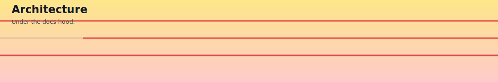

  

# Architecture

> Scope note: This page currently describes the experimental Tool Router architecture (`servers/tool-router.js`). The flagship production server is `server.js` → `dev/dist/server-refactored.js` (built from `dev/src/server-refactored.ts`), which provides the full integrated toolset used across wrappers and tests.

## High-Level Flow

- `servers/tool-router.js` boots an MCP server over stdio. (Experimental)
- On startup, it loads `servers/router-registry/tools.json` into an in-memory registry.
- Tools exposed by the router (`tool.list_catalog`, `tool.describe`, `tool.call`) operate over that registry.
- `tool.call` performs dynamic `import()` of the handler, executes it, and returns JSON content.

## Concurrency & Timeouts

- A basic semaphore (`inFlight`, `MAX_INFLIGHT`) throttles concurrent calls.
- A soft call timeout constant exists (`CALL_TIMEOUT_MS`), but the code defers to handler-level timeouts when implemented.

## Validation Hooks

- `validateInput` and `validateOutput` are intentionally minimal stubs.
- Swap with AJV for JSON Schema validation in production scenarios.

## Hot Reload

- A debounced `reloadSoon` is present to support future `fs.watch` usage.
- Current implementation reloads the catalog at startup; safe to wire a watcher.

## Error Surface

All errors are normalized to JSON error objects to keep client-side logic simple and consistent.

Fewer surprises, more good routes. That’s the archi-texture we’re going for.
