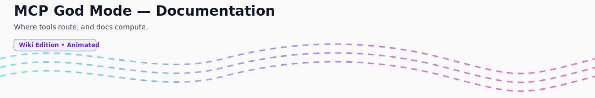

  

# MCP God Mode - Wiki Overview

> Version: 2.0Final | Last updated 9/19/2025

Welcome to the wiki-style docs: compact, connected, and a little bit computed. We split the monolithic README into bite-sized, linkable articles so you can route yourself efficiently. After all, why brute force when you can route of the box?

Quick links:

- Setup guide → [Setup-Guide](./Setup-Guide.md)
- Project layout and key paths → [Project-Structure](./Project-Structure.md)
- Flagship server (production): `server.js` → `dev/dist/server-refactored.js` (built from `dev/src/server-refactored.ts`)
- Tool Router: the beating route of dynamic tools → [Tool Router](./Tool-Router.md)
- Catalog format and validation → [Catalog Format](./Catalog-Format.md)
- How to call and compose tools → [Usage & Examples](./Usage-Examples.md)
- How it's wired → [Architecture](./Architecture.md)
- When gremlins appear → [Troubleshooting](./Troubleshooting.md)
- Contributing to docs → [Contributing to Docs](./Contributing-Docs.md)

Looking for the giant page? It retired to a farm upstate where all long READMEs go to live out their line breaks.
