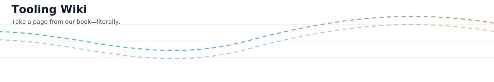

<p align="center">
  
  
</p>

# Project Structure

This guide orients you within the repo’s folder layout and points out where key files live, especially the flagship server and the installer.

## Top-Level

- `server.js`: Entry point used by launchers. Loads the compiled flagship server from `dev/dist/server-refactored.js`.
- `start-mcp.js`: CLI entry for packaged/hosted environments (e.g., LM Studio plugin).
- `package.json`: Scripts and metadata. Some legacy scripts still reference `dist/...`; see the notes below.
- `mcp.json`: MCP manifest/config for certain integrations.
- `README.md`: Landing page with quick links into the wiki.
- `docs/`: In-repo documentation and wiki content.
- `tests/`: Test helpers and scripts.
- `assets/`: SVGs and shared media used by docs.

## Development Workspace (`dev/`)

TypeScript sources, builders, and the interactive installer live here.

- `dev/src/`: Primary TypeScript source for the flagship server and tools.
  - `dev/src/server-refactored.ts`: Source of the flagship server.
- `dev/dist/`: Build output directory (compiled JavaScript).
  - `dev/dist/server-refactored.js`: Compiled flagship server loaded by `server.js`.
- `dev/build-server.js`: Modular build tool (assemble custom server builds).
- `dev/build-*.js`: Alternative/minimal/lazy builders.
- `dev/interactive-installer.js`: Interactive installer (moved here from older locations). See “Installer” below.
- `dev/tsconfig.json`: TypeScript configuration for building sources under `dev/`.

## Experimental/Router (`servers/`)

- `servers/tool-router.js`: Experimental tool-router server.
- `servers/tool-router.test.js`: Basic tests for the router.
- `servers/router-registry/tools.json`: Catalog file used by the router.
- `servers/router-registry/handlers/*.js`: Router handler implementations.

## Web UI Bridge (`mcp-web-ui-bridge/`)

Support code for browser automation and provider setup flows.

- `mcp-web-ui-bridge/src/`: Bridge sources.
- `mcp-web-ui-bridge/scripts/`: Launch/test helpers for Appium/Playwright.

## Schemas and Config

- `schemas/mcp-schema.json`: MCP schema reference.
- `src/config/elevated_permissions.json`: Elevated permissions defaults used in tests and runtime.

## Documentation (`docs/`)

- `docs/wiki/*.md`: Wiki-style pages (this file included).
- `docs/updates/*.md`: Changelogs and version notes.
- `docs/tools/*.md`: Tool-specific documentation.

---

## Installer

The interactive installer has moved into `dev/`.

- Current location: `dev/interactive-installer.js`
- What it does: lets you select categories/individual tools and emits a tailored configuration/build.

Run it directly:

```bash
node dev/interactive-installer.js
```

Related builders (non-interactive):

- `npm run build:minimal` → `cd dev && node build-server.js health system_info fs_list`
- `npm run build:custom`  → `cd dev && node build-server.js`

Note: Some legacy docs mention an installer at the repo root; that flow is deprecated. Use the `dev/interactive-installer.js` location above.

---

## Build & Run (Quick Reference)

1) Build the flagship server (from within repo root):

```bash
node dev/build-server.js   # or use one of the npm scripts that dispatch into dev/
```

2) Run via the entry shim:

```bash
node server.js   # loads dev/dist/server-refactored.js
```

If you prefer direct execution, ensure `dev/dist/server-refactored.js` exists and run it with Node.

---

## Server Build Locations (At a Glance)

- Sources: `dev/src/`
- Outputs: `dev/dist/`
- Entry shim: `server.js` → `dev/dist/server-refactored.js`
- Older references to `dist/` at repo root are legacy; use the `dev/` paths above.

---

## Notes on Legacy Paths

- References to `dist/server-refactored.js` at the repo root are legacy. The current shim loads `dev/dist/server-refactored.js` (see `server.js`).
- The interactive installer was consolidated under `dev/`. If you see older instructions, replace references accordingly.
