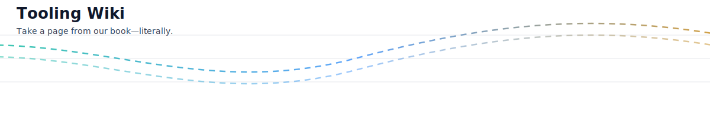

<p align="center">
  
</p>

# Tool Router

> Status: Experimental/Test Build
>
> This router is a new test build for catalog-driven routing and validation. The flagship, production server is `dist/server-refactored.js` (built from `dev/src/server-refactored.ts`). Prefer the flagship for day-to-day use.

Routes tool calls dynamically based on a JSON catalog. You bring the tools, we bring the routes. It's not magic—just good path-finding.

## TL;DR

- Server entry: `servers/tool-router.js`
- Catalog path: `servers/router-registry/tools.json`
- Handlers: `servers/router-registry/handlers/*.js`
- Exposed MCP tools:
  - `tool.list_catalog` — page/filter the catalog
  - `tool.describe` — get metadata and schemas
  - `tool.call` — invoke a tool by `name`

## Capabilities

- In-memory registry reloaded from a JSON catalog (debounced hot-reload ready).
- Lightweight input/output schema validation hooks (pluggable; stubbed by default).
- Concurrency guard via a small semaphore (`MAX_INFLIGHT = 8`).
- Simple version checking per tool entry.
- Timeboxing placeholder (`CALL_TIMEOUT_MS = 90_000`), defers to handler timeouts if any.

## Catalog Record Shape

Each entry in `tools.json` must follow this shape:

```json
{
  "name": "demo.echo",
  "version": "1.0.0",
  "summary": "Echo arguments back",
  "tags": ["demo", "utility"],
  "input_schema": { "type": "object", "properties": { "text": { "type": "string" } }, "required": ["text"] },
  "output_schema": { "type": "object", "properties": { "ok": { "type": "boolean" }, "echo": { "type": "object" } }, "required": ["ok", "echo"] },
  "handlerPath": "handlers/echo.js"
}
```

Notes:

- `handlerPath` can be absolute or relative to `servers/router-registry/`.
- `input_schema` and `output_schema` are JSON Schema–like; validation hooks can be upgraded with AJV.

## Public Tools

### `tool.list_catalog`

- Input: `{ q?: string, tags?: string[], page?: number, pageSize?: number }`
- Output: `{ total, page, pageSize, items[] }`
- Hides `handlerPath` from results (privacy by omission).

### `tool.describe`

- Input: `{ name: string }`
- Output: Catalog record without `handlerPath`.

### `tool.call`

- Input: `{ name: string, version?: string, args: object }`
- Behavior:
  - Validates `name` and optional `version`.
  - Validates `args` against `input_schema` (hook is currently permissive).
  - Dynamically imports `handlerPath` and calls `default` export or `handler`.
  - Validates handler result against `output_schema` (hook is currently permissive).
  - Returns `{ content: [{ type: "json", json: <result or error> }] }`.

## Error Model (JSON)

Errors are returned as JSON payloads shaped like:

```json
{
  "error": {
    "failure_class": "unknown_tool | version_mismatch | invalid_args | handler_error | invalid_output | overloaded",
    "hint": "human-readable detail",
    "retry_after_ms": 500
  }
}
```

## Extending Validation

`validateInput` and `validateOutput` are stubs in `servers/tool-router.js`. Swap in AJV:

```js
// Example sketch
import Ajv from "ajv";
const ajv = new Ajv({ allErrors: true, strict: false });
function validateInput(schema, args) {
  if (!schema) return { ok: true, errors: [] };
  const v = ajv.compile(schema);
  const ok = v(args);
  return { ok, errors: (v.errors || []).map(e => ajv.errorsText([e])) };
}
```

## Example Handler

`servers/router-registry/handlers/echo.js`

```js
export default async function handler(args) {
  return { ok: true, echo: args };
}
```

## Gotchas (route causes, if you will)

- Use stable `name` identifiers; clients may cache `version` expectations.
- Keep handler modules side-effect light—these are cold-loaded.
- Sanitise errors thrown by handlers to avoid leaking internals.
- If you raise `MAX_INFLIGHT`, consider isolating heavy handlers.

When in doubt, don’t over-engineer: just take the scenic route.
